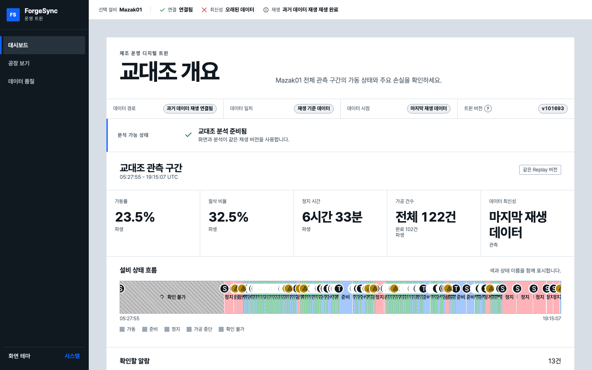
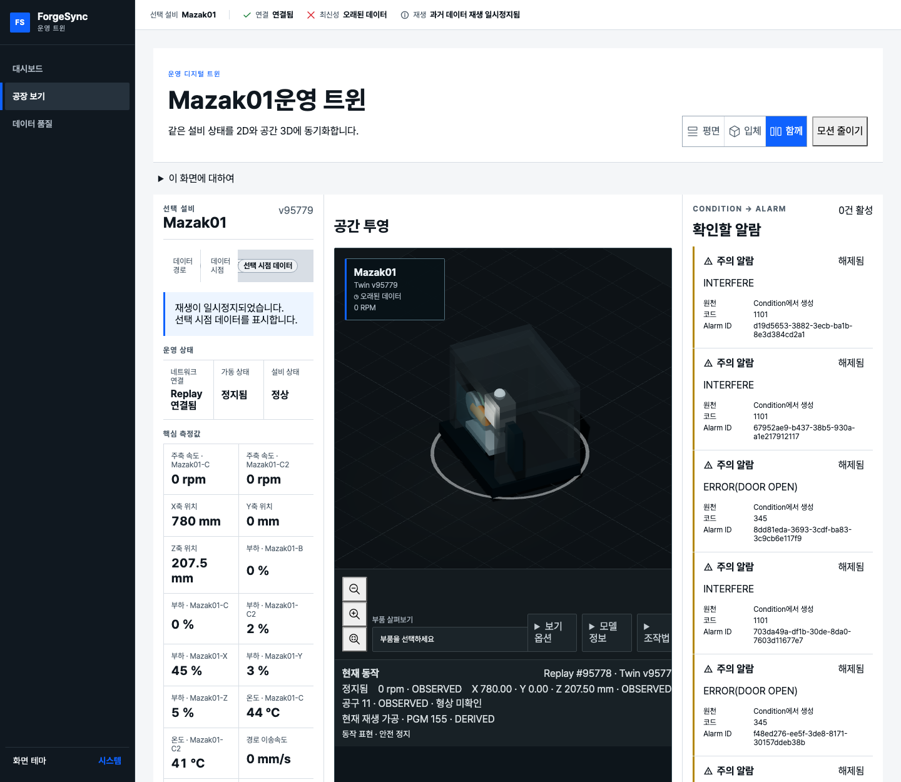

# ForgeSync

**설비 로그에서 정지·이상 구간을 조사할 때, 원본 근거를 잃지 않고 같은 과거를 다시 재생해 확인하는
제조 설비 Digital Twin.** 원본에 없는 사실은 숫자로 만들지 않고, 모르는 부분은 모른다고 표시한다.

실제 데이터: NIST Smart Manufacturing Systems Test Bed의 Mazak Integrex 100-IV(`Mazak01`) 하루 기록
(2016-10-05, 약 13.8시간, 115,991 레코드).



## 풀려는 문제

설비 로그가 대시보드 숫자가 되는 동안 의미가 바뀐다. 부품 카운터를 생산 실적으로, 데이터가 끊긴
시간을 정지로, 품질 데이터가 없는 상황을 양품 100%로, 같은 시간에 보인 경고를 정지 원인으로 읽는다.
이 해석은 각각 그럴듯하지만 원본이 뒷받침하지 않는다. 그 결과 같은 기록에서 서로 다른 숫자가 나오고,
문제가 생긴 시점을 다시 확인할 방법도 없다.

ForgeSync는 정지나 이상이 생긴 시점을 조사하는 엔지니어를 위해 다음을 지킨다.

- 원본 byte를 SHA-256과 함께 보존하고, 화면의 값마다 원본 레코드 위치와 매핑 버전을 남긴다.
- 같은 과거를 같은 순서로 다시 재생해 원하는 시점의 2D·3D 상태를 본다.
- 원본이 말하지 않는 생산 실적, 종합 OEE, 정지 원인은 만들지 않고, 왜 만들지 않았는지 공개한다.
- MQTT 중복·역순 전달에도 현재 상태가 과거 값으로 되돌아가지 않게 한다.

## 근거: 같은 데이터, naive 대시보드와의 비교

결과를 보기 전에 naive 규칙과 가설을 [사전 등록](docs/superpowers/specs/2026-10-02-naive-baseline-comparison-design.md)하고
같은 하루 기록으로 비교했다. 전체 결과와 한계는 [보고서](docs/evaluation/naive-baseline/report.md)에 있다.

| 질문 | 그럴듯한 naive 답 | ForgeSync |
|---|---|---|
| 오늘 몇 개 만들었나 | **0개**(부품 카운터) 또는 **137개**(가공 시작 횟수) | 생산 실적 `NOT_OBSERVED`. 가공 런 122건 관찰(완료 102) |
| 얼마나 가동했나 | **23.5% / 31.5% / 31.9%**(결측 처리 방식에 따라) | ACTIVE 23.5%, 데이터 끊김 25.5%를 `UNKNOWN`으로 별도 공개 |
| 종합 OEE는 | **0.34% / 0.46%**(품질 100% 가정) | `UNAVAILABLE` — 품질 원천 없음 |
| 긴 정지의 원인은 | 59건 중 6건에 "원인" 표시 | 인과 주장 0건, 동시 근거 42건·사유 미확인 17건 |

전달 장애를 일부러 주입한 실험(중복 최대 5%, 역순 최대 5%)에서 naive 소비자는 현재 값이 과거 값으로
최대 3,952번 되돌아갔다. ForgeSync의 상태 구간과 가공 런은 모든 시나리오에서 무장애 실행과 같았다.

이 실험은 ForgeSync의 결함도 찾았다. 역순 도착한 경고 1건이 업무 알람에서 빠졌고, 재생이 끝난
시점에서 운영 효율 계산이 cursor 불일치로 실패한다. 두 결함은 보고서와
[검증 장부](docs/verification-ledger.md)(V-070, V-071)에 기록했다.

## 조사 흐름

1. **교대조 개요 `/`**: 하루의 가동 상태, 정지 Pareto, 알람 흐름에서 긴 정지를 고른다.
2. **그 시점으로 재생 이동**: 2D·3D, 알람, 가공 분석이 같은 재생 cursor로 맞춰진다.
3. **근거 확인**: 정지 구간에 겹친 운전 모드 변경과 Condition을 "동시 근거"로 보고, 값마다 원본
   레코드 위치까지 따라간다.



## 동작 방식

```text
NIST 원본 byte ─ SHA-256 보존 ─▶ 원본 레코드 ─ 매핑 버전 ─▶ 공통 관찰(Observation envelope v2)
    ─▶ Replay Edge(결정적 재생) ─ MQTT QoS1 ─▶ Factory API
    ─▶ Inbox + 관찰 이력(PostgreSQL, 한 transaction) ─▶ Twin 상태·분석 projection
    ─▶ 2D 운영 화면 / 3D 공간 화면(같은 Twin을 읽는 projection)
```

| 결정 | 이유 |
|---|---|
| 원본, 공통 관찰, projection을 별도 계층으로 둔다 ([ADR-020](docs/adr/ADR-020-raw-source-preservation.md), [ADR-022](docs/adr/ADR-022-explicit-canonical-mapping.md)) | 규칙이 바뀌어도 과거 결과를 덮어쓰지 않고 새 처리 결과로 남긴다 |
| QoS1 at-least-once를 전제로 Inbox 경계 안에서만 effectively-once를 주장한다 ([ADR-024](docs/adr/ADR-024-mqtt-qos1-delivery-boundary.md), [ADR-025](docs/adr/ADR-025-postgres-ingestion-transaction.md)) | 전역 exactly-once는 보장할 수 없다 |
| 늦게 온 관찰은 이력에 남기되 현재 상태를 되돌리지 않는다 ([ADR-026](docs/adr/ADR-026-latest-observation-ordering.md)) | 역순 전달이 현재 상태를 오염시키지 않는다 |
| Condition을 그대로 알람으로 만들지 않는다 ([ADR-055](docs/adr/ADR-055-condition-derived-business-alarm-lifecycle.md)) | 설비 상태 신호와 업무 알람은 생명주기가 다르다 |
| 품질 원천 없이 종합 OEE를 만들지 않는다 ([ADR-053](docs/adr/ADR-053-cycle-performance-and-oee-disclosure.md)) | 근거 없는 숫자가 의사결정에 쓰이지 않게 한다 |

구성: Python Edge Gateway(수집·매핑·재생), Spring Boot Factory API(Modular Monolith),
React/TypeScript Factory Web(2D, React Three Fiber 3D), PostgreSQL, Mosquitto.

## 하지 않는 것과 한계

- 설비 1대, 하루 기록이다. 다설비나 장시간 운영 성능은 검증하지 않았다.
- 3D 공장 배치와 기계 모형은 실측이 아닌 `SIMULATED_LAYOUT`이다.
- 실제 CNC, PLC, Safety PLC를 제어하지 않는다.
- 생산 실적, 양품·불량, 종합 OEE, 공구 마모량과 잔여 수명을 만들지 않는다.
- AI service와 Virtual Controller는 아직 골격만 있다.

주장별 근거와 확인 상태는 [검증 장부](docs/verification-ledger.md), 설계 결정은 [ADR](docs/adr/)에 있다.

## 시작하기

### 준비물

- Python 3.12와 [uv](https://docs.astral.sh/uv/)
- Java 21(Gradle은 Factory API wrapper가 제공)
- Node.js 22.13+와 npm
- Docker(로컬 실행, 통합 검증, 평가 실행)

### 데이터 준비

원본과 파생 데이터는 Git에 넣지 않는다. lock 파일에 고정된 원본을 받아 checksum을 검증하고, 같은
매핑으로 공통 관찰을 다시 만든다. 출처와 이용 조건은 [NIST 데이터 출처](docs/data/nist-source-notice.md)에 있다.

```bash
uv run --package forgesync-edge-gateway forgesync-source acquire \
  --lock config/sources/nist-mazak01-20161005.lock.json --store datasets/raw
```

```bash
uv run --package forgesync-edge-gateway forgesync-source map-observations \
  --lock config/sources/nist-mazak01-20161005.lock.json --store datasets/raw \
  --machine Mazak01 --mapping config/mappings/nist-mazak01-observation-v2.json \
  --canonical-store datasets/canonical \
  --report-output docs/data/mappings/nist-mazak01-observation-v2
```

두 번째 명령은 항상 같은 processing run `839ad138…638109c`와 관찰 101,693개를 만든다.

### 로컬 실행

```bash
./scripts/run-local
```

PostgreSQL, Mosquitto, Replay Edge API, Factory API, Factory Web을 띄우고 출력된 주소를 연다.
REPLAY에서 재생을 시작하고 1x/10x/100x, 일시정지, 타임라인 이동을 쓴다. 원본 시각, 재생 시각,
Twin 최신성은 따로 표시된다. `/factory`는 `2D`, `3D`, `SPLIT` 모드를 제공하며 WebGL이나 asset이
실패해도 2D 화면은 계속 동작한다. `Ctrl+C`로 종료하면 스크립트가 띄운 프로세스를 모두 정리한다.

### 검증

```bash
./scripts/verify
```

lock 파일의 의존성을 설치하고 Python format·lint·type·test·build, Factory API check와 jar build,
Factory Web lint·type·test·architecture·build를 차례로 실행한다. 처음 실패한 단계에서 멈추고 실패한
영역을 알려 준다. 코딩 에이전트는 push 직전에 이 명령을 반드시 실행한다. Hosted GitHub workflow는
아직 구성하지 않았다.

Docker가 필요한 통합 검증은 따로 실행한다.

```bash
./scripts/verify-mqtt
```

```bash
./scripts/verify-database
```

```bash
npx --prefix apps/factory-web playwright install chromium
```

```bash
./scripts/verify-e2e
```

### 평가 재현

```bash
./scripts/evaluate-naive-baseline
```

```bash
./scripts/evaluate-delivery-faults
```

첫 번째는 의미 해석 비교(약 10분), 두 번째는 전달 장애 시나리오 S0~S4(약 1시간)를 실행한다.

### 개별 구성 요소

```bash
uv run --package forgesync-edge-gateway forgesync-replay --help
```

```bash
apps/factory-api/gradlew -p apps/factory-api bootRun
```

```bash
npm --prefix apps/factory-web run dev
```

제품 범위와 구현 제약은 [docs/README.md](docs/README.md)에 있다.
