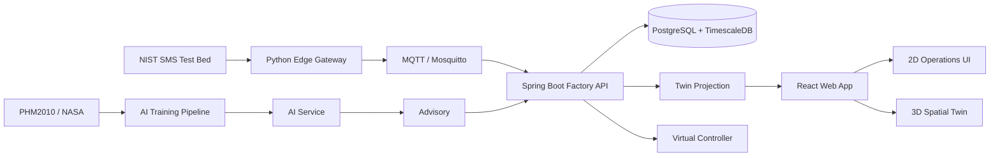

# ForgeSync PRD v1.4
## Real-Data Manufacturing Operations Digital Twin with Spatial 3D Operations UI

- 문서 버전: **v1.4**
- 기준일: **2026-08-31**
- 기반 문서: `ForgeSync_PRD_v1.3_Executable_Spec.md`
- 제품명: **ForgeSync**
- 한 줄 정의: **실제 제조설비 데이터를 표준 의미와 출처를 보존하여 Operational Digital Twin으로 동기화하고, 생산 실행·알람·정비·Condition Intelligence를 2D/3D 공간 UI에서 통합하는 제조 운영 플랫폼**
- 목표 개발 기간: **8주**
- 핵심 구현 원칙:
  - Verified facts first
  - Provenance first
  - Source semantics preservation
  - Twin freshness & synchronization
  - 3D is an operational view, not decoration
  - Effectively-once business processing within a declared boundary
  - Advisory-first AI
  - Progressive enhancement: 2D works even when 3D fails

---

# 0. v1.4에서 무엇이 달라졌는가

v1.3은 데이터 의미, provenance, 생산 실행, Twin freshness, reliability 경계를 정리했다.

v1.4의 핵심 변경은 **Digital Twin의 시각화 계층을 제품 핵심 기능으로 승격**하는 것이다.

기존:

```text
Real Data
→ Backend Projection
→ React Dashboard
```

v1.4:

```text
Real / Replay Manufacturing Data
        ↓
Canonical Observation
        ↓
Operational Projection
        ↓
Twin State
        ↓
┌──────────────────────────────────────┐
│ 2D Operations UI                    │
│ 3D Spatial Factory UI               │
│ Replay / Time Machine               │
│ Alarm / Production / Intelligence   │
└──────────────────────────────────────┘
```

중요한 차이:

> **3D 공장은 예쁜 배경이 아니라 Twin State를 공간적으로 표현하는 projection이다.**

즉 3D에서 장비의 회전, 상태, 경고, 작업 진행률, 선택 상태, Replay 시점은 모두 ForgeSync backend의 Twin State와 연결된다.

---

# 1. Product Vision

ForgeSync는 다음 질문에 답하는 시스템이다.

> “지금 어떤 설비가 어떤 상태이며, 어떤 작업을 수행하고 있고, 데이터는 얼마나 최신이며, 이상 징후가 있으며, 운영자는 무엇을 해야 하는가?”

사용자는 하나의 화면에서:

```text
공장 위치
설비 상태
실제 센서 데이터
작업 진행상황
설비 Condition
Alarm
Maintenance
AI Advisory
데이터 신뢰도
Replay 시간
```

을 볼 수 있어야 한다.

---

# 2. Product Positioning

ForgeSync는 다음 중 어느 하나만을 만드는 프로젝트가 아니다.

```text
단순 IoT Dashboard        X
단순 MES CRUD              X
단순 Predictive AI         X
단순 3D Viewer             X
단순 CNC Data Parser       X
```

대신:

```text
Manufacturing Data Integration
+
Manufacturing Operations
+
Operational Digital Twin
+
Spatial 3D Visualization
+
Condition Intelligence
+
Reliability Engineering
```

을 하나의 일관된 제품 흐름으로 연결한다.

---

# 3. Core Product Story

```text
NIST CNC Data
      ↓
MTConnect Semantics
      ↓
Edge Gateway
      ↓
MQTT
      ↓
Spring Backend
      ↓
TimescaleDB / Projection
      ↓
Operational Twin
      ↓
┌───────────────┬────────────────┐
│ 2D Ops UI     │ 3D Factory UI  │
└───────────────┴────────────────┘
      ↓
Production / Alarm / Maintenance
      ↑
Condition Intelligence
```

---

# 4. Data Strategy

## 4.1 Operational Source

### NIST Smart Manufacturing Systems Test Bed

Status:

```text
[VERIFIED / PRIMARY]
```

사용 목적:

```text
Equipment observation
Machine operational state
MTConnect semantics
Replay
Operational Twin
```

MVP 기준 logical source:

```text
Mazak01
```

---

# 5. Condition Intelligence Dataset Strategy

v1.4에서는 AI 데이터 소스를 한 단계 더 현실적으로 구분한다.

## Preferred Candidate

```text
PHM Society 2010 CNC Milling Data Challenge
```

Status:

```text
[PREFERRED_TO_VERIFY]
```

이유:

```text
CNC milling domain
cutter wear / RUL
Force XYZ
Vibration XYZ
AE-RMS
wear labels on training cutters
50 kHz/channel
```

공식 challenge 설명 기준 6개 cutter record가 있으며 c1/c4/c6가 training, c2/c3/c5가 test이고 각 acquisition은 7개 센서 채널을 가진다.

단:

```text
dataset download availability
archive integrity
license/redistribution
local reproducibility
```

를 Week 1에서 확인하기 전에는 `PRIMARY VERIFIED`로 승격하지 않는다.

## Fallback

```text
NASA Milling Wear
```

Status:

```text
[FALLBACK_TO_VERIFY]
```

PHM 2010 archive 획득 또는 재현성이 좋지 않을 경우 NASA Milling을 사용한다.

---

# 6. Data Truthfulness Policy

ForgeSync는 서로 다른 실험 장비를 같은 기계라고 주장하지 않는다.

금지:

```text
NIST Mazak01 RPM
→ PHM2010 model
→ “Mazak01 실제 RUL”
```

허용:

```text
NIST
→ Operational Channel

PHM2010 / NASA
→ Condition Intelligence Channel

ForgeSync Twin
→ provenance를 유지한 상태로 병렬 표시
```

UI 예:

```text
Operational State
[REAL:NIST]

Condition Intelligence
[AI:PHM2010]
DEMO CONDITION MODEL
```

---

# 7. Evidence States

모든 중요한 문장에는 다음 상태를 부여할 수 있어야 한다.

```text
[VERIFIED]
공식 문서 또는 실제 데이터에서 확인.

[DECIDED]
ForgeSync 설계 선택.

[TO_VERIFY]
직접 profiler / experiment 필요.

[PREFERRED_TO_VERIFY]
우선 채택 후보.

[FALLBACK]
대체 선택.

[OPTIONAL]
MVP 이후.
```

---

# 8. Non-Goals

MVP에서 하지 않는다.

```text
실제 PLC write
실제 CNC 자동 정지
Safety PLC 대체
ERP full integration
상용 MES 완전 구현
Physics-based machining simulation
실제 절삭력 물리해석
Robot collision simulation
Unity WebGL
Omniverse deployment
Kubernetes
Kafka
Full microservices
AI autonomous control
```

---

# 9. High-Level Architecture



---

# 10. Runtime Components

## edge-gateway

Python.

역할:

```text
source read
MTConnect metadata catalog
record parsing
canonical mapping
replay clock
schema validation
MQTT publish
source data-quality measurement
```

## factory-api

Java / Spring Boot.

역할:

```text
ingestion
persistence
Twin projection
production domain
alarm
maintenance
advisory
audit
REST
WebSocket/SSE
```

## factory-web

React + TypeScript.

역할:

```text
2D dashboard
3D factory view
Machine Detail
Replay controls
Production UI
Alarm UI
Data Quality
Intelligence UI
```

## ai-service

Python / FastAPI.

역할:

```text
feature vector inference
model metadata
prediction
confidence
risk/advisory input
```

## virtual-controller

MVP simulated command executor.

---

# 11. Frontend Technology Decision

## P0

```text
React
TypeScript
React Three Fiber
Three.js
GLB / glTF
```

### 선택 이유

React Three Fiber는 3D scene을 React component/state 구조 안에서 관리할 수 있게 하여:

```text
REST Twin State
WebSocket update
React state/store
3D machine
2D panel
```

이 동일 상태를 공유하기 쉽다.

---

# 12. Why Not Unity in MVP

Unity 자체가 나쁜 것이 아니다.

하지만 ForgeSync의 핵심 평가 포인트는:

```text
manufacturing semantics
event processing
Twin synchronization
reliability
manufacturing domain
```

이다.

Unity를 추가하면:

```text
C#
Unity scene
WebGL build
React ↔ Unity bridge
asset duplication
runtime debugging
```

비용이 커진다.

따라서:

```text
MVP = React Three Fiber
Future physical simulation = Unity/OpenUSD/Omniverse 검토
```

로 한다.

---

# 13. Future 3D Interoperability

v1.4 MVP asset format:

```text
GLB / glTF
```

향후:

```text
OpenUSD
```

를 검토한다.

OpenUSD는 여러 모델/asset을 scene hierarchy로 조합하는 능력이 강하므로 대형 factory layout이나 CAD/robotics 연계가 필요한 경우 확장 후보로 둔다.

Status:

```text
[OPTIONAL]
```

---

# 14. Digital Twin Definition

ForgeSync의 Twin:

```text
Twin =
Identity
+ Latest Valid Observations
+ Equipment State
+ Production Context
+ Production Result
+ Conditions
+ Alarm / Maintenance
+ Condition Intelligence
+ Provenance
+ Freshness
+ Spatial Representation
```

마지막의:

```text
Spatial Representation
```

이 v1.4의 추가 요소이다.

---

# 15. Twin != 3D Model

중요한 정의:

```text
3D Model ≠ Digital Twin
```

3D CAD/GLB 파일만 띄운 것은 Digital Twin이 아니다.

ForgeSync에서 Digital Twin이 되려면:

```text
backend state
       ↓
synchronized projection
       ↓
3D object state
```

가 존재해야 한다.

예:

```text
Machine.execution = ACTIVE
→ spindle visual rotation

Machine.health = WARNING
→ warning visual state

Operation.progress = 72%
→ spatial progress label

Alarm.CRITICAL
→ beacon / alert marker

Twin.stale = true
→ stale overlay
```

---

# 16. Twin Synchronization Timeline

한 observation의 시간정보:

```text
sourceObservedAt
replayPublishedAt
ingestedAt
projectedAt
uiReceivedAt
renderedAt
```

이를 이용하여:

```text
Ingestion Lag
Projection Lag
UI Delivery Lag
Render Lag
End-to-End Twin Lag
```

을 측정할 수 있다.

---

# 17. Twin Freshness

Replay mode에서 historical source time과 현재 wall clock을 비교하지 않는다.

Freshness:

```text
wall clock
-
latest projected/received time
```

기본 P0:

```text
FRESH      <= 2s
LAGGING    >2s <=10s
STALE      >10s
```

설정 가능.

---

# 18. Spatial Twin Freshness

3D object도 별도 stale 상태를 가진다.

예:

```text
Machine state age = 12s
→ 3D object stale
→ animation freeze
→ muted material
→ STALE badge
```

즉 오래된 데이터를 계속 “실시간으로 움직이는 것처럼” 보여주지 않는다.

---

# 19. Observation Model

Canonical root:

```text
ObservationEnvelope
```

Variants:

```text
SampleObservation
EventObservation
ConditionObservation
```

---

# 20. SampleObservation

예:

```text
SPINDLE_SPEED
PATH_FEEDRATE
TEMPERATURE
LOAD
POSITION
```

Example:

```json
{
  "kind": "SAMPLE",
  "metric": "SPINDLE_SPEED",
  "value": 6842.0,
  "unit": "REVOLUTION/MINUTE"
}
```

---

# 21. EventObservation

예:

```text
EXECUTION
CONTROLLER_MODE
TOOL_NUMBER
PROGRAM
PART_COUNT
AVAILABILITY
POWER_STATE
```

---

# 22. ConditionObservation

예:

```text
NORMAL
WARNING
FAULT
UNAVAILABLE
```

Condition과 Alarm은 분리한다.

```text
Source Condition
      ↓
Rule
      ↓
Business Alarm
```

---

# 23. Canonical Envelope

필수 정보:

```text
schemaVersion
eventId
sourceEventKey
machineId
observationKind
source metadata
source time
ordering
provenance
payload
```

---

# 24. Ordering

우선순위:

```text
same ReplaySession
→ replaySequence

historical ordering
→ sourceObservedAt

tie
→ sourceEventKey
```

과거 이벤트는 저장하되 current projection을 rollback하면 안 된다.

---

# 25. Replay Source Identity

가능하면:

```text
agentInstanceId
sourceSequence
```

보존.

없으면 만들지 않는다.

Replay identity:

```text
replaySessionId
replaySequence
```

별도.

---

# 26. Equipment State

## Connectivity

```text
UNKNOWN
ONLINE
STALE
OFFLINE
```

## Execution

```text
UNKNOWN
READY
ACTIVE
IDLE
HOLD
STOPPED
```

## Health

```text
UNKNOWN
NORMAL
WARNING
FAULT
```

## Maintenance

```text
NONE
REQUESTED
ASSIGNED
IN_PROGRESS
```

---

# 27. Operational Twin DTO

```json
{
  "machine": {},
  "consistency": {},
  "state": {},
  "metrics": {},
  "conditions": [],
  "production": {},
  "productionResult": {},
  "alarms": [],
  "maintenance": {},
  "intelligence": {},
  "quality": {},
  "spatial": {}
}
```

---

# 28. Spatial Metadata

Machine:

```json
{
  "spatial": {
    "assetId": "cnc-generic-v1",
    "sceneNodeId": "cnc-mill-01",
    "position": [4.2, 0.0, -2.8],
    "rotation": [0, 1.57, 0],
    "scale": [1,1,1]
  }
}
```

실제 NIST의 물리 위치라고 주장하지 않는다.

Default:

```text
provenance = SIMULATED_LAYOUT
```

---

# 29. Factory Scene Model

```text
FactoryScene
 ├─ Zone
 │   ├─ MachineInstance
 │   ├─ MachineInstance
 │   ├─ ConveyorInstance
 │   └─ InspectionInstance
 └─ Zone
```

MVP scene:

```text
Demo Factory
 └─ Machining Cell
      ├─ CNC-MILL-01
      ├─ CNC-MILL-02 [SIM]
      ├─ Buffer
      ├─ Conveyor [SIM]
      └─ Inspection [SIM]
```

---

# 30. 3D UI Main Layout

Desktop 기준:

```text
┌─────────────────────────────────────────────────────────────┐
│ ForgeSync | REPLAY | Source 2016-10-05 | 10x | Twin 183ms │
├──────────────────────────────────────┬──────────────────────┤
│                                      │ MACHINE DETAIL       │
│                                      │                      │
│           3D FACTORY                 │ CNC-MILL-01          │
│                                      │ ONLINE / ACTIVE      │
│      [CNC01]      [CNC02]            │ NORMAL               │
│                                      │                      │
│          ═══ Conveyor ═══            │ RPM      6842        │
│                                      │ Feed     15.2        │
│                 [Inspect]            │ Tool     #12         │
│                                      │ Program  O1234       │
│                                      │                      │
│                                      │ Operation 72%        │
│                                      │ [REAL:NIST] [SIM]    │
├──────────────────────────────────────┴──────────────────────┤
│ ◀  ▶  ❚❚  1x 10x 100x   ━━━━━━━●━━━━━━━━━━━━━━━━━━━━━━  │
└─────────────────────────────────────────────────────────────┘
```

---

# 31. Primary Interaction

사용자가 3D 장비를 클릭하면:

```text
SelectedMachineId
```

가 변경되고 오른쪽 Machine Detail이 갱신된다.

반대로:

```text
2D machine list 클릭
```

시 카메라가 해당 3D 장비를 focus한다.

즉 2D/3D selection state를 통합한다.

---

# 32. View Modes

상단 view toggle:

```text
[ 2D ] [ 3D ] [ SPLIT ]
```

## 2D

데이터 중심.

## 3D

공간 중심.

## SPLIT

추천 기본 데모 모드.

---

# 33. Why Progressive Enhancement

3D renderer가 오류 나거나 저사양 환경이면:

```text
2D UI
```

가 완전히 작동해야 한다.

금지:

```text
3D renderer failure
→ production UI unusable
```

허용:

```text
3D unavailable
→ fallback card
→ 2D operations continues
```

---

# 34. 3D Machine Visual State Contract

Machine object가 표현해야 하는 최소 상태:

| Twin state | 3D 표현 |
|---|---|
| ONLINE + ACTIVE | 정상 material + active indicator + spindle animation |
| ONLINE + IDLE | idle label |
| WARNING | warning halo/beacon |
| FAULT | fault beacon + label |
| STALE | muted/ghosted + STALE badge |
| OFFLINE | disabled material + OFFLINE badge |
| selected | outline/highlight |

색만으로 상태를 구분하지 않는다.

항상:

```text
color
+
icon
+
text
```

중 최소 2개를 함께 쓴다.

---

# 35. Spindle Animation Contract

Source:

```text
SPINDLE_SPEED
```

Visual speed:

```text
not physically exact
```

정규화:

```text
visualAngularVelocity =
clamp(RPM / VISUAL_DIVISOR, 0, MAX_VISUAL_SPEED)
```

목적:

```text
RPM 변화 시각화
```

금지:

```text
실제 회전 물리 시뮬레이션이라고 주장
```

---

# 36. Execution Animation

```text
ACTIVE
→ spindle animation on

READY / IDLE
→ spindle animation off or minimal

HOLD
→ freeze + HOLD badge

STOPPED
→ animation off

UNKNOWN
→ neutral state
```

---

# 37. Tool Change Visualization

Source:

```text
TOOL_NUMBER
```

변경 감지:

```text
12 → 24
```

UI:

```text
TOOL CHANGE
#12 → #24
```

MVP:

```text
floating notification
highlight
```

P2:

```text
tool rack animation
```

---

# 38. Program Visualization

Source:

```text
PROGRAM
```

장비 label:

```text
Program O1234
```

program 변경 시:

```text
brief flash / change marker
```

---

# 39. Machine Floating Label

장비 위:

```text
┌─────────────────┐
│ CNC-MILL-01     │
│ ● ACTIVE        │
│ 6842 RPM        │
│ Tool #12        │
└─────────────────┘
```

LOD:

멀리서:

```text
CNC-01
●
```

가까이서:

상세 label 표시.

---

# 40. Alarm Spatial Visualization

Alarm severity:

```text
INFO
WARNING
CRITICAL
```

3D:

```text
WARNING
→ halo + icon

CRITICAL
→ beacon + icon + label
```

사용자 click:

```text
Alarm drawer
```

열림.

---

# 41. Condition Visualization

Raw Condition:

```text
Source condition badge
```

Alarm과 분리해서 표시.

예:

```text
Condition: WARNING
Alarm: OPEN
```

사용자가 둘의 차이를 볼 수 있어야 한다.

---

# 42. Production Context on 3D

Machine label:

```text
OP-001
MILLING
72 / 100
72%
```

source:

```text
OperationExecution
ProductionResult
```

provenance:

```text
[SIM]
```

---

# 43. Progress Visualization

Machine 위 progress bar:

```text
██████████████░░░░ 72%
```

공간 UI에서 지나친 숫자 과밀화를 피하기 위해:

default:

```text
operation id
progress
```

만 표시.

상세는 right panel.

---

# 44. Material / Workpiece Flow

P1 simulated flow:

```text
Raw Material
→ CNC
→ Buffer
→ Inspection
→ Finished
```

모든 material movement는:

```text
SIMULATED
```

로 표시.

실제 NIST product routing이라고 주장하지 않는다.

---

# 45. Conveyor Animation

P1.

Operation progression에 맞춘 demo animation.

목적:

```text
공정 흐름 시각화
```

데이터 truthfulness:

```text
[SIM]
```

---

# 46. Factory Replay / Time Machine

3D UI의 핵심 차별화 기능.

하단 timeline:

```text
◀◀  ◀  ▶  ❚❚  ▶▶
1x 10x 100x MAX

━━━━━━━━━━━━●━━━━━━━━━━━━━━━━
```

사용자는:

```text
play
pause
speed change
seek
jump to event
```

를 수행한다.

---

# 47. Replay Mode Badge

항상:

```text
REPLAY
```

표시.

금지:

```text
LIVE
```

실제 live source가 아닌데 live라고 표시하지 않는다.

---

# 48. Replay Time Display

항상 세 시간을 구분한다.

```text
Source Time
Replay Time
Twin Freshness
```

예:

```text
Source Time   2016-10-05 14:32:15
Replay Time   2026-08-31 13:40:02
Speed         10x
Twin Lag      183ms
```

---

# 49. Replay Seek Architecture

P0:

seek는 session restart 방식으로 단순화 가능.

```text
pause
→ choose source timestamp
→ rebuild projection from nearest checkpoint
→ resume
```

P2:

```text
snapshot/checkpoint index
```

최적화.

---

# 50. Replay Checkpoint

P1:

```text
replay_checkpoint
```

Fields:

```text
sessionId
sourceTimestamp
replaySequence
projectionSnapshotId
```

목적:

빠른 timeline seek.

---

# 51. Event Marker Timeline

Timeline 위 marker:

```text
Tool change
Alarm
Condition warning
Operation start
Operation complete
```

예:

```text
────●────▲────────!────■────────
    tool  op       alarm complete
```

click 시 해당 시간으로 이동.

---

# 52. Camera Modes

P0:

```text
Overview
Machine Focus
Top View
```

P1:

```text
Follow Event
```

---

# 53. Camera Behavior

Machine 선택:

```text
camera smoothly focus
```

Alarm 발생:

자동 camera jump는 기본 OFF.

이유:

사용자가 보고 있는 화면을 강제로 빼앗지 않는다.

대신:

```text
“Focus alarm”
```

버튼 제공.

---

# 54. Scene Navigation

지원:

```text
orbit
zoom
pan
machine select
reset view
```

금지:

게임처럼 자유 이동이 핵심 기능이 되지 않도록 한다.

---

# 55. 3D Asset Pipeline

```text
Blender / licensed asset
        ↓
GLB
        ↓
asset validation
        ↓
optimization
        ↓
React Three Fiber
```

---

# 56. Asset Rules

MVP asset은:

```text
generic CNC
generic conveyor
generic inspection station
factory floor
```

사용.

실제 Mazak Integrex 외형을 정확히 재현했다고 주장하지 않는다.

표시:

```text
Generic CNC visualization
mapped to logical machine CNC-MILL-01
```

---

# 57. Asset Licensing

모든 asset:

```text
source
author
license
modification
```

기록.

파일:

```text
docs/assets/asset-manifest.md
```

---

# 58. Asset Optimization

목표:

```text
initial 3D assets <= 15 MB compressed
```

권장:

```text
Draco / mesh compression
texture compression
reasonable polygon counts
```

실제 목표값은 profiling 후 조정.

---

# 59. Scene Performance Budget

포트폴리오 목표:

```text
desktop 1080p
>= 45 FPS preferred
>= 30 FPS minimum usable
```

장비:

```text
5 objects MVP
20 simulated objects test
100 lightweight object stress test
```

FPS는 특정 산업 SLA 아님.

---

# 60. Render Optimization

필요 시:

```text
instancing
LOD
memoization
frustum culling
lazy asset loading
reduced shadows
```

사용.

---

# 61. Twin Update Frequency vs Render Frequency

중요:

```text
MQTT event frequency
!=
React state update frequency
!=
3D animation frame frequency
```

예:

```text
sensor data 100 events/s
→ projection aggregation
→ UI update 5~10Hz
→ render 60fps
```

모든 telemetry event마다 React 전체 scene re-render 금지.

---

# 62. Frontend State Architecture

권장:

```text
Server State
→ TanStack Query or equivalent

Realtime Twin State
→ dedicated store

3D UI Local State
→ camera / selection / hover
```

P0에서 라이브러리는 구현 시 확정.

핵심은 관심사 분리.

---

# 63. Realtime Update Contract

Backend WebSocket event:

```json
{
  "type": "TWIN_PATCH",
  "machineId": "cnc-mill-01",
  "version": 10231,
  "changed": {
    "SPINDLE_SPEED": 6842,
    "EXECUTION": "ACTIVE"
  },
  "projectedAt": "..."
}
```

---

# 64. WebSocket Is Notification / Patch

Authoritative state:

```text
REST Twin API + DB projection
```

Reconnect:

```text
1. GET Twin
2. store version
3. subscribe
4. apply patch > current version only
```

---

# 65. Frontend Version Guard

Patch:

```text
version <= localVersion
→ ignore

version > localVersion + expected gap
→ REST resync
```

3D와 2D가 서로 다른 버전을 보여주는 것을 방지.

---

# 66. Twin Consistency State

```text
CONSISTENT
PARTIAL
STALE
DEGRADED
```

3D UI 상단에도 표시.

예:

```text
TWIN: STALE
```

일 때 animation을 정상 실시간처럼 계속하지 않는다.

---

# 67. Data Quality Overlay

3D 오른쪽 상단 optional overlay:

```text
Ingestion      850 msg/s
Validity       99.9%
Coverage       94.1%
Twin Lag       183 ms
Duplicates     13
Out-of-order   2
```

---

# 68. Data Quality Heat View

P2.

View mode:

```text
Operational
Health
Data Quality
```

Data Quality mode에서는:

```text
stale
unknown
low semantic coverage
```

장비가 강조됨.

---

# 69. Health Heat View

P1.

Machine health:

```text
NORMAL
WARNING
FAULT
```

공간적으로 확인.

하지만 색상만으로 의존하지 않는다.

---

# 70. Production Flow View

P1.

공장 scene 위에:

```text
Operation route
```

overlay.

예:

```text
Buffer
  ↓
CNC-MILL-01
  ↓
Inspection
```

line/arrow로 표시.

---

# 71. Accessibility

3D만으로 핵심 정보 제공 금지.

모든 3D state는 2D에서도 접근 가능.

지원:

```text
keyboard machine list
screen-reader-friendly data table
text alarm
reduced motion option
```

---

# 72. Reduced Motion

사용자 설정:

```text
Reduce Motion
```

ON:

```text
spindle animation reduced/off
camera transition instant
beacon pulse reduced
```

---

# 73. Mobile / Small Screen

MVP 우선:

```text
desktop
```

Tablet:

```text
2D default
3D optional
```

Mobile:

```text
2D Machine Detail
```

우선.

---

# 74. UX Principle: Data Density

3D 공간에 모든 데이터를 띄우지 않는다.

기본 label:

```text
Machine Name
Execution
RPM
Operation Progress
```

나머지는 right panel.

---

# 75. UX Principle: Truthfulness

3D object geometry와 machine telemetry provenance를 구분.

예:

```text
3D layout     [SIM]
RPM           [REAL:NIST]
Operation     [SIM]
Advisory      [AI:PHM2010]
```

---

# 76. Dashboard Information Architecture

```text
/dashboard
/factory
/machines/:id
/replay
/production
/operations/:id
/alarms
/maintenance
/data-quality
/intelligence
/system
```

---

# 77. Dashboard

KPI:

```text
Machines Online
Machines Active
Active Operations
Open Alarms
Twin Lag
Replay Rate
Invalid Events
```

---

# 78. Factory Page

`/factory`

구성:

```text
view toggle
3D scene
machine filters
right detail panel
bottom replay timeline
```

ForgeSync의 대표 화면.

---

# 79. Machine Detail

`/machines/:id`

2D 중심.

Sections:

```text
Identity
Operational State
Metrics
Conditions
Current Operation
Production Result
Alarm
Maintenance
Intelligence
Data Quality
Provenance
```

---

# 80. Production Domain

```text
ProductionRequest
→ WorkOrder
→ OperationExecution
→ ProductionResult
```

---

# 81. ProductionRequest

```text
requestNo
product
plannedQuantity
dueAt
priority
status
provenance
```

MVP provenance:

```text
SIMULATED
```

---

# 82. WorkOrder

생산 요청의 실행 단위.

---

# 83. Routing

```text
Product
→ Routing
→ RoutingOperation
```

---

# 84. MachineCapability

P0:

```text
PROCESS_TYPE
```

P1:

```text
AXIS_COUNT
MAX_SPINDLE_RPM
```

---

# 85. OperationExecution

Machine에 직접 assign.

```text
CREATED
READY
ACTIVE
PAUSED
COMPLETED
FAILED
CANCELLED
```

---

# 86. ProductionResult

```text
plannedQuantity
completedQuantity
goodQuantity
rejectQuantity
actualDuration
cycleTime
reasonCode
```

NIST PartCount와 자동 연결하지 않는다.

---

# 87. Alarm

Source:

```text
EQUIPMENT_CONDITION
DATA_QUALITY
SYSTEM
AI_ADVISORY
USER
```

Status:

```text
OPEN
ACKNOWLEDGED
RESOLVED
```

---

# 88. Alarm 3D Link

Alarm record:

```text
machineId
```

가 존재하면 3D scene object와 연결.

Alarm 클릭:

```text
select machine
focus optional
open alarm panel
```

---

# 89. Maintenance

```text
REQUESTED
ASSIGNED
IN_PROGRESS
COMPLETED
CANCELLED
```

---

# 90. Advisory

Condition Intelligence 결과.

```text
LOW
MEDIUM
HIGH
UNKNOWN
```

AI HIGH만으로 Machine FAULT 금지.

---

# 91. Intelligence UI

오른쪽 panel:

```text
Condition Intelligence

Risk        HIGH
Wear est.   ...
RUL est.    ...
Model       phm2010-xgb-v1
Source      PHM2010
Provenance  [AI]
```

명시:

```text
Demo advisory model
Not measured from NIST Mazak01
```

---

# 92. AI Feature Pipeline

PHM2010 채택 시:

```text
7-channel raw signal
→ validation
→ filtering
→ segmentation/windowing
→ feature extraction
→ cutter-group split
→ model
→ wear/RUL evaluation
→ model card
```

---

# 93. PHM2010 Sensor Families

공식 challenge 기준:

```text
Force X
Force Y
Force Z
Vibration X
Vibration Y
Vibration Z
AE-RMS
```

---

# 94. AI Experiment Matrix

```text
E00 Dummy
E01 force only
E02 vibration only
E03 AE only
E04 force + vibration
E05 all sensors
```

Models:

```text
Ridge / ElasticNet
RandomForest
XGBoost
```

Deep learning은 optional.

---

# 95. AI Split Policy

같은 cutter/cut에서 나온 window가 train/test 양쪽에 섞이지 않도록 한다.

Primary validation:

```text
group by cutter
```

실제 dataset split과 competition protocol을 별도 보존.

---

# 96. Model Card

필수:

```text
dataset
hash
source
sensor channels
sampling rate evidence
label definition
split
feature schema
metrics
limitations
intended use
not for actual equipment control
```

---

# 97. Reliability Guarantee

Transport:

```text
MQTT QoS1
→ at-least-once
```

Declared transaction boundary:

```text
MQTT delivery
→ DB business state transition
```

목표:

```text
effectively-once business processing
```

Global exactly-once 주장 금지.

---

# 98. Inbox

Unique:

```text
replaySessionId
+
sourceEventKey
```

중복:

```text
SKIPPED_DUPLICATE
```

---

# 99. Ingestion Transaction

```text
BEGIN
Inbox insert
Observation insert
Latest projection
Condition projection
Machine state
Business event/outbox
COMMIT
```

---

# 100. Outbox

Raw telemetry마다 생성하지 않는다.

Business events:

```text
ALARM_CREATED
ALARM_RESOLVED
OPERATION_STARTED
OPERATION_PAUSED
OPERATION_COMPLETED
MAINTENANCE_REQUESTED
ADVISORY_ACCEPTED
```

---

# 101. UI Reliability Scenario

WebSocket disconnected:

```text
3D badge = RECONNECTING
existing Twin value remains but freshness increases
STALE threshold reached
→ animation stops/mutes
```

Reconnect:

```text
REST resync
→ WebSocket resubscribe
→ return to FRESH
```

---

# 102. 3D Failure Isolation

Three.js exception / asset load failure:

```text
error boundary
→ 3D unavailable notice
→ 2D data remains functional
```

---

# 103. Asset Failure

Missing CNC GLB:

```text
fallback primitive box
```

사용.

Twin 기능을 asset file 하나가 막으면 안 된다.

---

# 104. Data Quality

Dimensions:

```text
Validity
Completeness
Ordering
Duplication
Freshness
Semantic Coverage
```

---

# 105. Semantic Coverage

```text
mapped observations / parsed observations
```

3D에 사용되지 않는 DataItem이 있다고 해서 invalid는 아니다.

---

# 106. Unknown DataItem

Policy:

```text
store raw metadata if safe
count unknown
do not map blindly
```

---

# 107. Security Minimum

```text
schema validation
SQL parameter binding
no repo secrets
CORS explicit
dependency scan
command allowlist
container non-root where practical
```

JWT/RBAC P2.

---

# 108. OT Safety Boundary

ForgeSync command:

```text
Virtual Controller only
```

MVP에서:

```text
actual CNC
PLC
Safety PLC
interlock
```

제어하지 않는다.

---

# 109. Repository Structure

```text
forgesync/

├── apps/
│   ├── edge-gateway/
│   ├── factory-api/
│   ├── factory-web/
│   │   ├── src/features/twin/
│   │   ├── src/features/factory3d/
│   │   ├── src/features/replay/
│   │   └── public/assets/3d/
│   ├── ai-service/
│   └── virtual-controller/
│
├── contracts/
│   ├── observation-envelope/
│   ├── websocket/
│   └── twin/
│
├── config/
├── datasets/
├── db/
├── docs/
│   ├── architecture/
│   ├── data/
│   ├── ui/
│   ├── assets/
│   ├── ai/
│   ├── adr/
│   └── testing/
│
├── tests/
│   ├── fixtures/
│   ├── contract/
│   ├── e2e/
│   └── visual/
│
└── infra/
```

---

# 110. Frontend 3D Component Structure

```text
FactoryScene
 ├─ FactoryEnvironment
 ├─ MachineLayer
 │   └─ MachineTwin
 ├─ MaterialFlowLayer
 ├─ AlarmLayer
 ├─ FloatingLabelLayer
 ├─ SelectionLayer
 ├─ CameraController
 └─ ReplayOverlay
```

---

# 111. MachineTwin Component

Pseudo:

```tsx
<MachineTwin
  machineId="cnc-mill-01"
  asset="cnc-generic-v1.glb"
  execution="ACTIVE"
  health="NORMAL"
  spindleRpm={6842}
  toolNumber="12"
  progress={0.72}
  stale={false}
/>
```

---

# 112. 3D Binding Adapter

3D component가 backend DTO 전체를 직접 알아서는 안 된다.

Adapter:

```text
MachineTwinResponse
       ↓
MachineVisualState
       ↓
MachineTwin Component
```

---

# 113. MachineVisualState

```ts
type MachineVisualState = {
  machineId: string
  execution: ExecutionState
  health: HealthState
  connectivity: ConnectivityState
  rpm?: number
  tool?: string
  operationProgress?: number
  alarmSeverity?: AlarmSeverity
  stale: boolean
  selected: boolean
}
```

이 계층으로 backend 변경과 3D renderer를 분리한다.

---

# 114. UI Test Strategy

## Unit

```text
Twin → VisualState mapping
state badge
progress
freshness
reduced motion
```

## Component

```text
Machine selected
alarm overlay
stale state
fallback asset
```

## E2E

```text
NIST replay
→ backend
→ WebSocket
→ 2D RPM change
→ 3D spindle state change
```

---

# 115. Visual Regression

P1.

대표 screenshot:

```text
normal
warning
fault
stale
selected
replay paused
```

CI screenshot compare.

---

# 116. Performance Test

Browser measurement:

```text
FPS
frame time
JS heap
GL asset load
WebSocket rate
React commits
```

Test scenes:

```text
5 machines
20 machines
100 lightweight simulated machines
```

---

# 117. 3D Acceptance Criteria

```gherkin
Given CNC-MILL-01 is visible in the factory scene

When Twin execution changes to ACTIVE
And spindle RPM is greater than zero

Then the CNC visual spindle animation becomes active

When execution becomes STOPPED
Then spindle animation stops

When Twin becomes STALE
Then active animation does not continue as if live
And a STALE indicator is displayed
```

---

# 118. Alarm Spatial Acceptance

```gherkin
Given a WARNING alarm exists for CNC-MILL-01

Then the 3D machine shows a warning indicator
And the 2D alarm list contains the same alarm

When the machine is clicked
Then the alarm details are accessible

And color is not the only warning cue
```

---

# 119. Replay Acceptance

```gherkin
Given a NIST replay session

When user pauses replay
Then the source progression stops

When user changes speed from 1x to 10x
Then replay timing changes

And the UI continues to display:
Source Time
Replay Time
Twin Freshness
```

---

# 120. Provenance Acceptance

```gherkin
Given CNC-MILL-01 RPM originates from NIST
And its layout is simulated
And its production operation is simulated
And advisory is generated from PHM2010

Then the UI can distinguish:
RPM [REAL:NIST]
Layout [SIM]
Operation [SIM]
Advisory [AI:PHM2010]
```

---

# 121. 2D Fallback Acceptance

```gherkin
Given WebGL initialization fails

Then ForgeSync displays a 3D unavailable message

And Machine Detail
And Replay
And Production
And Alarm
And Data Quality

remain usable
```

---

# 122. Week 1 — Data Truth & UI Skeleton

```text
Repository
Compose
NIST dataset/profile
Devices.xml
PHM2010 availability check
NASA fallback check
verification ledger

React shell
3D blank scene
generic CNC asset
asset manifest
```

Exit:

```text
NIST raw assumptions documented
AI dataset decision made or still explicitly blocked
3D scene loads
```

---

# 123. Week 2 — Real Data Vertical Slice

```text
NIST
→ Edge
→ MQTT
→ Spring
→ TimescaleDB
→ Twin
→ React 2D
```

Exit:

```text
REAL:NIST RPM/feed/execution/tool/program visible
```

---

# 124. Week 3 — Spatial Twin

```text
React Three Fiber
FactoryScene
MachineTwin
selection
floating label
spindle animation
execution binding
health binding
stale binding
```

Exit:

```text
NIST Twin changes both 2D and 3D state
```

---

# 125. Week 4 — Replay Time Machine

```text
Replay controls
timeline
source/replay time
event markers
3D synchronization
WebSocket reconnect
REST resync
```

Exit:

```text
pause/speed/replay visible in spatial Twin
```

---

# 126. Week 5 — Manufacturing Operations

```text
ProductionRequest
Routing
Capability
WorkOrder
OperationExecution
ProductionResult
3D progress overlay
SIM provenance
```

---

# 127. Week 6 — Condition / Alarm / Maintenance

```text
ConditionObservation
Alarm mapping
Maintenance
3D warning/fault marker
Data Quality
```

---

# 128. Week 7 — Intelligence

Preferred:

```text
PHM2010
```

Fallback:

```text
NASA Milling
```

```text
profiler
features
split
model
model card
FastAPI
Advisory
```

---

# 129. Week 8 — Reliability / Portfolio

```text
duplicate
out-of-order
MQTT restart
DB restart
AI down
WebSocket disconnect
3D asset failure
performance
visual regression
README
demo video
architecture diagrams
```

---

# 130. First 25 GitHub Issues

```text
#1 Scaffold ForgeSync monorepo
#2 Add TimescaleDB + Mosquitto
#3 Create verification ledger
#4 Parse NIST Devices.xml
#5 Generate Mazak01 DataItem catalog
#6 Profile Mazak01 raw data
#7 Evaluate PHM2010 dataset availability
#8 Define observation schemas
#9 Implement canonical mapping
#10 Implement ReplaySession
#11 MQTT publisher
#12 Spring ingestion + Inbox
#13 Timescale observation persistence
#14 Latest Twin projection
#15 Machine state projection
#16 Build React app shell
#17 Build FactoryScene with R3F
#18 Load generic CNC GLB
#19 Bind Twin execution to 3D machine
#20 Bind RPM to spindle animation
#21 Add selection + right detail panel
#22 Add Twin freshness / stale visualization
#23 Add Replay timeline
#24 Add Data Quality page
#25 Add E2E NIST → 2D/3D Twin test
```

---

# 131. Demo Script v1.4

```text
1. ForgeSync Factory 화면 열기
2. “REPLAY” 표시 확인
3. 3D 공장과 CNC-MILL-01 확인
4. NIST Mazak01 replay 시작
5. RPM이 0 → 상승
6. 2D RPM 값 변화
7. 3D spindle animation 변화
8. Execution ACTIVE/STOPPED 변화
9. Tool change event 확인
10. Source Time / Replay Time / Twin Lag 확인
11. Simulated ProductionRequest 생성
12. CNC에 Operation assign
13. 3D machine 위 progress 확인
14. Condition WARNING 발생
15. 공간 warning + Alarm 생성
16. PHM/NASA Condition Intelligence Advisory 표시
17. Advisory accept
18. Virtual operation pause
19. duplicate event 100회 inject
20. business side effect 중복 없음 확인
21. out-of-order inject
22. Twin rollback 안 됨 확인
23. WebSocket disconnect
24. STALE UI 확인
25. reconnect → REST resync → FRESH 확인
```

---

# 132. Portfolio Hero Screen

면접/README 첫 화면:

```text
┌──────────────────────────────────────────────────────────────┐
│ ForgeSync                  Operational Digital Twin          │
│ REPLAY · 10x · Twin 183ms                                   │
├────────────────────────────────────┬─────────────────────────┤
│                                    │ CNC-MILL-01             │
│         3D FACTORY                 │ ACTIVE · NORMAL         │
│                                    │                         │
│       ┌───────┐                    │ RPM       6,842         │
│       │ CNC01 │  ← selected        │ Tool      #12           │
│       └───────┘                    │ Program   O1234         │
│            ═══════>                │                         │
│                                    │ Operation 72%           │
│          ┌─────────┐               │ [SIM]                   │
│          │ Inspect │               │                         │
│          └─────────┘               │ Advisory: MEDIUM        │
│                                    │ [AI:PHM2010]            │
│                                    │                         │
│                                    │ RPM [REAL:NIST]         │
├────────────────────────────────────┴─────────────────────────┤
│ ▶ 1x 10x 100x      ━━━━━━━●━━━━━━━━━━━━━━━━━━━━━━━━━━━━   │
└──────────────────────────────────────────────────────────────┘
```

---

# 133. README First Paragraph

> **ForgeSync** is a real-data manufacturing operations digital twin that replays NIST MTConnect manufacturing data, preserves equipment semantics and provenance, synchronizes operational state into both 2D and spatial 3D views, combines it with simulated production execution, and integrates a separately sourced CNC condition-intelligence model as an operator advisory channel.

---

# 134. Interview Explanation — Beginner Version

> ForgeSync는 실제 CNC 데이터를 가져와서 지금 기계가 움직이는지, RPM이 얼마인지, 어떤 공구를 쓰는지 등을 웹 화면에 보여주는 프로젝트입니다. 단순 숫자 대시보드가 아니라 공장 3D 화면의 CNC와 데이터를 연결해서 기계 상태가 바뀌면 3D 장비 상태도 같이 바뀝니다. 생산 작업, 알람, 정비, AI 조언도 하나의 Digital Twin에서 볼 수 있게 만들었습니다.

---

# 135. Interview Explanation — Technical Version

> ForgeSync uses NIST MTConnect manufacturing data as an operational source. Sample, Event, and Condition semantics are preserved at the ingestion boundary, and at-least-once MQTT delivery is converted into effectively-once business processing within a declared transactional boundary using an Inbox and idempotent state transitions. A versioned operational Twin projection drives both 2D React views and a React Three Fiber spatial scene. The 3D layer is intentionally a projection of Twin state rather than a standalone visualization, so freshness, stale state, alarms, execution, RPM and simulated production context are consistently represented.

---

# 136. Why the 3D Exists

면접에서 가장 중요한 답변:

> 3D를 넣은 이유는 보여주기 위해서만은 아닙니다. 표 형태의 UI에서는 여러 설비의 위치와 상태를 빠르게 파악하기 어렵기 때문에, 동일한 Twin State를 공간적인 view로 projection했습니다. 3D renderer가 장애가 나도 2D 운영 화면은 정상 동작하며, 3D는 backend와 별도의 truth source가 아니라 동일한 versioned Twin State의 consumer입니다.

---

# 137. Claims We Must Not Make

```text
실제 Mazak 공장 layout이다.
실제 Mazak CAD 모델이다.
3D spindle 속도가 물리적으로 정확하다.
NIST 기계의 실제 RUL을 PHM 모델로 예측했다.
실제 CNC를 AI가 정지한다.
Replay가 live factory connection이다.
ForgeSync가 full industrial Digital Twin platform이다.
1000 msg/s가 산업 SLA다.
```

---

# 138. Verification Ledger v1.4

```text
docs/verification-ledger.md
```

예:

| ID | Claim | Status | Evidence / Action |
|---|---|---|---|
| V-001 | NIST Mazak01 metadata | VERIFIED | Devices.xml |
| V-002 | selected NIST raw grammar | TO_VERIFY | local profiler |
| V-003 | PHM2010 7 sensor channels | VERIFIED official description | PHM Society |
| V-004 | PHM2010 archive currently downloadable | TO_VERIFY | Week 1 |
| V-005 | Generic CNC 3D asset license | TO_VERIFY | asset selection |
| V-006 | Factory layout corresponds to real NIST layout | FALSE / NOT CLAIMED | simulated layout |
| V-007 | R3F scene meets 45 FPS target | TO_VERIFY | browser benchmark |

---

# 139. Architecture Decisions

```text
ADR-001 NIST Operational Source
ADR-002 Observation Category Preservation
ADR-003 Condition != Alarm
ADR-004 Provenance First
ADR-005 Replay Identity Separation
ADR-006 Effectively-Once Boundary
ADR-007 Versioned Twin Projection
ADR-008 Twin Freshness
ADR-009 ProductionResult Separation
ADR-010 Advisory-First AI
ADR-011 Modular Monolith
ADR-012 MQTT QoS1
ADR-013 No Kafka MVP
ADR-014 React Three Fiber for Spatial Twin
ADR-015 3D Is Projection, Not Source of Truth
ADR-016 GLB/glTF MVP Asset Format
ADR-017 2D Fallback Required
ADR-018 OpenUSD Future Extension Only
ADR-019 PHM2010 Preferred Condition Dataset
```

---

# 140. Final Definition of Done

ForgeSync v1.4 MVP가 완료되었다고 말하려면 최소 다음이 모두 되어야 한다.

```text
[ ] NIST actual source replay
[ ] Source provenance visible
[ ] SAMPLE/EVENT semantics preserved
[ ] Twin freshness visible
[ ] Machine state projection works
[ ] 2D Machine Detail works
[ ] 3D FactoryScene works
[ ] RPM affects visual spindle state
[ ] Execution affects machine visual state
[ ] warning/fault visible spatially
[ ] Replay timeline works
[ ] Source Time / Replay Time separated
[ ] ProductionRequest → Result works
[ ] SIM production provenance visible
[ ] Alarm / Maintenance works
[ ] Condition Intelligence is separately sourced
[ ] AI cannot control actual equipment
[ ] duplicate delivery is idempotently handled
[ ] out-of-order cannot roll back current Twin
[ ] WebSocket disconnect produces stale state
[ ] reconnect resynchronizes authoritative Twin
[ ] 3D failure does not break 2D operations
[ ] browser performance benchmark documented
[ ] verification ledger updated
[ ] README claims are truthful
```

---

# 141. Final v1.4 Product Shape

```text
                      ForgeSync
                          │
         ┌────────────────┼────────────────┐
         │                │                │
 Equipment Data     Manufacturing      Intelligence
         │            Operations            │
         │                │                 │
         └──────────────┬─┴─────────────────┘
                        │
                 Operational Twin
                        │
              version / freshness
                        │
         ┌──────────────┴──────────────┐
         │                             │
      2D Ops UI                3D Spatial Twin
         │                             │
         └──────────────┬──────────────┘
                        │
                 Replay Time Machine
```

ForgeSync의 핵심은 “3D 공장을 만드는 것”이 아니다.

핵심은:

> **실제 제조 데이터의 의미와 시간, 출처, 생산 문맥을 하나의 신뢰 가능한 Twin State로 만들고, 그 동일한 상태를 2D와 3D에서 서로 다른 방식으로 이해할 수 있게 만드는 것**이다.

이 원칙을 지키면 3D UI는 장식이 아니라 ForgeSync의 가장 강한 포트폴리오 인터페이스가 된다.

---

# 142. External References

## NIST Smart Manufacturing Systems Test Bed
https://github.com/usnistgov/smstestbed

## NIST MTConnect Devices.xml
https://github.com/usnistgov/smstestbed/blob/master/mtconnect/agent/Devices.xml

## PHM Society 2010 CNC Milling Data Challenge
https://phmsociety.org/phm_competition/2010-phm-society-conference-data-challenge/

## NASA Milling Wear
https://data.nasa.gov/dataset/milling-wear

## React Three Fiber
https://r3f.docs.pmnd.rs/

## OpenUSD
https://openusd.org/

---

# Appendix A. v1.3 → v1.4 Major Changes

| v1.3 | v1.4 |
|---|---|
| Operational Twin + 2D React | Operational Twin + 2D + Spatial 3D |
| Unity excluded | R3F selected for MVP |
| 3D optional concept | 3D operational projection contract |
| Simple WebSocket update | Versioned patch + REST resync |
| Freshness backend concept | Freshness controls 3D animation/state |
| NASA Intelligence | PHM2010 preferred, NASA fallback |
| Replay backend | Replay Time Machine UI |
| Machine state | MachineVisualState adapter |
| Basic frontend scope | `/factory` hero spatial operations page |
| Generic performance target | Browser 3D performance budget |
| no 3D asset policy | GLB pipeline + licensing + fallback assets |
| no renderer failure contract | 2D progressive fallback mandatory |

---

# Appendix B. P0 / P1 / P2 Scope

## P0 — Must Have

```text
NIST replay
2D Machine Detail
3D FactoryScene
one CNC mapped to NIST
RPM animation
Execution state
Twin freshness
selection
right panel
Replay controls
provenance
2D fallback
```

## P1 — Should Have

```text
multiple logical machines
alarm spatial marker
production progress
conveyor simulated flow
Replay event markers
checkpoint seek
Health view
visual regression
```

## P2 — Nice to Have

```text
100-machine spatial stress scene
data quality heat view
tool rack animation
OpenUSD conversion experiment
mobile 3D
JWT/RBAC
DEMO OEE
```

---

# Appendix C. Beginner Mental Model

```text
NIST 데이터 = 공장에서 오는 기록
Edge Gateway = 번역기
MQTT = 택배기사
Spring = 중앙 두뇌
Database = 기억
Twin = 지금 상태를 정리한 복사본
React = 사용자 화면
React Three Fiber = Twin을 3D 공장으로 보여주는 도구
Replay = 과거 공장을 다시 재생
Alarm = 작업자가 처리해야 하는 문제
Advisory = AI의 조언
Provenance = 이 값이 어디서 왔는지 적힌 꼬리표
Freshness = 화면의 값이 얼마나 최신인지
```
