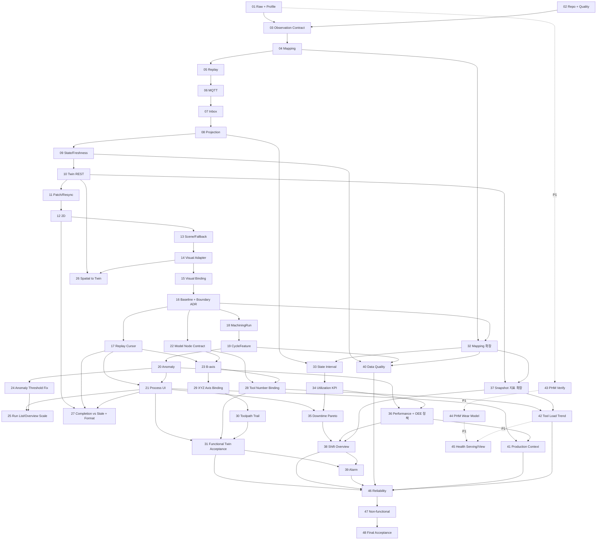

# ForgeSync 테스트 가능한 구현 Step

## 1. 이 문서의 사용법

각 Step은 독립적으로 리뷰하고 merge할 수 있는 최소 단위다. 한 Step이 1~2 작업일을 넘거나 서로 다른 Context의 정책 결정을 둘 이상 포함하면 하위 이슈로 더 나눈다. 단, 인프라 파일만 존재하고 검증 가능한 동작이 없는 상태로 merge하지 않는다.

모든 Step은 다음 순서를 따른다.

```text
인수 조건 고정
→ 실패 테스트 작성/확인
→ 최소 구현
→ 리팩터링과 아키텍처 검사
→ 관련 전체 테스트
→ 문서/Verification Ledger 갱신
```

상태 표기 권장: `NOT_STARTED`, `IN_PROGRESS`, `BLOCKED`, `DONE`. `DONE`은 아래 테스트와 완료 조건이 모두 충족된 경우에만 사용한다.

### Roadmap 식별자 사용 제한

`Step 01`과 같은 Step 번호는 이 문서에서 진행 순서와 의존성을 표현하기 위한 관리용 식별자일 뿐 ForgeSync의 ubiquitous language나 안정적인 시스템 identity가 아니다.

- Step 번호는 문서의 roadmap 제목, 선행 조건, 추적 표에서만 사용한다.
- package/module, class/type/function/variable, 테스트 이름에 Step 번호를 사용하지 않는다.
- CLI, 설정, 환경변수, 파일/디렉터리, fixture 이름에 Step 번호를 사용하지 않는다.
- API/DB/MQTT/log/metric 및 `sourceSetId`, `artifactId`, `processingRunId`에 Step 번호를 사용하지 않는다.
- 구현 산출물은 도메인 기능, 원천 identity, 관찰 기간, schema/version으로 명명한다.

예를 들어 `nist-mazak01-step01`, `Step01Profiler`, `step_01_status`는 금지하며 `nist-mazak01-20161005`, `SourceProfiler`, `acquisition_status`처럼 명명한다. 이 규칙은 `docs/**`를 제외한 정적 naming boundary test로 검증한다.

### Step 15 이후 재계획 기준

Step 01~15에서 만든 NIST ingestion, 권위 Twin, 2D, 격리된 3D scene과 `MachineVisualState`를
회귀 기준으로 유지한다. 이후 순서는 [NIST Mazak + PHM 2010 수정 가이드](../ForgeSync_NIST_Mazak_PHM2010_수정가이드.md)와
[Three.js Procedural 3D 수정 가이드](../ForgeSync_ThreeJS_Procedural_3D_수정가이드.md)의 방향을
현재 PRD와 Accepted ADR에 맞게 적용한다.

- NIST observation에서 재구성한 공정은 `DERIVED`, PHM 결과는 `REFERENCE`/`ESTIMATED`,
  Production 흐름은 `SIMULATED`로 분리한다. 서로를 같은 실제 장비의 측정값이나 결과로 연결하지 않는다.
- 관측에서 재구성하는 `MachiningRun`과 사용자가 생성하는 `OperationExecution`은 identity, lifecycle,
  저장소를 공유하지 않는다. 필요한 연결은 versioned public contract와 안정적인 ID로만 표현한다.
- 가이드의 `TwinState` 역할은 이미 존재하는 renderer 전용 `MachineVisualState`가 담당한다. 같은 의미의
  frontend 상태 모델을 병렬로 추가하지 않고, 검증된 새 visual field만 기존 contract에 추가한다.
- Three.js object는 backend DTO, MTConnect record, replay API를 직접 해석하지 않는다. 물리 좌표에서
  scene 좌표로의 변환과 node binding은 renderer Adapter에 두며, source에 없는 축·공구 형상을 만들지 않는다.
- v1 기본 모델은 procedural geometry다. Procedural/GLB가 따라야 할 최소 node contract는 유지하되,
  두 번째 provider가 실제로 필요하기 전에는 범용 asset framework를 만들지 않는다.
- ReplayClock과 권위 snapshot/version이 2D, 3D, run, anomaly의 공통 시간 기준이다. 각 화면이나
  Three.js animation loop가 별도 business clock을 만들지 않는다.
- PHM archive, channel, wear label, 라이선스가 실제로 검증되기 전에는 model 구현으로 넘어가지 않는다.
  RUL은 wear baseline과 leakage 검증 이후의 선택 범위이며 v1 완료를 막지 않는다.

### Step 23 이후 재계획 기준

Step 01~23에서 만든 ingestion, 권위 Twin, 2D, 격리된 3D scene, replay cursor, 관측 공정 분석을 회귀
기준으로 유지한다. Step 28 이후는 **이미 확보한 NIST 원천 관측값에서 운영 지표를 만드는 범위를 우선**하고,
외부 dataset과 시뮬레이션 도메인은 그 뒤의 선택 범위로 내린다.

- 원천 profile에 근거가 있는 관측값을 먼저 canonical contract, Twin snapshot, 화면에 반영한다.
  적재되었으나 표출되지 않는 지표를 남겨둔 채 새 데이터 원천을 추가하지 않는다.
- 가동률 계열 지표는 `execution`/`mode`/`power` 상태 구간과 기계 자체 누적 카운터(`total_time`,
  `auto_time`, `cut_time`)의 두 경로로 계산한다. 두 값이 다를 때 하나를 임의로 선택해 숨기지 않는다.
- 원천에 품질(양품/불량) 구분 데이터가 없으므로 **종합 OEE 수치를 만들지 않는다.** Availability와
  Performance만 근거와 함께 제시하고 Quality는 명시적 `UNAVAILABLE`로 남긴다.
- 3D 바인딩은 좌표 근거가 확인된 축만 활성화한다. 근거가 없는 축과 공구 형상은 개별적으로 unavailable이며
  다른 축이나 2D의 동작을 막지 않는다.
- 생산 문맥은 관측된 `program`, `PartCountAct`, `MachiningRun`의 시간 정렬로 표현한다. 원천에 없는
  생산 지시/작업 지시 aggregate를 만들지 않는다.
- PHM/NASA reference health는 P1 선택 범위이며 v1 완료를 막지 않는다. 어떤 경우에도 Mazak01의 상태나
  잔여 수명으로 표시하지 않는다.

#### Step 28 이후에서 제외한 항목

| 제외 항목 | 원래 위치 | 근거 |
|---|---|---|
| 절차형 공구 형상 factory (`TURNING_TOOL`/`DRILL`/`END_MILL`/`FACE_MILL`) | 구 Step 24 | 공구 형상 식별 근거가 원천에 없어 항상 `UNKNOWN`으로 렌더된다. tool number 바인딩만 남긴다 |
| XYZ/C축을 완료 조건에서 제외 | 구 Step 25 | XYZ는 이미 canonical `POSITION`으로 매핑된 15,786건이 있어 근거가 충분하다. Step 29~30으로 승격한다. C축은 계속 제외 |
| PHM raw/feature/model/serving/view 5단계 분리 | 구 Step 27~31 | 정책상 Mazak01과 연결이 금지된 reference 채널에 잔여 노력의 상당 부분이 배분되어 있었다. Step 43~45 P1로 압축 |
| Cut-based RUL baseline | 구 Step 32 | wear baseline 검증 이후의 선택 범위였고 reference 채널 자체가 P1로 내려갔다 |
| `ProductionRequest`/`WorkOrder`/`OperationExecution`/`ProductionResult` 시뮬레이션 aggregate | 구 Step 33~34 | PRD 8의 Non-Goal "단순 MES CRUD"와 충돌하며 원천에 없는 사실을 만든다. 관측 기반 Step 41로 대체 |
| Maintenance workflow | 구 Step 36 | 또 하나의 시뮬레이션 CRUD이며 Alarm aggregate가 증명하는 범위를 넘지 않는다 |

#### Step 28 이후가 사용하는 관측 근거

| 신호 | 건수 | 현재 상태 | 사용처 |
|---|---:|---|---|
| `total_time` / `auto_time` / `cut_time` | 32,471 / 10,111 / 3,516 | 매핑됨(Step 32), 미표출 | Step 34 가동률·절삭비 |
| `execution` / `mode` / `power` | 329 / 79 / 49 | 매핑됨 | Step 33 상태 구간 |
| `estop` | 51 | 매핑됨(Step 32), 미표출 | Step 33 구간, Step 35 정지 사유 |
| `Xabs` / `Yabs` / `Zabs` | 6,868 / 1,538 / 7,380 | 매핑됨, 미표출 | Step 29~30 축·툴패스 |
| 축·주축 `LOAD` | 14,473 | 매핑됨, 미표출 | Step 37, 42 |
| `Fact` PATH_FEEDRATE | 7,633 | 매핑됨, 미표출 | Step 37 |
| `Stemp` / `S2temp` | 10,203 | 매핑됨, 미표출 | Step 37 |
| `PartCountAct` | 49 | 매핑됨, 미표출 | Step 36, 41 |
| `Tool_number` | 593 | 매핑됨 | Step 28, 42 |
| CONDITION 전체 | 1,052 | 매핑됨 | Step 35, 39 |
| 오버라이드 `Sovr`/`Fovr`/`Frapidovr` | 184 | 매핑됨(Step 32), 미표출 | 운전 문맥 |
| `line` / `sequenceNum` | 1,372 | 매핑됨(Step 32), 미표출 | 생산 문맥 |

Step 32 이전 기준 semantic coverage는 53,939 / 115,991 (46.50%)이었고 Step 32 이후는
101,644 / 115,991 (87.63%)이다.

#### Step 01~23 실측 점검 결과

전량 NIST 관측(machining run 122건, source 13시간 47분)으로 실행한 점검 결과다. 소수 run fixture에서는
드러나지 않았고 Step 01~23이 `DONE`으로 표시된 뒤에 확인되었다. 각 결함은 아래 Step에서 처리한다.

| ID | 결함 | 실측 근거 | 처리 |
|---|---|---|---|
| D-01 | 이상 평가가 정상 변동을 과분류한다 | 평가 가능한 94건 중 92건(98%)이 `DEVIATING` 이상, `기준선 범위`는 2건(1.6%). 실제 편차는 8.8~10.8% 구간 | **완료** — Step 24. 정상 76건(81%)으로 전환 |
| D-02 | 편차 크기의 해상도가 없다 | 6초 run과 2분 13초 run이 같은 `큰 차이`로 표시된다 | **완료** — Step 24. 정상 폭의 배수를 함께 표시 |
| D-03 | 타임라인 개요가 규모에서 붕괴한다 | 막대 122개가 전부 최소폭 2%(22.9px)에 걸려 합계 244%, 116개(95%)가 겹치고 폭 라벨은 0개 | Step 25 |
| D-04 | 가공 목록에 탐색 수단이 없다 | 352px 스크롤 영역에 7,603px 콘텐츠(약 21.6화면), 필터·검색·그룹 요소 0개 | Step 25 |
| D-05 | 가동률 계열 지표가 없다 | source 49,632초 중 가공 11,681초(23.5%), 첫 가공 전 공백 3시간 34분이 어느 화면에도 없다 | Step 32~38 |
| D-06 | 상태 구간과 체류시간 projection이 없다 | Equipment State가 시점 값만 투영해 KPI 산출의 전제가 빠져 있다 | Step 33 |
| D-07 | spatial이 Twin 계약이 아니라 frontend 상수에 있다 | Twin 응답의 `spatial`이 `{}`인데 배치는 `MAZAK01_SCENE_BINDING` 상수에서 온다 | Step 26 |
| D-08 | 적재된 지표가 Twin에 노출되지 않는다 | Twin metric 4종. POSITION 15,786 / LOAD 14,473 / TEMPERATURE 10,203 / PATH_FEEDRATE 7,633 / PART_COUNT / CONTROLLER_MODE / POWER_STATE 미노출 | Step 37 |
| D-09 | 정상 종료된 재생이 고장처럼 표시된다 | 완료 시 `실시간 연결됨`과 `STALE`이 함께 뜨고 실시간 오판 경고가 표시된다 | Step 27 |
| D-10 | 두 타임라인의 시간축이 다르다 | Replay는 `05:27:55~19:15:07`, 가공 개요는 `09:01~19:13`. 앞 3시간 34분 공백이 개요에서 사라진다 | Step 25, Step 38 |
| D-11 | 원시 값이 그대로 표시된다 | 편차 `8.807549%`, 시각 `…04:44:39.496965 UTC`, 공구 번호 `0`, provenance 90건 평면 나열 | Step 27 |
| D-12 | 짧은 run과 종료 근거 미확정 구간 | 30초 미만 13건, 종료 근거 미확정 20건(16%) | Step 24의 등급 분리와 Step 25의 필터로 완화한다. segmentation rule 자체의 변경은 근거 확인 후 별도로 판단한다 |
| D-13 | 분류가 30개 동시 비교의 최댓값이었다 | 최상위 사유가 metric 채널인 run 92/94, run당 임계 초과 feature 중앙 5.5개, duration은 정상인데 채널 때문에 이상으로 분류된 run 73/94 | **완료** — Step 24. `durationSeconds`가 등급을 정하고 채널은 `supportingOutlierCount`로 분리 |

**결정이 필요한 항목**: [ADR-037](../adr/ADR-037-cursor-bound-process-analysis-presentation.md)은 공정
분석을 정지된 replay cursor 시점으로 한정한다. Step 33~38의 구간 집계 KPI는 cursor 시점이 아니라 관측
구간 전체를 대상으로 하므로 이 결정의 확장 또는 별도 집계 경로가 필요하다. Step 33 착수 전에 ADR을
갱신한다.

---

## Phase A — Data Truth Foundation

### Step 01 — 원천 데이터 불변 보존과 Human-readable Profile

**목적**: 선택한 NIST Mazak01 원천 데이터와 Devices.xml의 byte를 먼저 그대로 보존하고, 원본을 수정하지 않는 별도 처리 과정으로 사람이 검토할 수 있는 source profile을 생성한다.

**구현 범위**

- 최소 `SourceReader`, `ArtifactStore`, `ChecksumVerifier`, `RawRecordDecoder`, `ProfileGenerator` Port/Adapter 골격
- `SourceArtifact` manifest와 Processing Run metadata
- `datasets/raw/...` 저장 규칙 또는 대용량 원본을 위한 외부 저장 참조 규칙
- `profile.json`과 `profile.md`: record 수, 시간 범위, machine/DataItem 목록, category/type/unit, invalid/unknown, semantic coverage, sample locator
- 재현 명령과 작은 golden fixture
- raw license/download 가능성 및 확인 결과를 Verification Ledger에 기록

**의도적으로 제외**: MQTT, Spring ingestion, Twin state, 완전한 canonical schema, UI.

**테스트**

1. Golden fixture의 ingest 전후 byte와 SHA-256이 동일하다.
2. 같은 byte를 다시 수집해도 content identity가 안정적이며 원본을 덮어쓰지 않는다.
3. parser가 실패하도록 만든 record에서도 artifact와 source locator를 조회할 수 있다.
4. 같은 artifact/parser version으로 profile을 두 번 만들면 volatile 수집 시간을 제외한 결과가 같다.
5. unknown DataItem이 profile의 unknown count와 표본에 나타난다.
6. 원본 파일 일부만 저장된 경우 완료 artifact로 등록되지 않는다.

**완료 조건**

- manifest의 checksum으로 raw artifact를 검증할 수 있다.
- `profile.md`만 읽어도 실제 확인된 grammar, category, unit, 시간 범위와 미확인 사항을 알 수 있다.
- profile의 각 예시는 artifact와 locator로 원본까지 추적된다.
- Raw와 generated profile의 디렉터리/lifecycle이 분리된다.
- [ADR-020](../adr/ADR-020-raw-source-preservation.md)과 [Raw 파이프라인](../data/raw-to-canonical-pipeline.md)에 구현이 부합한다.

**선행 조건**: 없음. 외부 원본 획득이 막히면 검증된 작은 fixture로 도구와 계약을 완성하되 실제 dataset 상태는 `BLOCKED`/`TO_VERIFY`로 표시한다.

### Step 02 — Monorepo 실행 골격과 품질 명령

**목적**: Edge, API, Web, AI, Virtual Controller가 독립적으로 빌드되고 공통 검증 명령으로 검사되는 최소 저장소를 만든다.

**구현 범위**

- PRD 109의 `apps`, `contracts`, `tests`, `infra`, `config` 구조
- 언어별 format/lint/type/unit 명령
- root 단일 검증 진입점과 에이전트의 push 전 검증 절차
- domain/application/adapter package boundary 골격

**테스트**

- 각 app smoke test가 시작 가능한 module/config를 검증한다.
- architecture test가 domain → framework 의존을 의도적으로 넣은 fixture를 거절한다.
- root 검증 명령이 한 app의 실패를 정상 성공으로 숨기지 않는다.

**완료 조건**: 깨끗한 checkout에서 문서화된 한 명령으로 lint, type/compile, unit, architecture test가
재현되며, 에이전트는 push 직전에 이 명령을 실행하고 실패한 변경을 push하지 않는다. 현재 단계에서는
동일 검사를 수행하는 hosted GitHub Workflow를 별도로 운영하지 않는다.

**선행 조건**: Step 01 산출물의 위치를 보존해야 한다.

### Step 03 — Versioned Observation Contract

**목적**: SAMPLE/EVENT/CONDITION 의미와 provenance를 보존하는 언어 중립 Canonical Envelope를 확정한다.

**구현 범위**

- versioned JSON Schema/OpenAPI 호환 schema
- `schemaVersion`, identity, machine, source/replay time, ordering, provenance, payload, `rawRecordId`, `mappingVersion`
- 각 variant의 valid/invalid fixture와 호환성 정책
- 생성된 언어 타입 또는 명시적 mapping layer

**테스트**

- 세 variant golden fixture가 schema를 통과한다.
- 필수 identity/provenance/time 누락, category-payload 불일치, 잘못된 unit/value가 거절된다.
- producer가 생성한 fixture를 API consumer validator가 그대로 수락한다.
- 알 수 없는 optional field는 정책에 맞게 처리되고 schemaVersion 불일치는 명시적으로 실패한다.

**완료 조건**: Edge와 API가 복제한 DTO가 아니라 같은 versioned contract와 fixture에 대해 테스트된다.

**선행 조건**: Step 01의 실제 profile.

### Step 04 — Metadata Catalog와 Canonical Mapping

**목적**: Devices.xml metadata를 기준으로 RawRecord를 추측 없이 Canonical Observation으로 변환한다.

**구현 범위**

- DataItem catalog와 명시적 mapping table
- category/type/subtype/unit 보존
- `ObservationMapper` 순수 도메인 정책과 mapping report
- unknown/unsupported 경로와 mappingVersion

**테스트**

- RPM, feed, execution, tool, program 대표 golden mapping.
- SAMPLE을 EVENT로, CONDITION을 Alarm으로 바꾸지 않는 category 보존 테스트.
- source에 없는 unit/sequence를 만들어내지 않는 테스트.
- unknown DataItem이 저장/집계되며 canonical metric으로 오인되지 않는 테스트.
- 모든 canonical 결과가 rawRecordId와 provenance로 원본을 역추적할 수 있는 테스트.

**완료 조건**: profile의 mapped/parsed 비율과 미매핑 목록이 결정적으로 생성되고 근거 없는 mapping이 0개다.

**선행 조건**: Step 03.

### Step 05 — ReplaySession, Clock, Ordering

**목적**: historical source identity를 훼손하지 않고 pause/speed 가능한 결정적 replay stream을 만든다.

**구현 범위**

- `ReplaySession`, `ReplayClock`, `ReplaySequence`, 상태 전이
- sourceObservedAt/replayPublishedAt 분리
- 1x/10x/100x, pause/resume
- ordering tie-break 규칙

**테스트**

- 고정 Clock에서 1x/10x가 같은 순서와 다른 publish interval을 만든다.
- pause 중 sequence와 source progression이 멈추고 resume 후 중복 없이 이어진다.
- 동일 timestamp는 sourceEventKey로 결정적으로 정렬된다.
- source agent identity가 없는 경우 값을 조작해 만들지 않는다.
- 잘못된 speed나 종료된 session의 resume를 거절한다.

**완료 조건**: 같은 artifact와 설정으로 event sequence/hash가 재현된다.

**선행 조건**: Step 04.

---

## Phase B — Reliable Ingestion and Twin

### Step 06 — MQTT QoS1 Publisher/Consumer 계약

**목적**: versioned Observation을 MQTT QoS1으로 전달하되 at-least-once 특성을 명시적으로 노출한다.

**구현 범위**

- topic naming, message key/header, payload size/error 정책
- Edge publisher Port와 MQTT Adapter
- API inbound Adapter의 schema validation 및 reject telemetry

**테스트**

- 실제 broker 통합 테스트에서 valid message가 전달된다.
- duplicate delivery fixture가 consumer에 두 번 도착할 수 있음을 재현한다.
- invalid schema/version은 domain use case 진입 전 거절되고 오류 지표가 증가한다.
- broker unavailable 시 bounded retry 후 artifact/replay 위치를 잃지 않고 실패한다.

**완료 조건**: QoS1은 at-least-once이며 exactly-once라고 주장하지 않는 계약 문서와 통합 테스트가 있다.

**선행 조건**: Step 03, Step 05.

### Step 07 — Inbox + Observation 원자적 저장

**목적**: MQTT 중복 전달을 선언된 DB transaction 경계 안에서 effectively-once business processing으로 바꾼다.

**구현 범위**

- Inbox unique key `(replaySessionId, sourceEventKey)`
- Canonical observation history와 ingestion result
- application use case와 transaction boundary
- rawRecord/provenance 참조

**테스트**

- 같은 message를 순차/동시로 반복해도 Inbox와 business acceptance가 한 번이다.
- observation insert 실패 시 Inbox만 commit되지 않는다.
- DB integration test에서 unique constraint가 최종 방어선으로 동작한다.
- invalid/duplicate/accepted 결과가 서로 구분된다.

**완료 조건**: duplicate 100회 주입 시 business 처리 1회이며, transaction의 부분 성공이 없다.

**선행 조건**: Step 06.

### Step 08 — Latest Observation Projection과 Out-of-order Guard

**목적**: observation history는 보존하면서 현재 metric/event/condition projection이 과거 데이터로 rollback하지 않게 한다.

**구현 범위**

- `ObservationOrderingPolicy`
- latest sample/event/condition projection
- accepted/late/duplicate projection result
- projection timestamp와 version

**테스트**

- 최신 이후 과거 event를 넣어도 history는 정책대로 보존되고 current는 유지된다.
- replaySequence/sourceObservedAt/sourceEventKey 우선순위 경계 테스트.
- 같은 입력을 재처리한 결과가 결정적이다.
- projection update와 version 증가가 같은 transaction에서 원자적이다.

**완료 조건**: ordering 규칙이 pure unit test와 실제 DB concurrent integration test에서 모두 검증된다.

**선행 조건**: Step 07.

### Step 09 — Equipment State와 Freshness Projection

**목적**: latest observations를 Connectivity/Execution/Health와 FRESH/LAGGING/STALE로 투영한다.

**구현 범위**

- 상태 Value Object와 허용 mapping
- 주입 가능한 `FreshnessPolicy`: `<=2s`, `>2s..10s`, `>10s`
- historical source time이 아닌 projected/received wall-clock 사용
- STALE 시 visual animation을 중단할 수 있는 명시적 상태

**테스트**

- 정확히 2초와 10초 경계의 분류.
- source time이 오래되어도 방금 replay/project된 값은 FRESH임을 검증.
- unknown/unavailable input이 가짜 NORMAL/ONLINE을 만들지 않음.
- 과거 observation이 EquipmentState를 rollback하지 않음.

**완료 조건**: Clock을 고정한 빠른 unit test로 모든 상태 경계를 재현할 수 있다.

**선행 조건**: Step 08.

### Step 10 — Versioned Twin Snapshot REST API

**목적**: 2D와 3D가 공유할 권위 있는 human-readable Twin snapshot을 제공한다.

**구현 범위**

- PRD 27의 섹션을 가진 DTO, P0 필드부터 점진 구현
- `TwinVersion`, consistency, freshness, field-level provenance
- Domain → API DTO Mapper와 query port
- machine not-found/error contract

**테스트**

- golden Twin DTO contract test.
- REAL:NIST metric과 SIM layout 등 필드별 provenance가 섞이지 않는 테스트.
- DTO mapper가 JPA entity/framework type을 노출하지 않는 architecture test.
- not-found와 unavailable 상태 API 테스트.

**완료 조건**: 한 API 응답에서 RPM/execution/tool/program/freshness/version/provenance를 사람이 해석할 수 있다.

**선행 조건**: Step 09.

### Step 11 — WebSocket Patch와 REST Resync

**상태**: `DONE` — 실제 Chromium에서 단절, STALE, REST resync, WebSocket 재구독과 권위
snapshot 수렴을 자동화했다.

**목적**: WebSocket을 알림/patch로 사용하고 gap 발생 시 REST snapshot으로 권위 상태를 복구한다.

**구현 범위**

- patch schema와 `baseVersion`/`targetVersion`
- frontend version guard 상태 기계
- reconnect → REST resync → resubscribe 순서
- connection/consistency 표시

**테스트**

- 연속 patch 적용, duplicate patch 무시, gap/역행 patch 감지.
- disconnect 후 freshness가 증가해 STALE이 되는 fake-timer 테스트.
- reconnect 시 REST가 완료되기 전에 patch를 무질서하게 적용하지 않는 component/integration test.
- invalid patch가 기존 snapshot을 훼손하지 않는 테스트.

**완료 조건**: 네트워크 단절/복구 E2E에서 version과 화면 값이 서버 snapshot으로 수렴한다.

**선행 조건**: Step 10.

---

## Phase C — Operational UI and Spatial Twin

### Step 12 — 2D Machine Detail Vertical Slice

**상태**: `DONE` — 접근 가능한 route와 P0 section, 명시적인 unavailable/error 상태, 실제 replay
업데이트 E2E를 자동화했다.

**목적**: 3D 없이도 핵심 Twin 상태와 provenance를 사용할 수 있는 접근 가능한 2D 화면을 만든다.

**구현 범위**

- `/machines/:id` route와 Identity/State/Metrics/Data Quality/Provenance P0 section
- loading/empty/error/reconnecting/stale 상태
- REST snapshot + patch store

**테스트**

- RPM/execution/tool/program/freshness/provenance 렌더링 component test.
- missing optional metric이 0으로 오인되지 않고 unavailable로 표시되는 테스트.
- keyboard 탐색과 주요 label 접근성 테스트.
- E2E에서 replay event가 2D 값을 변경한다.

**완료 조건**: WebGL 없이 Step 10의 모든 P0 정보를 보고 연결 상태를 판단할 수 있다.

**선행 조건**: Step 11.

### Step 13 — FactoryScene Shell과 3D Failure Isolation

**상태**: `DONE` — `/factory` shell, lazy R3F scene, asset/WebGL/bundle failure boundary와
PostgreSQL/MQTT/API/Web을 포함한 Chromium E2E를 자동화했다.

**목적**: 3D scene의 성공 여부가 2D 앱의 생존 여부와 분리된 `/factory` shell을 만든다.

**구현 범위**

- React Three Fiber scene/error boundary/lazy loading
- asset manifest, 라이선스 metadata, generic primitive fallback
- 2D/3D/SPLIT toggle과 3D unavailable 안내

**테스트**

- WebGL initialization exception에서 2D panel이 계속 동작.
- GLB 404/invalid asset에서 fallback primitive 표시.
- asset provenance/license manifest schema 검증.
- 3D bundle load 실패가 전체 route error boundary로 전파되지 않는 component/E2E 테스트.

**완료 조건**: 3D 정상/asset 실패/WebGL 실패 세 경우에 `/factory`가 사용 가능하다.

**선행 조건**: Step 12.

### Step 14 — MachineVisualState Adapter와 선택 동기화

**상태**: `DONE` — Mazak01 Twin을 renderer 전용 visual contract로 변환하고, 단일 live session을
2D 상세와 3D가 공유하도록 구성했다. 장비/label 선택, Twin version 일치, simulated layout provenance,
renderer import boundary를 unit/component/architecture/전체 runtime E2E로 검증했다.

**목적**: backend DTO를 renderer에서 분리하고 3D 선택과 2D 상세 panel을 같은 machine identity로 연결한다.

**구현 범위**

- 순수 `Twin → MachineVisualState` mapper
- FactoryScene/MachineTwin 최소 component
- 선택 store, floating label, right panel 연결
- simulated spatial metadata provenance

**테스트**

- Twin fixture의 모든 visual field mapping unit test.
- machine click 후 selected cue와 right panel machineId 일치.
- backend DTO optional field가 빠져도 renderer가 안전한 default/unknown을 사용.
- 3D component가 backend response type을 직접 import하지 않는 boundary test.

**완료 조건**: 2D와 3D가 같은 Twin version과 machine을 표현하며 renderer는 독립 visual contract만 안다.

**선행 조건**: Step 13.

### Step 15 — Execution/RPM/Health/Stale Visual Binding

**상태**: `DONE` — RPM을 비물리적 visual speed로 정규화하고 execution/health/connectivity cue,
STALE 즉시 정지와 muted 상태, OS 기본 및 화면 override reduced motion을 구현했다. 고정 Canonical
NIST ACTIVE/STOPPED/RPM 관찰값의 전체 runtime E2E와 unit/component/접근성 테스트로 검증했다.
절차형 fallback을 외함/가공실/작업대/스핀들/조작반이 구분되는 범용 수직형 CNC로 개선하고,
시각 cue와 freshness 의미를 화면에서 설명한다. 당시 로컬 관찰용 fixture는 체크섬 고정 원본의 약
1시간 구간 337건을 1.5초 간격으로 발행했으며 원본 replay timing으로 주장하지 않는다. Step 17부터
`run-local`은 실제 ReplayClock 기반 제어 runtime을 사용한다.

**목적**: Twin State 변화가 공간 장비의 의미 있는 시각 상태를 바꾸도록 한다.

**구현 범위**

- ACTIVE + rpm 기반의 정규화된 visual spindle animation
- execution/health/connectivity cue
- STALE 시 animation freeze/muted material/badge
- reduced motion와 색 이외 cue

**테스트**

- ACTIVE + rpm > 0 활성, STOPPED 또는 rpm 0 정지.
- STALE 전환 즉시 live-like animation 중단.
- WARNING/FAULT/STALE/selected cue mapping unit/component test.
- reduced-motion 설정과 접근성 label 테스트.
- NIST replay → backend → 2D RPM → 3D visual state E2E.

**완료 조건**: PRD 117의 3D 인수 조건이 자동화되어 통과한다. 회전 속도를 물리적으로 정확하다고 표시하지 않는다.

**선행 조건**: Step 14.

### Step 16 — 완료 Baseline 동결과 Context 경계 결정

**상태**: `DONE` — Process Analytics를 독립 Bounded Context로 결정하고 ADR-032와 도메인
용어에 소유권, identity, 시간, transaction, provenance 경계를 기록했다. Canonical Observation만
`DERIVED` process fact로 허용하는 순수 policy와 Context 간 내부 의존을 막는 ArchUnit 검사를
추가했다. 고정 Twin/patch/E2E fixture와 visual 의미를 regression manifest로 잠갔으며 root,
PostgreSQL, MQTT/API/Web/Chromium 검증을 모두 통과했다.

**목적**: Step 01~15의 동작을 회귀 기준으로 고정하고, `MachiningRun`/공정 분석의 소유권과
Production·Equipment Twin·Intelligence 사이 계약을 구현 전에 결정한다.

**구현 범위**

- 고정 NIST fixture의 observation, Twin snapshot, visual state, 2D/3D 결과 baseline
- `MachiningRun`, `CycleFeature`, `AnomalyAssessment`의 Context 소유권과 public event/query 계약 ADR
- 도메인 용어, provenance, source/replay time, 재처리 version 규칙
- 기존 `MachineVisualState`와 새 functional node field의 호환성 정책

**테스트**

- 고정 fixture의 raw/canonical hash와 주요 Twin/visual 결과가 기존 baseline과 일치한다.
- architecture test가 공정 분석에서 Ingestion/Equipment Twin 내부 Repository 접근을 거절한다.
- domain policy test가 Canonical Observation은 `DERIVED`로 분류하고 simulated operation과
  reference health 입력을 거절한다.
- 새 optional visual field가 없는 기존 snapshot에서도 Step 15 화면이 동일하게 동작한다.

**완료 조건**: 새 Context, 용어, identity, transaction, provenance 소유권이 ADR과 도메인 용어에
기록되고 Step 01~15 회귀 suite가 통과한다. 결정 전에는 새 영속 모델을 추가하지 않는다.

**선행 조건**: Step 15.

### Step 17 — Replay Controls와 공통 시간 Cursor

**상태**: `DONE` (2026-09-04)

**목적**: 사용자가 replay 상태, source/replay time, 속도, pause를 제어하고 이후 모든 projection이
같은 ReplayClock과 권위 version을 사용하게 한다.

**구현 범위**

- play/pause/speed/session state API와 keyboard 가능한 UI
- REPLAY badge, source time, replay time, freshness, timeline cursor
- REST resync와 WebSocket patch를 거치는 단일 frontend replay state
- 2D/3D와 이후 run/anomaly consumer가 사용할 versioned replay cursor contract

**테스트**

- pause, resume, 1x/10x/100x의 domain/API 경계와 종료 session 제어 거절.
- UI optimistic 상태가 server 거절 시 권위 상태로 복구된다.
- source time, replay time, freshness가 서로 다른 label로 노출된다.
- pause/speed/scrub 이후 2D와 3D가 같은 snapshot version으로 수렴한다.

**완료 조건**: PRD 119 Replay Acceptance가 자동화되고 Three.js가 독립 business clock을 만들지 않는다.

**선행 조건**: Step 05, Step 11, Step 16.

---

## Phase D — Observed Process Analytics

### Step 18 — Deterministic MachiningRun Segmentation

**상태**: `DONE` (2026-09-04) — Execution 중심 rule `1.0.0`, immutable PostgreSQL processing
result, versioned REST 조회 계약을 구현했다. 같은 입력은 같은 ID/hash로 멱등 처리하고 late input은
기존 결과를 수정하지 않는 새 processing version으로 보존한다.

**목적**: NIST observation 이력을 수정하지 않고 연속 상태를 추적 가능한 가공 run으로 재구성한다.

**구현 범위**

- Step 16에서 결정한 Context의 `MachiningRun` Aggregate와 segmentation policy
- execution/program/spindle 신호를 사용하는 명시적 start/end rule과 rule version
- `PENDING/RUNNING/COMPLETED/INTERRUPTED/ABORTED/UNKNOWN` 전이
- source observation 범위, machine ID, source time, confidence/evidence를 가진 projection

**테스트**

- 같은 ordered observation과 rule version에서 run 경계와 결과 hash가 결정적이다.
- missing program, spindle gap, 중간 시작, 종료 없는 stream이 `UNKNOWN`/`INTERRUPTED`로 보존된다.
- late observation 재처리는 기존 run을 덮어쓰지 않고 새 processing result/version으로 남는다.
- telemetry PartCount, ProductionResult, `OperationExecution`을 run 결과로 자동 동일시하지 않는다.

**완료 조건**: 각 run을 시작/종료 근거 observation까지 추적할 수 있고 수동 검토 fixture와 경계가 일치한다.

**선행 조건**: Step 08, Step 16.

### Step 19 — Versioned CycleFeature Projection

**상태**: `DONE` (2026-09-04) — 완료 Machining Run에 대해 source-time 기반의 version `1.0.0`
시간 가중 feature, coverage/provenance, immutable PostgreSQL projection과 versioned REST 조회 계약을
구현했다. 동일 입력은 재사용하고 late relevant Observation은 기존 결과를 수정하지 않는 새 processing
result로 보존한다.

**목적**: 완료된 run의 비교 가능한 통계를 raw telemetry 재조회 없이 재현 가능하게 제공한다.

**구현 범위**

- duration/cutting/idle과 RPM/load/feed/state의 P0 feature
- unit, null/missing coverage, aggregation window, feature version
- `MachiningRun` public result를 소비하는 순수 extractor와 projection store
- source observation 범위와 field-level provenance

**테스트**

- 작은 golden run의 mean/max/std/duration이 수동 계산과 일치한다.
- empty window, unit mismatch, missing load/feed, zero duration을 명시적으로 처리한다.
- 같은 run/version의 재처리 결과가 결정적이며 다른 version을 덮어쓰지 않는다.
- extractor가 Ingestion persistence model이나 Controller DTO를 import하지 않는다.

**완료 조건**: feature마다 계산식, 단위, coverage, version, 원천 범위를 조회할 수 있다.

**선행 조건**: Step 18.

### Step 20 — Explainable Cycle Baseline과 AnomalyAssessment

**상태**: `DONE` (2026-09-05) — 동일 설비·프로그램·Cycle Feature version의 엄격히 이전 run으로
median/IQR baseline을 만들고, coverage/표본 부족을 보존하는 explainable assessment `1.0.0`, immutable
PostgreSQL projection과 versioned REST 조회 계약을 구현했다. 높은 deviation은 파생 분석으로만
유지하며 Fault, Alarm, Advisory 또는 command를 만들지 않는다.

**목적**: 같은 program 또는 검증된 grouping의 과거 run과 비교해 공정 차이를 원인과 함께 보여준다.

**구현 범위**

- median/IQR 기반의 결정적 baseline과 최소 sample/coverage policy
- versioned `AnomalyAssessment`와 feature별 contribution/reason
- baseline group identity와 학습/평가 구간 provenance
- unavailable/insufficient-data 상태

**테스트**

- 정상, outlier, IQR 0, 표본 부족, missing feature fixture를 검증한다.
- program이 없거나 다른 group의 run이 baseline에 섞이지 않는다.
- assessment 재처리가 deterministic하며 과거 version을 덮어쓰지 않는다.
- 높은 anomaly가 Machine FAULT, Alarm, 실제 command를 직접 만들지 않는다.

**완료 조건**: score만이 아니라 비교 baseline과 상위 원인을 표시하며 `DERIVED`로 추적된다.

**선행 조건**: Step 19.

### Step 21 — Process Timeline과 Current Run UI

**상태**: `DONE` — 기존 분석 v1을 유지하고, 정지된 권위 Replay Cursor에서 분석하는
범위를 [ADR-037](../adr/ADR-037-cursor-bound-process-analysis-presentation.md)로 확정했다.
실제 seek E2E에서 드러난 worker 경합과 broker queue 포화는
[ADR-038](../adr/ADR-038-seek-delivery-backpressure.md)의 유한 경계로 보완했다.

**목적**: replay cursor 기준의 현재 run, process feature, anomaly를 기존 Machine Detail에서 설명한다.

**구현 범위**

- run 목록/상세와 feature/anomaly versioned query contract
- CURRENT RUN/PROCESS/ANOMALY panel과 timeline marker
- `OBSERVED` observation과 `DERIVED` run/assessment의 구분
- loading/insufficient-data/reprocessing/version mismatch 상태
- 일시정지·seek 완료·재생 종료 후 자동 분석. 재생 중에는 분석 대기 상태를 표시한다.
- 설비 상세/Factory 2D의 전체 분석과 Factory 분할 보기 우측의 현재 가공 요약
- 종료 근거 없는 구간은 기존 `INTERRUPTED`/`UNKNOWN`을 유지하고 완료된 가공만 특징·평가를 제공

**테스트**

- timeline scrub 시 2D, 3D, current run, anomaly가 같은 replay cursor/version에 수렴한다.
- run이 없는 시점을 임의 run으로 채우지 않는다.
- version mismatch에서 혼합 화면을 표시하지 않고 resync한다.
- keyboard와 screen reader로 run 근거와 anomaly reason을 확인할 수 있다.
- 서버 승인 전 pause는 분석을 시작하지 않고, 자연 재생 종료도 자동으로 감지한다.
- 서로 다른 DataItem의 늦은 반영이 동일 session의 machine cursor를 rollback하지 않는다.

**완료 조건**: raw signal을 몰라도 현재 공정과 차이의 근거를 이해할 수 있고 모든 값의 출처를 확인할 수 있다.

**선행 조건**: Step 17, Step 20.

---

## Phase E — Functional Procedural Twin

### Step 22 — Machine Model Node Contract와 Procedural Skeleton

**상태**: `DONE` (2026-09-05) — procedural geometry와 runtime binding을 분리하고, procedural/GLB가
공유하는 필수 semantic node 계약과 장면 부착 전 검증을 구현했다. 불완전한 GLB는 부분 렌더링하지
않고 전체 procedural 모델로 교체하며, 대표 공작물과 배치는 각각 `SIMULATED`,
`SIMULATED_LAYOUT`으로 표시한다. 구조와 범위는
[ADR-039](../adr/ADR-039-machine-model-node-contract.md)에 기록했다. 후속으로 모델/부품 자동 framing,
orbit·zoom·reset, 접근 가능한 부품 검사와 외함 반투명을
[ADR-040](../adr/ADR-040-machine-inspection-camera.md)으로 추가했다.

**목적**: procedural CNC 생성과 state binding을 분리하고 향후 검증된 GLB가 같은 최소 node contract를
구현할 수 있게 한다.

**구현 범위**

- `root`, main spindle/chuck, B-axis pivot, milling head, tool/workpiece mount의 renderer node contract
- enclosure/work area/chuck/head/tool mount가 구분되는 procedural component hierarchy
- static geometry factory와 runtime binding의 분리
- representative workpiece와 layout의 `SIMULATED` provenance

**테스트**

- procedural model이 필수 node reference와 안정적인 semantic name을 제공한다.
- node 누락 provider는 scene에 부분 연결되지 않고 기존 primitive fallback으로 전환된다.
- model factory는 backend DTO/store를 import하지 않고 binding은 geometry를 직접 생성하지 않는다.
- WebGL/model 실패에서도 Step 12의 2D 기능이 유지된다.

**완료 조건**: 기능 node를 binding이 이름 탐색 없이 참조하고 asset 표현 교체가 Twin 계약을 바꾸지 않는다.

**선행 조건**: Step 13, Step 16.

### Step 23 — B-axis와 Physical Coordinate Binding

**상태**: `DONE` (2026-09-06) — NIST `Mazak01-B_4`의 `ANGLE/DEGREE` 관찰을 canonical
mapping `2.1.0`과 Operational Twin `1.3.0`으로 전달하고 2D에서 provenance와 함께 표시한다.
실제 회전축·부호·영점·한계의 근거는 확인되지 않아 Mazak01 3D binding은 명시적으로 unavailable이며,
검증된 설정만 explicit pivot reference에 적용하는 정책은
[ADR-041](../adr/ADR-041-observed-b-axis-and-physical-coordinate-evidence.md)에 기록했다.

**목적**: 검증된 NIST B-axis 관찰값을 명시적 좌표 변환으로 head orientation에 연결한다.

**구현 범위**

- canonical DataItem에서 `MachineVisualState`까지의 B-axis mapping과 provenance
- degree/radian, sign, zero, limit을 가진 immutable coordinate mapping
- B-axis pivot binding과 missing/out-of-range 표시
- replay cursor/version guard와 reduced-motion 정책

**테스트**

- 0, 양/음 경계 각도와 단위 변환이 고정 node orientation과 일치한다.
- unknown unit, missing value, 검증 범위 밖 값은 회전을 추측하지 않는다.
- stale/gap/version mismatch에서 마지막 값을 live animation처럼 진행하지 않는다.
- replay scrub 후 B-axis와 2D 숫자가 같은 source observation을 가리킨다.

**완료 조건**: 실제 profile에서 B-axis mapping 근거가 확인된 경우에만 binding을 활성화하고 Ledger에
입력값과 render 결과를 기록한다. 근거가 없으면 기능은 명시적으로 unavailable이다.

**선행 조건**: Step 17, Step 22.

## Phase F — 실측 회귀 보정

Step 01~23은 소수 run fixture로 검증되었고, 전량 관측에서 처음 드러난 결함이 남아 있다. 새 기능을
추가하기 전에 이미 `DONE`인 기능이 실제 규모에서 동작하도록 보정한다. 각 Step은 기존 계약과 회귀
baseline을 깨지 않고 policy version 또는 표현 계층만 올린다.

### Step 24 — 이상 평가 임계 재정의와 편차 등급

**목적**: 사이클이 매우 일정한 설비에서 IQR baseline이 정상 변동을 이상으로 분류하는 문제를 없애고,
편차 크기를 구분해 표시한다.

**근거**: D-01, D-02. 전량 122 run 실측에서 평가 가능한 94건 중 92건(98%)이 `DEVIATING` 이상으로
분류되었고 `기준선 범위`는 2건(1.6%)이었다. 실제 편차는 8.8~10.8% 구간이다. 사이클이 2분 0~1초로
일정해 IQR이 1~2초에 그치고, 12초 차이가 IQR의 6~12배로 계산된 결과다.

**구현 범위**

- `AnomalyAssessmentPolicy` version 상승. IQR 기반 거리에 절대 하한과 중앙값 대비 상대 하한을 함께
  적용하는 임계
- 편차 크기 등급 분리와 등급별 label. 기존 `AVAILABLE`/표본 부족 상태 모델은 유지
- 새 version으로 재처리하되 기존 assessment version을 덮어쓰지 않는 기존 규칙 유지
- 적용된 임계, 하한, 그 선택 근거를 assessment와 함께 조회 가능하게 노출

**테스트**

- 사이클이 거의 일정한 golden fixture에서 정상 변동이 `기준선 범위`로 분류된다.
- IQR이 0이거나 극히 작은 경우 하한이 적용되어 과분류가 발생하지 않는다.
- 편차 10%와 90%가 서로 다른 등급으로 분류된다.
- 새 policy version이 기존 version의 결과를 수정하지 않는다.
- 높은 편차가 여전히 Machine FAULT, Alarm, command를 만들지 않는다.

**완료 조건**: 전량 관측 기준 분류 분포가 근거와 함께 문서화되고, 임계와 하한의 선택 이유를 조회할 수
있다. 과분류를 줄이기 위해 실제 이상을 숨기지 않았음을 fixture로 보인다.

**결과**: `2.0.0`에서 척도에 하한을 넣고(`max(IQR, 0.10·|중앙값|, 초 단위 feature는 1초)`),
`3.0.0`에서 등급을 `durationSeconds` 기준으로 옮겼다. 같은 94건 기준 분류가
`정상 2 / 차이 46+28 / 큰 차이 64` 에서 `정상 76 / 차이 7 / 큰 차이 11`로 바뀌었다. 착수 시점의 진단은
IQR 퇴화만 원인으로 봤으나, 실제로는 30개 동시 비교의 최댓값을 등급으로 쓴 것이 지배적 원인이었다(D-13).
근거와 수치는 [process-analytics 계약](../../contracts/process-analytics/README.md)에 기록했다.

**선행 조건**: Step 20.

### Step 25 — 가공 목록과 타임라인 개요의 스케일 `DONE`

**목적**: run 수가 많은 실제 구간에서도 목록과 개요가 정보를 잃지 않게 한다.

**근거**: D-03, D-04, D-10. 122 run에서 개요 막대가 전부 최소폭 2%(22.9px)에 걸려 합계 244%가 되고
116개(95%)가 겹쳤으며 폭 라벨은 하나도 표시되지 않았다. 목록은 352px 영역에 7,603px 콘텐츠이고 필터,
검색, 그룹화 요소가 없다. 개요의 시간축이 첫 run부터 시작해 앞선 공백 구간이 사라진다.

**구현 범위**

- 개요의 밀도 기반 표현. 최소폭 강제 대신 구간 집계 또는 겹침 해소를 사용하고, 축소로 생략된 정보를 표시
- 개요 시간축을 replay source 범위와 일치시키고 가공이 없는 구간을 공백으로 유지
- 목록의 프로그램·분류·기간 필터와 그룹 요약: 건수, 중앙 사이클, 총 가공시간
- 대량 항목의 렌더 예산과 가상 스크롤 필요 여부 판단

**테스트**

- 100건 이상 fixture에서 개요 막대가 겹치지 않거나 겹침이 명시적 집계 표현으로 대체된다.
- 개요 시간축이 replay 타임라인과 같은 시작·종료를 가진다.
- 필터 적용 후에도 선택된 run과 cursor 동기화가 유지된다.
- 그룹 요약 값이 필터된 목록 항목의 합과 일치한다.
- keyboard와 screen reader로 필터와 목록을 모두 조작할 수 있다.
- 대량 항목에서 frame 시간이 Step 47 예산 안에 유지된다.

**완료 조건**: 122건 규모에서 개별 run과 구간 분포를 모두 읽을 수 있고, 화면이 무엇을 생략했는지 표시한다.

**결과**: Replay Session의 전체 source range를 시간축으로 사용해 첫 가공 전 공백을 보존한다. 32건을
넘는 결과는 서로 겹치지 않는 동일 시간 구간으로 집계하고, 집계 건수와 개별 run 생략 사실을 표시한다.
프로그램·판정·가공시간 필터와 프로그램별 건수/중앙 사이클/총 가공시간/판정별 건수를 추가했다. 필터가
명시적으로 선택한 run을 제외하면 선택을 해제하고 이유를 알리며 Replay Cursor는 변경하지 않는다. 목록은
최초 40건씩 점진 렌더링하며 새 가상화 의존성은 추가하지 않았다. 최종 frame-time 수치 예산은 Step 47에서
측정 환경과 함께 확정한다. [ADR-042](../adr/ADR-042-dense-machining-run-presentation.md)

**선행 조건**: Step 21, Step 24.

### Step 26 — Spatial Metadata를 Twin 계약으로 이관 `DONE`

**목적**: 3D 배치를 frontend 상수가 아니라 권위 Twin 계약에서 받는다.

**근거**: D-07. Twin 응답의 `spatial`이 빈 객체인데도 3D가 동작한다. position, rotation, scale과
`SIMULATED_LAYOUT` provenance가 frontend 상수에 있어, 두 번째 설비를 추가하려면 데이터가 아니라
renderer 코드를 고쳐야 한다. PRD 28은 spatial을 Twin에 두도록 정한다.

**구현 범위**

- Twin snapshot의 `spatial` 채우기: `assetId`, `sceneNodeId`, position/rotation/scale, provenance
- 설비별 spatial 설정의 저장 위치와 기본값 정책
- renderer는 Twin에서 온 spatial을 기존 `MachineVisualState` 경로로만 소비
- spatial이 없거나 불완전할 때의 fallback과 명시적 표시

**테스트**

- golden Twin DTO에 spatial이 포함되고 provenance가 `SIMULATED_LAYOUT`으로 유지된다.
- spatial 없는 snapshot에서 renderer가 안전한 기본 배치와 명시적 표시를 사용한다.
- renderer가 backend response type을 직접 import하지 않는 기존 boundary가 유지된다.
- 설정만 바꿔 배치가 이동하며 renderer 코드 변경이 필요하지 않다.

**완료 조건**: 배치가 데이터에서 오고, 실제 NIST 물리 위치라고 주장하지 않는 provenance가 함께 전달된다.

**결과**: Twin `1.4.0`의 optional `spatial`에 asset/node identity, 3축 position/rotation/scale와
`SIMULATED_LAYOUT` provenance를 추가했다. position은 물리 단위가 아닌 `SCENE_UNIT`, rotation은
`RADIAN`, scale은 양수 무단위 배율이다. Mazak01 배치는
`config/spatial/machine-layout-v1.json`에서 읽으며 불완전한 항목은 전체를 unavailable로 처리한다.
frontend는 Twin adapter를 거쳐서만 renderer binding을 만들고, 누락 또는 알 수 없는 asset이면 기존
procedural 기본 배치와 명시적 안내를 사용한다. [ADR-043](../adr/ADR-043-versioned-simulated-spatial-layout.md)

**선행 조건**: Step 10, Step 14.

### Step 27 — 재생 종료 표시와 값 서식 정합성

**상태**: `DONE` (2026-09-06)

**목적**: 정상적으로 끝난 재생을 고장처럼 보이게 하는 표시를 없애고, 원시 값을 사람이 읽을 수 있게 만든다.

**근거**: D-09, D-11. 재생이 끝나면 `연결: 실시간 연결됨`과 `TWIN FRESHNESS: STALE`이 함께 표시되고
실시간으로 판단하지 말라는 경고가 뜬다. 재생 종료를 구분하는 안내는 3D 패널 안에만 있다. 그 밖에 편차가
`8.807549%`, 반영 시각이 `2026-09-06 04:44:39.496965 UTC`로 표시되고, 공구 번호 `0`이 미장착과
구분되지 않으며, 원본 추적 정보가 90건 평면 나열된다.

**구현 범위**

- 재생 완료와 데이터 지연의 표시 분리. 2D 상세와 대시보드에도 같은 구분을 적용
- 소수 자릿수, 시각 정밀도, 단위 표기 규칙과 공용 서식 함수
- 값 없음과 0의 구분 표시 정책
- provenance 목록의 그룹화와 기본 접힘

**테스트**

- 재생 완료 상태에서 실시간 오판 경고를 표시하지 않고 완료 상태를 표시한다.
- 실제 지연으로 인한 STALE에서는 기존 경고와 animation 정지가 그대로 유지된다.
- 서식 함수의 반올림, 자릿수, 시각 정밀도 경계 테스트.
- 값이 없는 채널과 0인 채널이 서로 다르게 표시된다.
- provenance 항목 수가 많아도 화면 진입 시 기본 접힘 상태다.

**완료 조건**: 정상 종료를 오류로 오인하게 하는 표시가 없고, 화면의 수치가 원시 출력이 아니라 정의된
서식을 따른다. freshness 자체의 계산 규칙은 바꾸지 않는다.

**선행 조건**: Step 12, Step 17, Step 21.

**구현 기록**: freshness 판정은 변경하지 않고 Replay lifecycle을 표시 정책에 함께 전달해
`COMPLETED`는 `마지막 재생 데이터`, `PAUSED`는 `선택 시점 데이터`로 구분했다. 실제 `STALE`만
실시간 오판 위험 경고를 유지하며 세 상태 모두 기존 3D 정지 정책을 보존한다. UTC는 날짜·초 단위
시각·zone badge로 나누고 원본 ISO 값은 `datetime`과 title에 보존한다. 숫자는 공용 서식으로
불필요한 자릿수를 줄였고, 관측 공구 번호 `0`은 미장착으로 추측하지 않고
`0 · 미장착 여부 확인 불가`로 표시한다. provenance는 source/source set별로 묶어 기본 접힘으로
제공한다. [ADR-044](../adr/ADR-044-replay-lifecycle-presentation-and-value-formatting.md)

---

## Phase G — Functional Twin 완성

### Step 28 — Tool Number Binding과 Tool Change 표현

**상태**: `DONE` (2026-09-06)

**목적**: 관측된 `Tool_number`를 `ToolMount`의 활성 공구 identity로 연결하고 교체 시점을 replay
타임라인에서 추적할 수 있게 한다. 공구 형상은 추정하지 않는다.

**구현 범위**

- `Tool_number` EVENT(593건) → `MachineVisualState`의 활성 공구 번호와 provenance
- `ToolMount` node에 부착되는 형상 중립 placeholder와 접근 가능한 label
- 이전 번호에서 새 번호로의 전이 감지와 타임라인 tool change marker
- 같은 번호 재수신, `UNAVAILABLE`, missing, replay seek 후 재동기화 정책

**의도적으로 제외**: `TURNING_TOOL/DRILL/END_MILL/FACE_MILL` 절차형 형상 factory와 tool type registry.
`Tool_group`/`Tool_suffix`가 형상을 식별한다는 근거가 profile에서 확인되기 전에는 만들지 않는다.

**테스트**

- tool number 변경 시 mount label과 접근 가능한 텍스트가 함께 바뀌고 node가 증식하지 않는다.
- 같은 번호 재수신이 change marker를 만들지 않는다.
- `UNAVAILABLE`/missing tool number는 `확인할 수 없음`이며 마지막 번호를 유지하지 않는다.
- replay seek 후 활성 공구가 cursor 시점 관측과 일치한다.
- tool 표현 실패가 spindle, 축, 2D 상태를 중단시키지 않는다.

**완료 조건**: tool number는 `OBSERVED` provenance로 표시되고 형상은 명시적으로 미확인이며 실제 Mazak
공구나 PHM cutter로 주장하지 않는다.

**선행 조건**: Step 22, Step 23.

**구현 기록**: Canonical `TOOL_NUMBER` 이력을 machine, Replay session, cursor sequence로 제한하는
Tool Change Timeline `1.0.0` 조회 계약을 추가했다. 최초 값과 공백 뒤 첫 값은 기준점이며, 같은 번호
반복과 `UNAVAILABLE`은 marker를 만들지 않는다. 각 전이는 source time, sequence, DataItem, artifact,
raw locator, mapping version을 보존한다. 3D는 기존 `toolMount` 하나의 label만 갱신하고
`OBSERVED · 형상 미확인`을 표시하며, 공구 형상을 추측하지 않는다. [ADR-045](../adr/ADR-045-observed-tool-change-timeline.md)

### Step 29 — XYZ Linear Axis Coordinate Binding ✅ DONE

**목적**: 이미 canonical `POSITION`으로 매핑된 X/Y/Z 관측값의 변화를 3D 축 이동에 연결하되,
검증되지 않은 절대 기계 자세나 행정 한계를 주장하지 않는다.

**근거**: `Xabs` 6,868건, `Yabs` 1,538건, `Zabs` 7,380건이 단위 `MILLIMETER`로 매핑 `2.1.0`에서 이미
`POSITION`으로 변환된다. `Xtravel`/`Ytravel`/`Ztravel`은 숫자 한계가 아니라 상태를 나타내는
CONDITION이므로 행정 범위 근거로 사용할 수 없다. Devices.xml은 X/Y/Z를 machine-coordinate
`ACTUAL POSITION`으로 설명하지만, 실제 장비의 3D 영점·방향·축척까지 제공하지 않는다.

**구현 범위**

- `POSITION` 관측 → `MachineVisualState` 축별 위치와 field-level provenance ([ADR-041](../adr/ADR-041-observed-b-axis-and-physical-coordinate-evidence.md) 정책 재사용)
- 고정한 source anchor 대비 millimeter 변화량 → scene unit을 계산하는 immutable coordinate mapping
- observed source range 검증과 `OBSERVED_DELTA_MAPPING`/`SIMULATED` 표현 경계
- procedural model의 X/Y/Z 이송 node 바인딩과 out-of-range/missing 표시
- 축별 관측 주기가 다를 때의 hold/unknown 정책

**테스트**

- 기준점, 양/음 observed-range 경계, 범위 밖 값의 node 좌표가 고정 기대치와 일치한다.
- unknown unit, missing value, 검증 범위 밖 값에서 이동을 추측하지 않는다.
- 축마다 최신 관측 시각이 다를 때 오래된 축을 live처럼 진행시키지 않는다.
- stale/gap/version mismatch에서 마지막 위치를 animation으로 이어가지 않는다.
- replay scrub 후 3D 위치와 2D 숫자가 같은 source observation을 가리킨다.
- reduced motion에서 보간 없이 즉시 위치를 반영한다.

**완료 조건**: source DataItem, anchor와 observed range가 기록된 축만 관측 변화 바인딩을 활성화한다.
화면은 관측 변화는 `OBSERVED`, authored 기준 자세와 축척은 `SIMULATED`라고 함께 표시한다. 근거가
없는 축은 개별적으로 unavailable이며 나머지 축은 계속 동작한다.

**선행 조건**: Step 23.

**구현 기록**: Twin `1.5.0`에 X/Y/Z별 optional observed position과 field-level provenance를
추가했다. 중복, unknown unit, missing은 축별로 격리한다. 버전 관리되는
`config/visualization/mazak01-observed-delta-mapping-v1.json`은 source anchor와 실제 dataset에서
확인한 observed range만 검증 경계로 사용한다. Procedural 모델은 명시적 Z→X→Y carriage 참조를
가지며 renderer는 이름 검색 없이 관측 delta를 바인딩한다. stale, gap, invalid update는 마지막
검증 자세를 진행시키지 않고 reduced motion에서는 즉시 반영한다. [ADR-046](../adr/ADR-046-observed-linear-axis-delta-visualization.md)

### Step 30 — Toolpath Trail과 Work Envelope ✅ DONE

**목적**: replay 구간의 X/Y/Z 궤적을 유한한 시각 자산으로 누적해 실제 이동 경로를 공간에서 설명한다.

**구현 범위**

- replay cursor 진행에 따른 궤적 polyline 누적과 점 개수/메모리 상한 정책
- 시간 기반 decimation과, `Fact` PATH_FEEDRATE로 구분 근거가 확인되는 범위에서의 rapid/feed 구분
- seek, session 변경, 속도 변경 시 궤적 재설정 규칙
- 궤적 on/off, 현재 `MachiningRun` 구간만 보기, work envelope 경계 표시

**테스트**

- 같은 replay 구간을 두 번 재생하면 같은 궤적 점 집합이 나온다.
- 상한 초과 시 오래된 점부터 버리고 frame 시간이 Step 47 예산 안에 유지된다.
- seek 후 이전 cursor 구간의 궤적이 현재 위치를 잘못 설명하도록 남지 않는다.
- 축 하나가 unavailable이면 궤적을 만들지 않고 이유를 표시한다.
- 보간으로 만든 점을 관측값으로 표시하지 않는다.

**완료 조건**: 궤적의 모든 점이 source observation으로 역추적되고, 궤적은 관측된 위치의 연결선일 뿐 실제
절삭이나 재료 제거가 아니라고 화면에서 밝힌다.

**선행 조건**: Step 29.

**구현 기록**: Observed Toolpath `1.0.0` 조회 계약은 선택한 `MachiningRun`의 sequence 범위와 현재
Replay watermark까지만 읽는다. X/Y/Z가 모두 유효한 source observation 조합만 점으로 만들고,
`UNAVAILABLE` gap에서는 해당 축을 비워 세 축이 다시 확인될 때까지 선을 잇지 않는다. 100ms 간격으로
결정적으로 decimation하고 최신 2,048점으로 제한하며 모든 점에 세 축의 provenance를 보존한다.
3D는 차분한 단색 선과 반환된 점의 observed envelope만 표시한다. 화면은 이를 실제 절삭 흔적, 소재 제거,
충돌 안전 범위 또는 기계 행정 한계라고 주장하지 않는다. [ADR-047](../adr/ADR-047-selected-run-observed-toolpath.md)

### Step 31 — Functional Twin Replay Acceptance ✅ DONE

**목적**: execution, spindle, XYZ, tool, current run이 하나의 replay cursor에서 일관된 물리적 의미를
설명하게 한다.

**구현 범위**

- execution/spindle/축 위치/궤적/tool/current run의 통합 visual composition
- observed/derived/unavailable cue와 현재 바인딩 근거 표시
- orbit/zoom/reset과 부품 검사([ADR-040](../adr/ADR-040-machine-inspection-camera.md))의 통합 회귀
- 외관 고도화와 기능 바인딩을 독립적으로 교체할 수 있는 visual fixture

**테스트**

- replay에서 ACTIVE/RPM, XYZ, tool number, current run 변화가 같은 cursor 순서로 재현된다.
- 미지원 축(B, C)과 공구 형상은 정지/`UNKNOWN`이며 가짜 animation을 만들지 않는다.
- reduced motion, stale, pause, disconnect/resync 경계를 검증한다.
- procedural model과 실패 fallback 모두 2D 권위 값을 유지한다.

**완료 조건**: PRD 117의 3D 인수 조건과 Three.js 가이드 v1 중 NIST 근거가 있는 항목이 자동화된다.
C축, 실제 절삭 시뮬레이션, coolant/chip, OEM CAD fidelity는 완료 조건이 아니다.

**선행 조건**: Step 21, Step 28, Step 30.

**구현 기록 (2026-09-06)**

- Replay cursor 하나에서 execution, RPM, XYZ, tool, 현재 가공을 조합하는 순수 presentation policy와
  작은 상시 노출 `현재 동작` 요약을 추가했다. 관측값은 `OBSERVED`, 가공 구간은 `DERIVED`, 관측
  경로는 `OBSERVED_PATH`로 구분한다.
- 현재 cursor가 포함된 가공과 사용자가 따로 고른 과거 가공 경로를 별도 상태로 유지한다. 과거 경로를
  골라도 `현재 재생 가공` 표시는 바뀌지 않으며, 경로는 session/run 범위가 일치할 때만 표시한다.
- ACTIVE/RPM만으로 애니메이션을 켜지 않고 online, fresh, Replay advancing 조건을 함께 요구한다.
  STOPPED, pause, stale에서는 안전 정지하며 B/C축과 공구 형상은 검증 전 상태를 그대로 표시한다.
- production route가 아닌 `SIMULATED_TEST_FIXTURE`로 ACTIVE/STOPPED/pause/stale frame을 고정했다.
  결정 근거는 [ADR-048](../adr/ADR-048-functional-twin-replay-composition.md), 검증 상태는
  Verification Ledger `V-043`에 기록했다.

---

## Phase H — Observed Utilization and Operational KPI

### Step 32 — Accumulated Time과 운전 신호 Canonical Mapping 확장 ✅ DONE

**목적**: 가동률 KPI의 원천인 누적 시간 카운터와 운전 신호를 canonical contract에 추가해 의미 커버리지를
올린다.

**근거**: `total_time` 32,471건, `auto_time` 10,111건, `cut_time` 3,516건, `estop` 51건,
오버라이드 184건, `line`/`sequenceNum` 1,372건이 현재 `UNSUPPORTED_DATA_ITEM`이다. `total_time`은
원본에서 가장 빈번한 DataItem이며 현재 coverage는 46.50%다.

**구현 범위**

- `ACCUMULATED_TIME` SAMPLE의 canonical target과 단위 정책. 원본 unit이 `-`이므로 실제 단위를 profile
  근거로 확인하고, 확인 전에는 단위 미확정 상태로 값을 보존한다
- `EMERGENCY_STOP`, `PATH_FEEDRATE_OVERRIDE`, `ROTARY_VELOCITY_OVERRIDE`, `LINE`,
  `x:SEQUENCE_NUMBER` 매핑
- observation envelope schema와 mapping table version 증가 및 호환성 정책
- 갱신된 mapping report와 semantic coverage 재생성

**테스트**

- 각 신규 DataItem의 golden mapping과 category 보존.
- 누적 카운터의 단조 증가 위반, 리셋, 역행을 보정하지 않고 그대로 보존한다.
- 단위가 확인되지 않은 값을 임의 단위로 표기하지 않는다.
- mapping/schema version 증가 후에도 Step 01~23 회귀 baseline이 통과한다.
- 갱신된 semantic coverage와 미매핑 목록이 결정적으로 재생성된다.

**완료 조건**: 신규 매핑마다 profile 근거가 있고 근거 없는 매핑이 0개이며 커버리지 변화가 mapping report와
Verification Ledger에 기록된다.

**선행 조건**: Step 04, Step 16.

**결과**: mapping `2.2.0` / mapper `2.1.0` / envelope `2.1.0`, 처리 run `sha256:80ce6b...b3ef`.
Coverage 46.50% → 87.63%(101,644 / 115,991), invalid value 0. 누적 카운터는 catalog가 단위를 선언하지
않으므로 mapping table의 `derivedUnit`으로 `SECOND`를 명시하고 근거는 Ledger V-044에 남겼다. subType만
다른 형제 신호는 canonical target 이름으로 구분한다([ADR-049](../adr/ADR-049-accumulated-time-and-operating-signal-mapping.md)).
남은 미매핑 14,325건은 이 Step의 범위 밖이다. PostgreSQL `V008` migration과 두 버전 병존 저장 test는
Docker 부재로 미실행이며 Ledger V-046에 `TO_VERIFY`로 남아 있다.

### Step 33 — Equipment State Interval Projection

**목적**: 시점별 상태 관측을 시간 구간으로 재구성해 체류시간을 계산할 수 있게 한다.

**구현 범위**

- `execution`, `mode`, `power`, `estop`의 구간화 policy와 rule version
- 구간 projection: 시작/종료 source time, 상태 값, 근거 observation, confidence
- 열린 구간, 관측 공백, `UNAVAILABLE` 구간의 명시적 보존
- 재처리 시 기존 결과를 덮어쓰지 않는 immutable versioned processing result (Step 18 패턴 재사용)

**테스트**

- 같은 ordered observation과 rule version에서 구간 경계와 결과 hash가 결정적이다.
- 관측 공백을 직전 상태로 채우지 않고 `UNKNOWN` 구간으로 보존한다.
- 종료 관측이 없는 마지막 구간은 열린 구간으로 남고 임의 종료 시각을 만들지 않는다.
- 구간 합계가 원천 관측 시간 범위를 넘지 않는다.
- late observation 재처리가 기존 구간을 수정하지 않고 새 processing version으로 남는다.

**완료 조건**: 각 구간을 시작/종료 근거 observation까지 추적할 수 있고 구간 합과 원천 시간 범위의 차이를
설명할 수 있다.

**선행 조건**: Step 08, Step 32.

### Step 34 — Utilization KPI Projection

**목적**: 상태 구간과 기계 자체 누적 카운터로 가동률 계열 지표를 두 경로로 산출하고 근거를 구분한다.

**구현 범위**

- 구간 기반 상태별 체류시간과 비율: ACTIVE/READY/STOPPED/INTERRUPTED/UNKNOWN
- 카운터 기반 지표: 자동운전 비율 `auto_time`/`total_time`, 절삭 비율 `cut_time`/`auto_time`
- 두 산출 경로의 불일치를 숨기지 않고 함께 표시하는 정책
- 집계 구간 identity(원천 시간 범위 또는 replay cursor까지), version, coverage

**테스트**

- 고정 fixture에서 체류시간과 비율이 수동 계산과 일치한다.
- 카운터 리셋/역행 구간에서 음수나 100% 초과 비율을 만들지 않는다.
- `UNKNOWN` 구간이 분모에서 조용히 사라지지 않는다.
- 두 경로의 값이 다를 때 하나를 임의로 선택하지 않고 차이를 노출한다.
- 계획 정지 데이터가 없으므로 계획시간 기준 Availability를 주장하지 않는다.

**완료 조건**: 각 지표의 계산식, 분모 정의, 원천, coverage, version을 조회할 수 있고 관측 기반 지표와
파생 지표가 구분된다.

**선행 조건**: Step 33.

### Step 35 — Downtime과 정지 사유 Pareto

**목적**: 비가동 구간을 길이순으로 정렬하고 동시 관측된 근거를 인과 주장 없이 함께 제시한다.

**구현 범위**

- STOPPED/INTERRUPTED/UNKNOWN 구간의 지속시간 순위와 누적 비율
- 구간과 시간적으로 겹치는 `estop`, CONDITION(WARNING/FAULT), `mode` 변화의 근거 link
- 사유가 확인되지 않은 구간의 명시적 `사유 미확인` 분류
- Pareto 항목 선택 시 replay cursor 이동

**테스트**

- 정지 구간 순위와 누적 비율이 고정 fixture에서 결정적이다.
- 시간적으로 겹치지 않는 condition을 사유로 연결하지 않는다.
- 사유가 없는 구간을 최빈 사유로 채우지 않는다.
- 겹치는 근거가 여러 개일 때 하나를 인과로 단정하지 않고 모두 제시한다.
- Pareto 항목에서 cursor를 이동하면 2D, 3D, current run이 같은 version으로 수렴한다.

**완료 조건**: 상위 정지 구간마다 시작/종료 근거와 동시 관측 근거를 확인할 수 있고 인과를 주장하지 않는다.

**선행 조건**: Step 21, Step 34.

### Step 36 — Cycle 기준 Performance와 OEE 공개 정책

**목적**: 자체 사이클 baseline 대비 성능 지표를 제공하되 품질 데이터 부재를 이유로 OEE 종합 수치를
주장하지 않는다.

**구현 범위**

- Step 19/20의 CycleFeature median을 기준 사이클로 사용하는 Performance 정의와 provenance
- `PartCountAct` 기반 throughput과 카운터 리셋/공백 처리
- OEE 구성요소 상태 모델: Availability `OBSERVED`/`DERIVED`, Performance `DERIVED`,
  Quality `UNAVAILABLE`
- 종합 OEE 수치를 계산하지도 표시하지도 않는 정책과 그 근거 문구

**테스트**

- 기준 사이클 표본이 부족하면 Performance를 `표본 부족`으로 남기고 숫자를 만들지 않는다.
- `PartCountAct` 리셋과 역행을 음수 생산량으로 만들지 않는다.
- Quality 입력이 없는 상태에서 OEE 종합 수치를 만들지 않는 policy test.
- 이상적 사이클 시간을 외부에서 가정해 넣으면 provenance가 `ASSUMED`로 구분된다.

**완료 조건**: 사용자가 무엇이 관측이고 무엇이 파생이며 무엇이 원천에 없어 제공 불가인지 화면과 문서에서
구분할 수 있다.

**선행 조건**: Step 20, Step 34.

### Step 37 — Twin Snapshot 관측 지표 확장

**목적**: 이미 canonical로 적재되지만 Twin snapshot에 노출되지 않는 지표를 권위 계약에 추가한다.

**근거**: `POSITION` 15,786건, `LOAD` 14,473건, `PATH_FEEDRATE` 7,633건, `TEMPERATURE` 10,203건,
`PART_COUNT`, `CONTROLLER_MODE`, `POWER_STATE`가 매핑되었으나 snapshot에 없다.

**구현 범위**

- Twin snapshot schema version 증가와 신규 metric: 축 위치, 축/주축 부하, 경로 이송속도, 온도,
  부품 수, 제어 모드, 전원 상태
- 각 필드의 availability와 field-level provenance, missing 정책
- WebSocket patch 계약과 frontend version guard 정합
- 2D 상세의 신규 지표 표시와 채널별 원본 추적

**테스트**

- golden Twin DTO contract test와 patch 계약 정합.
- 신규 optional field가 없는 이전 snapshot에서도 기존 화면이 동일하게 동작한다.
- 축/부하 채널이 컴포넌트별로 섞이지 않는다.
- 값이 없는 채널을 0으로 표시하지 않는다.
- snapshot 크기 증가가 Step 47의 patch rate 예산 안에 있다.

**완료 조건**: 한 응답에서 위치, 부하, 이송속도, 온도, 부품 수, 제어 모드를 provenance와 함께 사람이
해석할 수 있다.

**선행 조건**: Step 10, Step 32.

### Step 38 — Shift Overview 화면

**목적**: cursor 시점 상태에 더해 관측 구간 전체에서 무슨 일이 있었는지 한 화면에서 보여준다.

**구현 범위**

- 상단 KPI 밴드: 가동률, 절삭 비율, 정지 시간, 가공 건수, 데이터 최신성. 각 값에 provenance chip
- replay 타임라인 위 상태 띠(ACTIVE/READY/STOPPED/UNKNOWN)와 정지·알람·공구 교체 marker
- 정지 사유 Pareto와 항목 선택 시 cursor 이동
- 대시보드(`/`)는 구간 요약, 운영 뷰(`/factory`)는 시점 상세로 역할 분리
- loading, insufficient-data, version mismatch 상태

**테스트**

- 상태 띠 구간 경계가 Step 33 projection과 일치한다.
- KPI 값이 Step 34/36의 계산 결과와 같은 version을 가리킨다.
- marker와 Pareto 선택 시 2D, 3D, current run이 같은 cursor/version으로 수렴한다.
- 원천에 없는 Quality를 100%나 NORMAL로 표시하지 않는다.
- keyboard와 screen reader로 KPI, 구간, 정지 사유를 확인할 수 있다.
- 색 이외의 cue로 상태 구간을 구분할 수 있다.

**완료 조건**: 사용자가 raw signal을 몰라도 관측 구간 전체의 가동 상태와 주요 손실을 이해하고 각 숫자의
출처를 확인할 수 있다.

**선행 조건**: Step 35, Step 36, Step 37.

---

## Phase I — Operational Semantics and Quality

### Step 39 — Condition에서 Alarm으로의 명시적 규칙

**목적**: Source Condition을 보존하고 별도 정책으로 처리 가능한 Business Alarm을 만든다.

**구현 범위**

- Condition projection과 `ConditionToAlarmPolicy` (관측 CONDITION 1,052건)
- Alarm aggregate: OPEN/ACKNOWLEDGED/RESOLVED
- machine ID 공간 연결, 3D warning/fault marker, Step 38 타임라인 알람 marker
- business Outbox event

**테스트**

- Condition 저장과 Alarm 생성이 별도임을 검증한다.
- rule 비대상 Condition과 `AnomalyAssessment`는 자동 Alarm을 만들지 않는다.
- 중복 Condition이 같은 열린 Alarm을 증식시키지 않는다.
- ACK/RESOLVE 허용·금지 전이와 idempotency.
- 2D 목록, 3D marker, 타임라인 marker가 같은 alarm ID와 machine ID를 사용하고 색 외 cue를 제공한다.

**완료 조건**: PRD 118 Alarm Spatial Acceptance가 자동화된다.

**선행 조건**: Step 31, Step 38.

### Step 40 — Data Quality Projection과 UI

**목적**: Validity, Completeness, Ordering, Duplication, Freshness, Semantic Coverage를 숨기지 않고
운영자에게 노출한다.

**구현 범위**

- 차원별 계산 policy와 machine/replay session 집계
- Twin quality section과 전용 데이터 품질 화면
- Step 32 이후의 semantic coverage 변화와 미매핑 DataItem 목록 공개
- run segmentation/feature coverage와 원천 품질의 별도 지표
- 임계값 설정과 provenance/evidence link

**테스트**

- invalid/unknown/duplicate/out-of-order fixture별 지표 증가.
- semantic/feature coverage의 분모·분자 0과 partial mapping 경계.
- replay session, processing run 지표가 잘못 합쳐지지 않는다.
- UI가 missing을 100% quality나 NORMAL로 표현하지 않는다.
- 미매핑 DataItem 목록에서 원본 locator로 이동할 수 있다.

**완료 조건**: source profile, runtime, derived process 품질의 정의 차이가 문서화되고 추적 가능하며
실제 커버리지 수치가 화면에서 정직하게 공개된다.

**선행 조건**: Step 07~09, Step 19, Step 32.

### Step 41 — 관측 기반 Production Context

**목적**: 프로그램, 부품 수, 가공 run을 연결해 관측만으로 설명 가능한 생산 문맥을 제공한다.

**구현 범위**

- `program`/`subprogram` 실행 구간과 `MachiningRun`, `PartCountAct` 증가의 시간 정렬
- 프로그램별 가공 건수, 중앙/평균 사이클, 총 가공시간
- 부품 수 증가와 run 완료의 관계를 인과로 단정하지 않는 표시 정책
- Twin production context 섹션과 2D 표시

**의도적으로 제외**: `ProductionRequest`/`WorkOrder`/`OperationExecution`/`ProductionResult`
aggregate, 작업 할당 CRUD, `SIMULATED` 생산 흐름. PRD 8의 Non-Goal과 일치하며 원천에 없는 사실을
만들지 않는다.

**테스트**

- 프로그램 구간과 run 경계가 같은 관측에서 결정적으로 도출된다.
- `PartCountAct` 증가를 특정 run의 결과로 자동 확정하지 않는다.
- 카운터 리셋 구간에서 생산량을 음수나 급증으로 만들지 않는다.
- 프로그램이 `UNAVAILABLE`인 run을 임의 프로그램에 귀속시키지 않는다.

**완료 조건**: 생산 문맥의 모든 값이 관측으로 역추적되고 시뮬레이션 값이 섞이지 않는다.

**선행 조건**: Step 21, Step 36.

### Step 42 — Tool별 Load Trend와 마모 대리지표

**목적**: 같은 프로그램과 공구 조합의 부하 추세를 비교해 이 기계의 관측값에 근거한 마모 대리지표를 만든다.

**구현 범위**

- (machine, program, tool number) 그룹의 부하 통계 시계열과 최소 표본 정책
- 그룹 내 추세와 baseline 대비 편차, 표본 부족/coverage 부족 상태
- `DERIVED` provenance, 계산식, version
- 마모량이나 잔여 수명으로 환산하지 않는 표시 정책

**테스트**

- 고정 fixture의 그룹 통계가 수동 계산과 일치한다.
- 다른 program/tool 그룹의 run이 섞이지 않는다.
- 표본이 부족하면 추세를 만들지 않는다.
- 부하 추세를 마모량, 잔여 수명, Machine FAULT, Alarm으로 변환하지 않는다.

**완료 조건**: 실제 Mazak01 관측값으로 계산되며 마모 물리량이 아니라 부하 추세 지표임을 화면에서 명시한다.

**선행 조건**: Step 28, Step 37.

---

## Phase J — Reference Tool Health (P1, 선택)

이 Phase는 v1 완료와 출시의 필수 선행 조건이 아니다. 어떤 산출물도 Mazak01의 상태, 마모량, 잔여 수명으로
표시하지 않는다.

### Step 43 — PHM Dataset 검증과 Immutable Acquisition (P1, 선택)

**목적**: PHM2010을 우선 검증하고 불가하면 NASA Milling fallback을 Step 01과 같은 원천 보존 규칙으로
결정한다.

**구현 범위**

- download URI, archive/file hash, integrity, license/redistribution evidence
- immutable `SourceArtifact`/manifest와 재현 가능한 sensor/label profile
- cutter/cut/channel/wear label identity와 train/evaluation group 후보
- dataset decision과 Verification Ledger 기록

**테스트**

- archive/file checksum과 profile의 실제 file/channel/cut count가 일치한다.
- truncated archive, missing channel/label, duplicate cut identity가 완료 artifact로 등록되지 않는다.
- 같은 artifact/parser version에서 volatile 수집 시간을 제외한 profile이 결정적이다.
- 실제 timestamp가 없는 record에 임의 wall-clock을 만들지 않는다.

**완료 조건**: dataset이 `VERIFIED`되거나 fallback/`BLOCKED` 상태와 근거가 명확하다. 검증 전에는 channel
수, sample rate, model 적합성을 완료 사실로 주장하지 않는다.

**선행 조건**: Step 01의 artifact 규칙.

### Step 44 — PHM Feature와 Wear Baseline Model Card (P1, 선택)

**목적**: 검증된 PHM 원본을 cut 단위 feature로 바꾸고 데이터 누수 없이 측정 wear를 추정하는 설명 가능한
baseline을 만든다.

**구현 범위**

- MTConnect parser와 분리된 PHM decoder Adapter, `PHMCut`/channel/`ToolWearMeasurement` 계약
- validation 후 mean/std/RMS/peak 계열의 작은 P0 feature set과 versioned feature schema
- dummy와 최소 두 개의 단순 regression baseline, cutter/group split, seed, evaluation configuration
- MAE/RMSE, limitation, intended use를 담은 versioned model card와 registry

**테스트**

- valid cutter/cut/channel/wear fixture가 source locator까지 round-trip된다.
- PHM parser가 Ingestion/MTConnect package를 import하지 않는다.
- 같은 cutter/group이 train과 evaluation에 동시에 있으면 pipeline이 실패한다.
- 동일 artifact/config/seed에서 split, prediction, metric이 재현된다.
- model metric이 dummy 결과와 split 근거 없이 게시되지 않는다.

**완료 조건**: 각 수치가 dataset hash와 split에 연결되고 NIST Mazak 실제 wear/RUL 예측이 아니라 PHM
reference model임을 model card에 명시한다. cut number를 Mazak tool number나 실제 시간으로 변환하지
않는다.

**선행 조건**: Step 43.

### Step 45 — HealthAssessment Serving과 Reference Tool View (P1, 선택)

**목적**: model 출력을 출처가 명확한 reference health로 제공하고 operational Twin과 격리한다.

**구현 범위**

- wear value/unit, health score, threshold source, confidence, model provenance 계약
- AI Adapter와 Factory API의 versioned public query, unavailable/timeout/incompatible-model fallback
- Advisory는 조언만 제공하고 Equipment/Alarm에 직접 쓰지 않는 Port 경계
- holder/cutter/flute/wear-zone reference view와 measured/estimated 구분 overlay
- Machine Detail의 `REFERENCE MODEL AVAILABLE` 링크와 요약

**테스트**

- threshold source가 없으면 임의 health score를 만들지 않는다.
- AI down/timeout에서도 핵심 Twin API가 동작하고 health는 unavailable/`UNKNOWN`이다.
- measured와 estimated 값의 label/provenance를 서로 바꿀 수 없다.
- Mazak tool number와 PHM cutter 사이 근거 없는 직접 mapping이 contract/architecture test에서 거절된다.
- HIGH Advisory가 Machine FAULT, Alarm, command를 직접 만들지 않는다.
- Health view/WebGL/AI 실패가 Mazak 2D operational view를 중단하지 않는다.

**완료 조건**: 사용자가 NIST operational state와 PHM reference health를 별도 사실로 이해할 수 있다.

**선행 조건**: Step 42, Step 44.

---

## Phase K — Release Reliability

### Step 46 — End-to-end Reliability and Recovery

**목적**: PRD의 신뢰성 보장 경계와 주요 장애 복구를 하나의 자동화 suite로 고정한다.

**구현 범위**

- duplicate/out-of-order, MQTT/DB restart, WebSocket disconnect, asset/WebGL failure 시나리오
- replay에서 run, anomaly, KPI, 상태 구간, 기능 3D가 다시 권위 version으로 수렴하는 시나리오
- 관찰 가능한 metric/log/correlation ID와 운영 runbook
- 제한된 retry/backoff와 부분 실패 상태

**테스트**

- [테스트 전략](../testing/test-strategy.md)의 E2E-01~04와 출시 범위의 process/KPI 흐름.
- MQTT/DB restart 후 재처리에서 business side effect 중복이 없다.
- REST resync 후 UI, Twin, run, KPI, 기능 3D version이 권위 상태에 수렴한다.
- 선택 Phase H가 없거나 실패해도 2D operational flow가 중단되지 않는다.

**완료 조건**: 각 장애의 기대 상태, 자동/수동 복구, 데이터 유실 여부가 테스트와 runbook에 기록된다.

**선행 조건**: Step 31, Step 38~42. 선택 Phase H는 제외할 수 있다.

### Step 47 — 성능, 보안, 접근성, Visual Baseline

**목적**: 기능 완료를 측정 가능한 비기능 baseline과 안전한 기본값으로 마무리한다.

**구현 범위**

- 축 이동과 toolpath trail을 포함한 FPS, frame time, heap, asset load, patch rate, React commit 측정
- 궤적 점 상한과 KPI 집계 쿼리의 응답시간 예산
- schema validation, CORS explicit, parameter binding, secret/dependency scan, container non-root 검토
- normal/warning/fault/stale/selected/replay-paused/shift-overview visual baseline
- keyboard, screen reader cue, reduced motion 검토

**테스트**

- 반복 가능한 browser performance script와 환경 metadata.
- 대표 visual regression과 asset fallback screenshot.
- automated accessibility scan과 핵심 흐름 수동 keyboard checklist.
- dependency/secret/security configuration test.
- 입력 payload size와 invalid command allowlist 경계 테스트.

**완료 조건**: 수치를 산업 SLA로 과장하지 않고 측정 환경과 함께 기록하며 실패 기준에는 후속 작업이 있다.

**선행 조건**: Step 46.

### Step 48 — Final Traceability and Demo Acceptance

**목적**: PRD Definition of Done, 두 수정 가이드의 채택 범위, 구현, 테스트, 데모 사이 추적성을 완성한다.

**구현 범위**

- PRD 117~121, 131, 140과 process/KPI/functional 3D acceptance 연결
- Verification Ledger 최종 검토와 미채택 guide 항목 정리
- README 주장, architecture diagram, 실행/복구 절차
- P1/P2와 known limitation backlog

**테스트**

- 깨끗한 환경에서 raw verify → replay → run/anomaly → KPI/shift overview → functional 3D → alarm
  smoke test.
- 모든 contract와 문서 내부 link 검사.
- PRD/채택 guide 항목마다 test ID 또는 수동 근거 존재 여부 검사.
- observed/derived/estimated/simulated와 NIST/PHM을 혼동하는 claim이 없는지 검토한다.
- 종합 OEE 수치나 계획시간 기준 Availability를 주장하는 문구가 없는지 검토한다.

**완료 조건**: PRD 140과 채택한 범위마다 근거가 있고 미완료/선택 항목을 완료로 표시하지 않는다.

**선행 조건**: Step 47.

---

## 2. Step 간 핵심 의존 흐름



## 3. Step 분할 기준

다음 상황이면 번호를 `Step 08a`, `Step 08b`처럼 나누되 각 하위 Step에도 테스트와 완료 조건을 둔다.

- schema와 runtime migration을 동시에 바꾼다.
- Domain 규칙과 UI 표현을 독립적으로 검증할 수 있다.
- 외부 dataset/asset 결정이 구현을 막는다.
- 한 Step이 둘 이상의 PR에서 완료될 가능성이 높다.
- 리뷰자가 전체 diff를 한 번에 이해하기 어렵다.

반대로 테스트 없이 DTO/Repository/Controller만 각각 만드는 수평 분할은 피한다. 가능한 한 작은 vertical behavior를 끝낸다.
