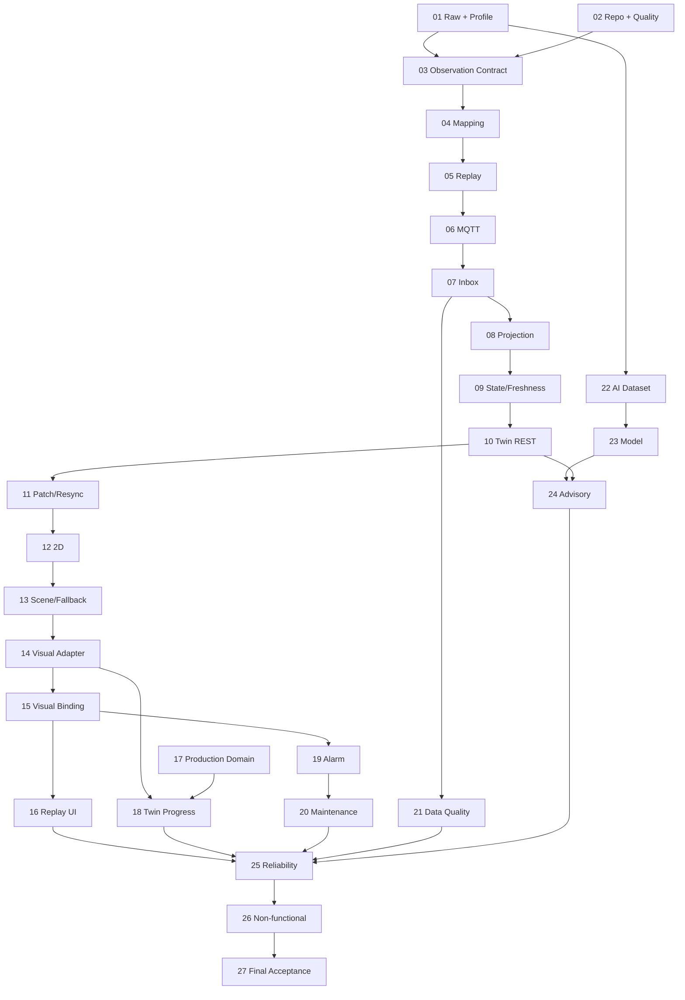

# ForgeSync 테스트 가능한 구현 Step

## 1. 이 문서의 사용법

각 Step은 독립적으로 리뷰하고 merge할 수 있는 최소 단위다. 한 Step이 1~2 작업일을 넘거나 서로 다른 Context의 정책 결정을 둘 이상 포함하면 하위 이슈로 더 나눈다. 단, 인프라 파일만 존재하고 검증 가능한 동작이 없는 상태로 merge하지 않는다.

모든 Step은 다음 순서를 따른다.

```text
인수 조건 고정
→ 실패 테스트 작성/확인
→ 최소 구현
→ 리팩터링과 아키텍처 검사
→ 관련 전체 테스트
→ 문서/Verification Ledger 갱신
```

상태 표기 권장: `NOT_STARTED`, `IN_PROGRESS`, `BLOCKED`, `DONE`. `DONE`은 아래 테스트와 완료 조건이 모두 충족된 경우에만 사용한다.

### Roadmap 식별자 사용 제한

`Step 01`과 같은 Step 번호는 이 문서에서 진행 순서와 의존성을 표현하기 위한 관리용 식별자일 뿐 ForgeSync의 ubiquitous language나 안정적인 시스템 identity가 아니다.

- Step 번호는 문서의 roadmap 제목, 선행 조건, 추적 표에서만 사용한다.
- package/module, class/type/function/variable, 테스트 이름에 Step 번호를 사용하지 않는다.
- CLI, 설정, 환경변수, 파일/디렉터리, fixture 이름에 Step 번호를 사용하지 않는다.
- API/DB/MQTT/log/metric 및 `sourceSetId`, `artifactId`, `processingRunId`에 Step 번호를 사용하지 않는다.
- 구현 산출물은 도메인 기능, 원천 identity, 관찰 기간, schema/version으로 명명한다.

예를 들어 `nist-mazak01-step01`, `Step01Profiler`, `step_01_status`는 금지하며 `nist-mazak01-20161005`, `SourceProfiler`, `acquisition_status`처럼 명명한다. 이 규칙은 `docs/**`를 제외한 정적 naming boundary test로 검증한다.

---

## Phase A — Data Truth Foundation

### Step 01 — 원천 데이터 불변 보존과 Human-readable Profile

**목적**: 선택한 NIST Mazak01 원천 데이터와 Devices.xml의 byte를 먼저 그대로 보존하고, 원본을 수정하지 않는 별도 처리 과정으로 사람이 검토할 수 있는 source profile을 생성한다.

**구현 범위**

- 최소 `SourceReader`, `ArtifactStore`, `ChecksumVerifier`, `RawRecordDecoder`, `ProfileGenerator` Port/Adapter 골격
- `SourceArtifact` manifest와 Processing Run metadata
- `datasets/raw/...` 저장 규칙 또는 대용량 원본을 위한 외부 저장 참조 규칙
- `profile.json`과 `profile.md`: record 수, 시간 범위, machine/DataItem 목록, category/type/unit, invalid/unknown, semantic coverage, sample locator
- 재현 명령과 작은 golden fixture
- raw license/download 가능성 및 확인 결과를 Verification Ledger에 기록

**의도적으로 제외**: MQTT, Spring ingestion, Twin state, 완전한 canonical schema, UI.

**테스트**

1. Golden fixture의 ingest 전후 byte와 SHA-256이 동일하다.
2. 같은 byte를 다시 수집해도 content identity가 안정적이며 원본을 덮어쓰지 않는다.
3. parser가 실패하도록 만든 record에서도 artifact와 source locator를 조회할 수 있다.
4. 같은 artifact/parser version으로 profile을 두 번 만들면 volatile 수집 시간을 제외한 결과가 같다.
5. unknown DataItem이 profile의 unknown count와 표본에 나타난다.
6. 원본 파일 일부만 저장된 경우 완료 artifact로 등록되지 않는다.

**완료 조건**

- manifest의 checksum으로 raw artifact를 검증할 수 있다.
- `profile.md`만 읽어도 실제 확인된 grammar, category, unit, 시간 범위와 미확인 사항을 알 수 있다.
- profile의 각 예시는 artifact와 locator로 원본까지 추적된다.
- Raw와 generated profile의 디렉터리/lifecycle이 분리된다.
- [ADR-020](../adr/ADR-020-raw-source-preservation.md)과 [Raw 파이프라인](../data/raw-to-canonical-pipeline.md)에 구현이 부합한다.

**선행 조건**: 없음. 외부 원본 획득이 막히면 검증된 작은 fixture로 도구와 계약을 완성하되 실제 dataset 상태는 `BLOCKED`/`TO_VERIFY`로 표시한다.

### Step 02 — Monorepo 실행 골격과 품질 명령

**목적**: Edge, API, Web, AI, Virtual Controller가 독립적으로 빌드되고 공통 검증 명령으로 검사되는 최소 저장소를 만든다.

**구현 범위**

- PRD 109의 `apps`, `contracts`, `tests`, `infra`, `config` 구조
- 언어별 format/lint/type/unit 명령
- root 단일 검증 진입점과 CI
- domain/application/adapter package boundary 골격

**테스트**

- 각 app smoke test가 시작 가능한 module/config를 검증한다.
- architecture test가 domain → framework 의존을 의도적으로 넣은 fixture를 거절한다.
- root 검증 명령이 한 app의 실패를 정상 성공으로 숨기지 않는다.

**완료 조건**: 깨끗한 checkout에서 문서화된 한 명령으로 lint, type/compile, unit, architecture test가 재현된다.

**선행 조건**: Step 01 산출물의 위치를 보존해야 한다.

### Step 03 — Versioned Observation Contract

**목적**: SAMPLE/EVENT/CONDITION 의미와 provenance를 보존하는 언어 중립 Canonical Envelope를 확정한다.

**구현 범위**

- versioned JSON Schema/OpenAPI 호환 schema
- `schemaVersion`, identity, machine, source/replay time, ordering, provenance, payload, `rawRecordId`, `mappingVersion`
- 각 variant의 valid/invalid fixture와 호환성 정책
- 생성된 언어 타입 또는 명시적 mapping layer

**테스트**

- 세 variant golden fixture가 schema를 통과한다.
- 필수 identity/provenance/time 누락, category-payload 불일치, 잘못된 unit/value가 거절된다.
- producer가 생성한 fixture를 API consumer validator가 그대로 수락한다.
- 알 수 없는 optional field는 정책에 맞게 처리되고 schemaVersion 불일치는 명시적으로 실패한다.

**완료 조건**: Edge와 API가 복제한 DTO가 아니라 같은 versioned contract와 fixture에 대해 테스트된다.

**선행 조건**: Step 01의 실제 profile.

### Step 04 — Metadata Catalog와 Canonical Mapping

**목적**: Devices.xml metadata를 기준으로 RawRecord를 추측 없이 Canonical Observation으로 변환한다.

**구현 범위**

- DataItem catalog와 명시적 mapping table
- category/type/subtype/unit 보존
- `ObservationMapper` 순수 도메인 정책과 mapping report
- unknown/unsupported 경로와 mappingVersion

**테스트**

- RPM, feed, execution, tool, program 대표 golden mapping.
- SAMPLE을 EVENT로, CONDITION을 Alarm으로 바꾸지 않는 category 보존 테스트.
- source에 없는 unit/sequence를 만들어내지 않는 테스트.
- unknown DataItem이 저장/집계되며 canonical metric으로 오인되지 않는 테스트.
- 모든 canonical 결과가 rawRecordId와 provenance로 원본을 역추적할 수 있는 테스트.

**완료 조건**: profile의 mapped/parsed 비율과 미매핑 목록이 결정적으로 생성되고 근거 없는 mapping이 0개다.

**선행 조건**: Step 03.

### Step 05 — ReplaySession, Clock, Ordering

**목적**: historical source identity를 훼손하지 않고 pause/speed 가능한 결정적 replay stream을 만든다.

**구현 범위**

- `ReplaySession`, `ReplayClock`, `ReplaySequence`, 상태 전이
- sourceObservedAt/replayPublishedAt 분리
- 1x/10x/100x, pause/resume
- ordering tie-break 규칙

**테스트**

- 고정 Clock에서 1x/10x가 같은 순서와 다른 publish interval을 만든다.
- pause 중 sequence와 source progression이 멈추고 resume 후 중복 없이 이어진다.
- 동일 timestamp는 sourceEventKey로 결정적으로 정렬된다.
- source agent identity가 없는 경우 값을 조작해 만들지 않는다.
- 잘못된 speed나 종료된 session의 resume를 거절한다.

**완료 조건**: 같은 artifact와 설정으로 event sequence/hash가 재현된다.

**선행 조건**: Step 04.

---

## Phase B — Reliable Ingestion and Twin

### Step 06 — MQTT QoS1 Publisher/Consumer 계약

**목적**: versioned Observation을 MQTT QoS1으로 전달하되 at-least-once 특성을 명시적으로 노출한다.

**구현 범위**

- topic naming, message key/header, payload size/error 정책
- Edge publisher Port와 MQTT Adapter
- API inbound Adapter의 schema validation 및 reject telemetry

**테스트**

- 실제 broker 통합 테스트에서 valid message가 전달된다.
- duplicate delivery fixture가 consumer에 두 번 도착할 수 있음을 재현한다.
- invalid schema/version은 domain use case 진입 전 거절되고 오류 지표가 증가한다.
- broker unavailable 시 bounded retry 후 artifact/replay 위치를 잃지 않고 실패한다.

**완료 조건**: QoS1은 at-least-once이며 exactly-once라고 주장하지 않는 계약 문서와 통합 테스트가 있다.

**선행 조건**: Step 03, Step 05.

### Step 07 — Inbox + Observation 원자적 저장

**목적**: MQTT 중복 전달을 선언된 DB transaction 경계 안에서 effectively-once business processing으로 바꾼다.

**구현 범위**

- Inbox unique key `(replaySessionId, sourceEventKey)`
- Canonical observation history와 ingestion result
- application use case와 transaction boundary
- rawRecord/provenance 참조

**테스트**

- 같은 message를 순차/동시로 반복해도 Inbox와 business acceptance가 한 번이다.
- observation insert 실패 시 Inbox만 commit되지 않는다.
- DB integration test에서 unique constraint가 최종 방어선으로 동작한다.
- invalid/duplicate/accepted 결과가 서로 구분된다.

**완료 조건**: duplicate 100회 주입 시 business 처리 1회이며, transaction의 부분 성공이 없다.

**선행 조건**: Step 06.

### Step 08 — Latest Observation Projection과 Out-of-order Guard

**목적**: observation history는 보존하면서 현재 metric/event/condition projection이 과거 데이터로 rollback하지 않게 한다.

**구현 범위**

- `ObservationOrderingPolicy`
- latest sample/event/condition projection
- accepted/late/duplicate projection result
- projection timestamp와 version

**테스트**

- 최신 이후 과거 event를 넣어도 history는 정책대로 보존되고 current는 유지된다.
- replaySequence/sourceObservedAt/sourceEventKey 우선순위 경계 테스트.
- 같은 입력을 재처리한 결과가 결정적이다.
- projection update와 version 증가가 같은 transaction에서 원자적이다.

**완료 조건**: ordering 규칙이 pure unit test와 실제 DB concurrent integration test에서 모두 검증된다.

**선행 조건**: Step 07.

### Step 09 — Equipment State와 Freshness Projection

**목적**: latest observations를 Connectivity/Execution/Health와 FRESH/LAGGING/STALE로 투영한다.

**구현 범위**

- 상태 Value Object와 허용 mapping
- 주입 가능한 `FreshnessPolicy`: `<=2s`, `>2s..10s`, `>10s`
- historical source time이 아닌 projected/received wall-clock 사용
- STALE 시 visual animation을 중단할 수 있는 명시적 상태

**테스트**

- 정확히 2초와 10초 경계의 분류.
- source time이 오래되어도 방금 replay/project된 값은 FRESH임을 검증.
- unknown/unavailable input이 가짜 NORMAL/ONLINE을 만들지 않음.
- 과거 observation이 EquipmentState를 rollback하지 않음.

**완료 조건**: Clock을 고정한 빠른 unit test로 모든 상태 경계를 재현할 수 있다.

**선행 조건**: Step 08.

### Step 10 — Versioned Twin Snapshot REST API

**목적**: 2D와 3D가 공유할 권위 있는 human-readable Twin snapshot을 제공한다.

**구현 범위**

- PRD 27의 섹션을 가진 DTO, P0 필드부터 점진 구현
- `TwinVersion`, consistency, freshness, field-level provenance
- Domain → API DTO Mapper와 query port
- machine not-found/error contract

**테스트**

- golden Twin DTO contract test.
- REAL:NIST metric과 SIM layout 등 필드별 provenance가 섞이지 않는 테스트.
- DTO mapper가 JPA entity/framework type을 노출하지 않는 architecture test.
- not-found와 unavailable 상태 API 테스트.

**완료 조건**: 한 API 응답에서 RPM/execution/tool/program/freshness/version/provenance를 사람이 해석할 수 있다.

**선행 조건**: Step 09.

### Step 11 — WebSocket Patch와 REST Resync

**목적**: WebSocket을 알림/patch로 사용하고 gap 발생 시 REST snapshot으로 권위 상태를 복구한다.

**구현 범위**

- patch schema와 `baseVersion`/`targetVersion`
- frontend version guard 상태 기계
- reconnect → REST resync → resubscribe 순서
- connection/consistency 표시

**테스트**

- 연속 patch 적용, duplicate patch 무시, gap/역행 patch 감지.
- disconnect 후 freshness가 증가해 STALE이 되는 fake-timer 테스트.
- reconnect 시 REST가 완료되기 전에 patch를 무질서하게 적용하지 않는 component/integration test.
- invalid patch가 기존 snapshot을 훼손하지 않는 테스트.

**완료 조건**: 네트워크 단절/복구 E2E에서 version과 화면 값이 서버 snapshot으로 수렴한다.

**선행 조건**: Step 10.

---

## Phase C — Operational UI and Spatial Twin

### Step 12 — 2D Machine Detail Vertical Slice

**목적**: 3D 없이도 핵심 Twin 상태와 provenance를 사용할 수 있는 접근 가능한 2D 화면을 만든다.

**구현 범위**

- `/machines/:id` route와 Identity/State/Metrics/Data Quality/Provenance P0 section
- loading/empty/error/reconnecting/stale 상태
- REST snapshot + patch store

**테스트**

- RPM/execution/tool/program/freshness/provenance 렌더링 component test.
- missing optional metric이 0으로 오인되지 않고 unavailable로 표시되는 테스트.
- keyboard 탐색과 주요 label 접근성 테스트.
- E2E에서 replay event가 2D 값을 변경한다.

**완료 조건**: WebGL 없이 Step 10의 모든 P0 정보를 보고 연결 상태를 판단할 수 있다.

**선행 조건**: Step 11.

### Step 13 — FactoryScene Shell과 3D Failure Isolation

**목적**: 3D scene의 성공 여부가 2D 앱의 생존 여부와 분리된 `/factory` shell을 만든다.

**구현 범위**

- React Three Fiber scene/error boundary/lazy loading
- asset manifest, 라이선스 metadata, generic primitive fallback
- 2D/3D/SPLIT toggle과 3D unavailable 안내

**테스트**

- WebGL initialization exception에서 2D panel이 계속 동작.
- GLB 404/invalid asset에서 fallback primitive 표시.
- asset provenance/license manifest schema 검증.
- 3D bundle load 실패가 전체 route error boundary로 전파되지 않는 component/E2E 테스트.

**완료 조건**: 3D 정상/asset 실패/WebGL 실패 세 경우에 `/factory`가 사용 가능하다.

**선행 조건**: Step 12.

### Step 14 — MachineVisualState Adapter와 선택 동기화

**목적**: backend DTO를 renderer에서 분리하고 3D 선택과 2D 상세 panel을 같은 machine identity로 연결한다.

**구현 범위**

- 순수 `Twin → MachineVisualState` mapper
- FactoryScene/MachineTwin 최소 component
- 선택 store, floating label, right panel 연결
- simulated spatial metadata provenance

**테스트**

- Twin fixture의 모든 visual field mapping unit test.
- machine click 후 selected cue와 right panel machineId 일치.
- backend DTO optional field가 빠져도 renderer가 안전한 default/unknown을 사용.
- 3D component가 backend response type을 직접 import하지 않는 boundary test.

**완료 조건**: 2D와 3D가 같은 Twin version과 machine을 표현하며 renderer는 독립 visual contract만 안다.

**선행 조건**: Step 13.

### Step 15 — Execution/RPM/Health/Stale Visual Binding

**목적**: Twin State 변화가 공간 장비의 의미 있는 시각 상태를 바꾸도록 한다.

**구현 범위**

- ACTIVE + rpm 기반의 정규화된 visual spindle animation
- execution/health/connectivity cue
- STALE 시 animation freeze/muted material/badge
- reduced motion와 색 이외 cue

**테스트**

- ACTIVE + rpm > 0 활성, STOPPED 또는 rpm 0 정지.
- STALE 전환 즉시 live-like animation 중단.
- WARNING/FAULT/STALE/selected cue mapping unit/component test.
- reduced-motion 설정과 접근성 label 테스트.
- NIST replay → backend → 2D RPM → 3D visual state E2E.

**완료 조건**: PRD 117의 3D 인수 조건이 자동화되어 통과한다. 회전 속도를 물리적으로 정확하다고 표시하지 않는다.

**선행 조건**: Step 14.

### Step 16 — Replay Controls와 Time Machine UI

**목적**: 사용자가 replay 상태, source/replay time, 속도, pause를 확인하고 제어한다.

**구현 범위**

- play/pause/speed/session state API와 UI
- REPLAY badge, source time, replay time, freshness
- timeline과 최소 event marker
- 2D/3D 동일 시점 동기화

**테스트**

- pause, resume, 1x/10x/100x API/domain test.
- UI control의 optimistic 상태가 server 거절 시 복구되는 테스트.
- source time/replay time/freshness가 서로 다른 label로 노출되는 테스트.
- pause/speed 변경이 2D와 3D에서 같은 version progression을 만드는 E2E.

**완료 조건**: PRD 119 Replay Acceptance가 자동화되고 keyboard만으로 핵심 제어가 가능하다.

**선행 조건**: Step 05, Step 15.

---

## Phase D — Manufacturing Operations

### Step 17 — Production Aggregate와 상태 전이

**목적**: simulated production의 `ProductionRequest → WorkOrder → OperationExecution → ProductionResult` 생명주기를 telemetry와 분리해 모델링한다.

**구현 범위**

- Entity/Value Object/Aggregate와 repository ports
- Routing, P0 PROCESS_TYPE capability
- Operation 상태 전이와 SIMULATED provenance
- telemetry PartCount와 ProductionResult의 명시적 분리

**테스트**

- 모든 허용 상태 전이와 완료 후 ACTIVE 같은 금지 전이.
- quantity 음수/불일치, dueAt/identity validation.
- capability 없는 machine assign 거절.
- NIST PartCount event가 ProductionResult 수량을 자동 갱신하지 않음.

**완료 조건**: framework 없는 domain unit test로 생산 lifecycle 전체를 표현할 수 있다.

**선행 조건**: Step 02의 모듈 경계.

### Step 18 — Operation Application/API와 Twin Progress

**목적**: 생산 작업을 machine에 할당하고 진행/결과를 Twin과 2D/3D에 SIM으로 표시한다.

**구현 범위**

- create/assign/start/pause/complete use case와 API
- transaction + business Outbox events
- Twin production context projection
- right panel과 spatial progress label

**테스트**

- API integration에서 assign→start→complete 정상 흐름.
- 동일 command 재시도 시 상태와 Outbox side effect 중복 없음.
- Twin/2D/3D progress 값과 provenance 일치.
- 실제 equipment command Adapter가 호출되지 않는 architecture/integration test.

**완료 조건**: simulated operation 전체 흐름과 결과가 이력/Twin에 남고 실제 제어와 연결되지 않는다.

**선행 조건**: Step 17, Step 14.

### Step 19 — Condition에서 Alarm으로의 명시적 규칙

**목적**: Source Condition을 보존하고 별도 정책으로 처리 가능한 Business Alarm을 만든다.

**구현 범위**

- Condition projection과 `ConditionToAlarmPolicy`
- Alarm aggregate: OPEN/ACKNOWLEDGED/RESOLVED
- machineId 공간 연결과 warning/fault marker
- business Outbox event

**테스트**

- Condition 자체 저장과 Alarm 생성이 별도임을 검증.
- rule 비대상 Condition은 Alarm을 만들지 않음.
- 중복 Condition이 같은 열린 Alarm을 증식시키지 않음.
- ACK/RESOLVE 허용/금지 전이와 idempotency.
- 2D 목록과 3D marker가 같은 alarmId/machineId를 사용하고 색 외 cue를 제공.

**완료 조건**: PRD 118 Alarm Spatial Acceptance가 자동화된다.

**선행 조건**: Step 15.

### Step 20 — Maintenance Workflow

**목적**: Alarm과 선택적으로 연결되는 독립 Maintenance 생명주기를 구현한다.

**구현 범위**

- request/assign/start/complete/cancel domain behavior
- Alarm/Machine ID 참조, audit, API/UI 최소 흐름
- `MAINTENANCE_REQUESTED` Outbox

**테스트**

- 허용/금지 전이와 actor/time audit.
- 없는/resolved alarm 연결 정책 검증.
- command retry에서 요청과 Outbox 중복 없음.
- Alarm resolve가 진행 중 Maintenance를 암묵적으로 완료하지 않음.

**완료 조건**: Maintenance 상태가 Alarm과 독립적으로 추적되고 Twin 상세에서 보인다.

**선행 조건**: Step 19.

### Step 21 — Data Quality Projection과 UI

**목적**: Validity, Completeness, Ordering, Duplication, Freshness, Semantic Coverage를 숨기지 않고 운영자에게 노출한다.

**구현 범위**

- 차원별 계산 policy와 machine/session 집계
- `/data-quality`와 Twin quality section
- 임계값 설정 및 provenance/evidence link

**테스트**

- invalid/unknown/duplicate/out-of-order fixture별 지표 증가.
- semantic coverage 분모/분자 0 및 partial mapping 경계.
- replay session 간 지표가 잘못 합쳐지지 않음.
- UI가 missing을 100% quality로 표현하지 않음.

**완료 조건**: Step 01 profile 지표와 runtime 지표의 정의 차이가 문서화되고 대표 장애를 UI에서 추적할 수 있다.

**선행 조건**: Step 07~09.

---

## Phase E — Advisory-first Intelligence

### Step 22 — AI Dataset Verification과 Reproducible Profile

**목적**: PHM2010을 우선 검증하고 불가하면 NASA Milling fallback을 근거와 함께 결정한다.

**구현 범위**

- download availability, archive hash/integrity, license/redistribution 확인
- raw artifact/manifest와 sensor/label profile
- dataset decision record와 Verification Ledger
- train/evaluation group identity 탐색

**테스트**

- archive/file checksum과 expected file/channel count 검증.
- malformed/missing channel/label을 profiler가 보고.
- 같은 artifact로 deterministic profile 생성.
- train/test candidate group overlap 탐지 테스트.

**완료 조건**: 선택 dataset이 `VERIFIED`되거나 fallback/blocked 상태와 근거가 명확하다. 외부 사실을 확인하기 전 PRIMARY라고 표현하지 않는다.

**선행 조건**: Step 01의 artifact 규칙 재사용.

### Step 23 — Feature/Model Pipeline과 Model Card

**목적**: 데이터 누수 없이 재현 가능한 baseline advisory model과 model card를 만든다.

**구현 범위**

- validation→filter/window→feature→group split→baseline train/evaluate
- E00 dummy와 최소 한 baseline
- versioned feature schema/model artifact
- dataset hash, split, metric, limitation, intended use가 있는 model card

**테스트**

- 동일 seed/artifact/config에서 feature hash와 metric 재현.
- 같은 cutter/cut group이 train/test에 동시에 등장하면 pipeline 실패.
- feature order/type가 model schema와 다르면 inference 거절.
- dummy baseline과 비교 metric 생성.

**완료 조건**: 성능 수치마다 dataset hash와 split 근거가 있고 `not for actual equipment control` 제한이 명시된다.

**선행 조건**: Step 22.

### Step 24 — AI Service와 Advisory Integration

**목적**: model 결과를 별도 출처의 Advisory로 제공하고 NIST 실제 설비 상태와 혼동하지 않는다.

**구현 범위**

- FastAPI input/output contract와 model metadata
- Factory API Advisory aggregate/use case
- LOW/MEDIUM/HIGH/UNKNOWN UI 및 `AI:<dataset>` provenance
- unavailable/timeout fallback

**테스트**

- valid/invalid feature vector contract test.
- service timeout/down에서 Twin 핵심 API가 동작하고 Advisory는 unavailable/UNKNOWN.
- HIGH Advisory가 Machine FAULT나 실제 command를 만들지 않음.
- UI에 model/dataset/provenance/limitation이 함께 표시됨.

**완료 조건**: NIST RPM과 별도 dataset advisory가 동일 Twin 화면에서 필드별 출처로 구분된다.

**선행 조건**: Step 23, Step 10.

---

## Phase F — Release Reliability

### Step 25 — End-to-end Reliability and Recovery

**목적**: PRD의 신뢰성 보장 경계와 주요 장애 복구를 하나의 자동화 suite로 고정한다.

**구현 범위**

- duplicate/out-of-order, MQTT restart, DB restart, WebSocket disconnect, AI down, asset/WebGL failure 시나리오
- 관찰 가능한 metric/log/correlation id
- 운영 runbook과 제한된 retry/backoff

**테스트**

- [테스트 전략](../testing/test-strategy.md)의 E2E-01~04 전체.
- MQTT/DB restart 후 재처리에서 business side effect 중복 없음.
- REST resync 후 UI version이 권위 snapshot에 수렴.
- AI/3D 장애가 2D operational flow를 중단하지 않음.

**완료 조건**: 각 장애의 기대 상태, 자동 복구/수동 복구, 데이터 유실 여부가 테스트 결과와 runbook에 기록된다.

**선행 조건**: Step 06~24 중 출시 범위 전체.

### Step 26 — 성능, 보안, 접근성, Visual Baseline

**목적**: 기능 완료를 측정 가능한 비기능 baseline과 안전한 기본값으로 마무리한다.

**구현 범위**

- 5/20 machine FPS, frame time, heap, asset load, patch rate, React commit 측정
- 100 lightweight machine은 P2 실험으로 별도 표기
- schema validation, CORS explicit, parameter binding, secret scan, dependency scan, container non-root 검토
- normal/warning/fault/stale/selected/replay-paused visual baseline
- keyboard, screen-reader cue, reduced motion 검토

**테스트**

- 반복 가능한 browser performance script와 환경 metadata.
- 대표 visual regression과 asset fallback screenshot.
- automated accessibility scan + 핵심 흐름 수동 keyboard checklist.
- dependency/secret/security configuration test.
- 입력 payload size/invalid command allowlist 경계 테스트.

**완료 조건**: 수치를 산업 SLA로 과장하지 않고 측정 환경과 함께 기록하며, 실패한 기준에는 owner와 후속 Step이 있다.

**선행 조건**: Step 25.

### Step 27 — Final Traceability and Demo Acceptance

**목적**: PRD Definition of Done, 구현, 자동 테스트, 사용자 데모 사이의 추적성을 완성한다.

**구현 범위**

- PRD 117~121, 131, 140을 test/report/demo 단계에 연결
- Verification Ledger 최종 검토
- README 주장, architecture diagrams, 실행/복구 절차
- known limitation과 P1/P2 backlog

**테스트**

- 깨끗한 환경에서 setup→raw verify→replay→2D/3D→operation→alarm→advisory 데모 smoke test.
- 모든 contract link와 문서 내부 link 검사.
- PRD DoD 항목마다 test ID 또는 수동 근거 존재 여부 검사.
- 금지된 claim이 사용자 문서에 없는지 review checklist로 검증.

**완료 조건**: PRD 140의 각 항목에 통과 근거가 있고, 미완료 항목은 완료로 표시하지 않은 채 명시적 backlog/blocker로 남는다.

**선행 조건**: Step 26.

---

## 2. Step 간 핵심 의존 흐름



## 3. Step 분할 기준

다음 상황이면 번호를 `Step 08a`, `Step 08b`처럼 나누되 각 하위 Step에도 테스트와 완료 조건을 둔다.

- schema와 runtime migration을 동시에 바꾼다.
- Domain 규칙과 UI 표현을 독립적으로 검증할 수 있다.
- 외부 dataset/asset 결정이 구현을 막는다.
- 한 Step이 둘 이상의 PR에서 완료될 가능성이 높다.
- 리뷰자가 전체 diff를 한 번에 이해하기 어렵다.

반대로 테스트 없이 DTO/Repository/Controller만 각각 만드는 수평 분할은 피한다. 가능한 한 작은 vertical behavior를 끝낸다.
