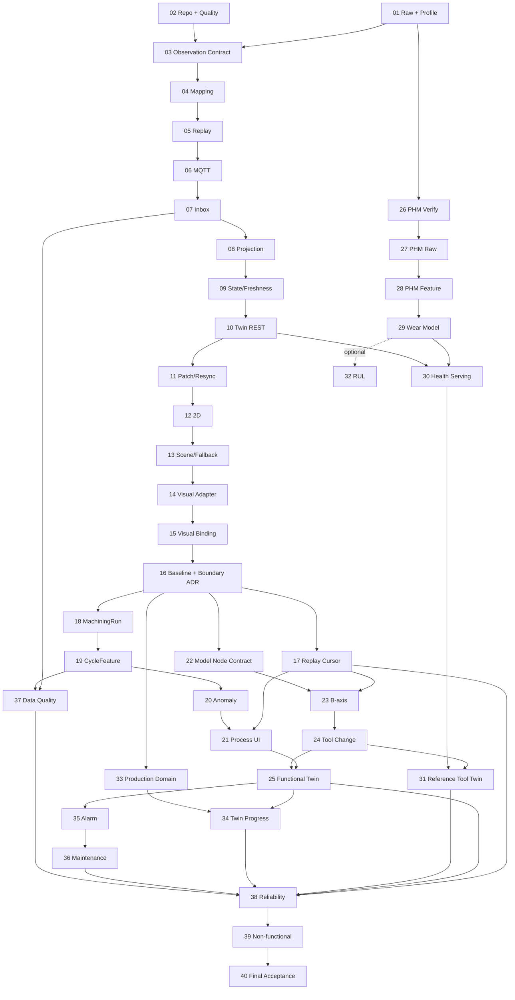

# ForgeSync 테스트 가능한 구현 Step

## 1. 이 문서의 사용법

각 Step은 독립적으로 리뷰하고 merge할 수 있는 최소 단위다. 한 Step이 1~2 작업일을 넘거나 서로 다른 Context의 정책 결정을 둘 이상 포함하면 하위 이슈로 더 나눈다. 단, 인프라 파일만 존재하고 검증 가능한 동작이 없는 상태로 merge하지 않는다.

모든 Step은 다음 순서를 따른다.

```text
인수 조건 고정
→ 실패 테스트 작성/확인
→ 최소 구현
→ 리팩터링과 아키텍처 검사
→ 관련 전체 테스트
→ 문서/Verification Ledger 갱신
```

상태 표기 권장: `NOT_STARTED`, `IN_PROGRESS`, `BLOCKED`, `DONE`. `DONE`은 아래 테스트와 완료 조건이 모두 충족된 경우에만 사용한다.

### Roadmap 식별자 사용 제한

`Step 01`과 같은 Step 번호는 이 문서에서 진행 순서와 의존성을 표현하기 위한 관리용 식별자일 뿐 ForgeSync의 ubiquitous language나 안정적인 시스템 identity가 아니다.

- Step 번호는 문서의 roadmap 제목, 선행 조건, 추적 표에서만 사용한다.
- package/module, class/type/function/variable, 테스트 이름에 Step 번호를 사용하지 않는다.
- CLI, 설정, 환경변수, 파일/디렉터리, fixture 이름에 Step 번호를 사용하지 않는다.
- API/DB/MQTT/log/metric 및 `sourceSetId`, `artifactId`, `processingRunId`에 Step 번호를 사용하지 않는다.
- 구현 산출물은 도메인 기능, 원천 identity, 관찰 기간, schema/version으로 명명한다.

예를 들어 `nist-mazak01-step01`, `Step01Profiler`, `step_01_status`는 금지하며 `nist-mazak01-20161005`, `SourceProfiler`, `acquisition_status`처럼 명명한다. 이 규칙은 `docs/**`를 제외한 정적 naming boundary test로 검증한다.

### Step 15 이후 재계획 기준

Step 01~15에서 만든 NIST ingestion, 권위 Twin, 2D, 격리된 3D scene과 `MachineVisualState`를
회귀 기준으로 유지한다. 이후 순서는 [NIST Mazak + PHM 2010 수정 가이드](../ForgeSync_NIST_Mazak_PHM2010_수정가이드.md)와
[Three.js Procedural 3D 수정 가이드](../ForgeSync_ThreeJS_Procedural_3D_수정가이드.md)의 방향을
현재 PRD와 Accepted ADR에 맞게 적용한다.

- NIST observation에서 재구성한 공정은 `DERIVED`, PHM 결과는 `REFERENCE`/`ESTIMATED`,
  Production 흐름은 `SIMULATED`로 분리한다. 서로를 같은 실제 장비의 측정값이나 결과로 연결하지 않는다.
- 관측에서 재구성하는 `MachiningRun`과 사용자가 생성하는 `OperationExecution`은 identity, lifecycle,
  저장소를 공유하지 않는다. 필요한 연결은 versioned public contract와 안정적인 ID로만 표현한다.
- 가이드의 `TwinState` 역할은 이미 존재하는 renderer 전용 `MachineVisualState`가 담당한다. 같은 의미의
  frontend 상태 모델을 병렬로 추가하지 않고, 검증된 새 visual field만 기존 contract에 추가한다.
- Three.js object는 backend DTO, MTConnect record, replay API를 직접 해석하지 않는다. 물리 좌표에서
  scene 좌표로의 변환과 node binding은 renderer Adapter에 두며, source에 없는 축·공구 형상을 만들지 않는다.
- v1 기본 모델은 procedural geometry다. Procedural/GLB가 따라야 할 최소 node contract는 유지하되,
  두 번째 provider가 실제로 필요하기 전에는 범용 asset framework를 만들지 않는다.
- ReplayClock과 권위 snapshot/version이 2D, 3D, run, anomaly의 공통 시간 기준이다. 각 화면이나
  Three.js animation loop가 별도 business clock을 만들지 않는다.
- PHM archive, channel, wear label, 라이선스가 실제로 검증되기 전에는 model 구현으로 넘어가지 않는다.
  RUL은 wear baseline과 leakage 검증 이후의 선택 범위이며 v1 완료를 막지 않는다.

---

## Phase A — Data Truth Foundation

### Step 01 — 원천 데이터 불변 보존과 Human-readable Profile

**목적**: 선택한 NIST Mazak01 원천 데이터와 Devices.xml의 byte를 먼저 그대로 보존하고, 원본을 수정하지 않는 별도 처리 과정으로 사람이 검토할 수 있는 source profile을 생성한다.

**구현 범위**

- 최소 `SourceReader`, `ArtifactStore`, `ChecksumVerifier`, `RawRecordDecoder`, `ProfileGenerator` Port/Adapter 골격
- `SourceArtifact` manifest와 Processing Run metadata
- `datasets/raw/...` 저장 규칙 또는 대용량 원본을 위한 외부 저장 참조 규칙
- `profile.json`과 `profile.md`: record 수, 시간 범위, machine/DataItem 목록, category/type/unit, invalid/unknown, semantic coverage, sample locator
- 재현 명령과 작은 golden fixture
- raw license/download 가능성 및 확인 결과를 Verification Ledger에 기록

**의도적으로 제외**: MQTT, Spring ingestion, Twin state, 완전한 canonical schema, UI.

**테스트**

1. Golden fixture의 ingest 전후 byte와 SHA-256이 동일하다.
2. 같은 byte를 다시 수집해도 content identity가 안정적이며 원본을 덮어쓰지 않는다.
3. parser가 실패하도록 만든 record에서도 artifact와 source locator를 조회할 수 있다.
4. 같은 artifact/parser version으로 profile을 두 번 만들면 volatile 수집 시간을 제외한 결과가 같다.
5. unknown DataItem이 profile의 unknown count와 표본에 나타난다.
6. 원본 파일 일부만 저장된 경우 완료 artifact로 등록되지 않는다.

**완료 조건**

- manifest의 checksum으로 raw artifact를 검증할 수 있다.
- `profile.md`만 읽어도 실제 확인된 grammar, category, unit, 시간 범위와 미확인 사항을 알 수 있다.
- profile의 각 예시는 artifact와 locator로 원본까지 추적된다.
- Raw와 generated profile의 디렉터리/lifecycle이 분리된다.
- [ADR-020](../adr/ADR-020-raw-source-preservation.md)과 [Raw 파이프라인](../data/raw-to-canonical-pipeline.md)에 구현이 부합한다.

**선행 조건**: 없음. 외부 원본 획득이 막히면 검증된 작은 fixture로 도구와 계약을 완성하되 실제 dataset 상태는 `BLOCKED`/`TO_VERIFY`로 표시한다.

### Step 02 — Monorepo 실행 골격과 품질 명령

**목적**: Edge, API, Web, AI, Virtual Controller가 독립적으로 빌드되고 공통 검증 명령으로 검사되는 최소 저장소를 만든다.

**구현 범위**

- PRD 109의 `apps`, `contracts`, `tests`, `infra`, `config` 구조
- 언어별 format/lint/type/unit 명령
- root 단일 검증 진입점과 에이전트의 push 전 검증 절차
- domain/application/adapter package boundary 골격

**테스트**

- 각 app smoke test가 시작 가능한 module/config를 검증한다.
- architecture test가 domain → framework 의존을 의도적으로 넣은 fixture를 거절한다.
- root 검증 명령이 한 app의 실패를 정상 성공으로 숨기지 않는다.

**완료 조건**: 깨끗한 checkout에서 문서화된 한 명령으로 lint, type/compile, unit, architecture test가
재현되며, 에이전트는 push 직전에 이 명령을 실행하고 실패한 변경을 push하지 않는다. 현재 단계에서는
동일 검사를 수행하는 hosted GitHub Workflow를 별도로 운영하지 않는다.

**선행 조건**: Step 01 산출물의 위치를 보존해야 한다.

### Step 03 — Versioned Observation Contract

**목적**: SAMPLE/EVENT/CONDITION 의미와 provenance를 보존하는 언어 중립 Canonical Envelope를 확정한다.

**구현 범위**

- versioned JSON Schema/OpenAPI 호환 schema
- `schemaVersion`, identity, machine, source/replay time, ordering, provenance, payload, `rawRecordId`, `mappingVersion`
- 각 variant의 valid/invalid fixture와 호환성 정책
- 생성된 언어 타입 또는 명시적 mapping layer

**테스트**

- 세 variant golden fixture가 schema를 통과한다.
- 필수 identity/provenance/time 누락, category-payload 불일치, 잘못된 unit/value가 거절된다.
- producer가 생성한 fixture를 API consumer validator가 그대로 수락한다.
- 알 수 없는 optional field는 정책에 맞게 처리되고 schemaVersion 불일치는 명시적으로 실패한다.

**완료 조건**: Edge와 API가 복제한 DTO가 아니라 같은 versioned contract와 fixture에 대해 테스트된다.

**선행 조건**: Step 01의 실제 profile.

### Step 04 — Metadata Catalog와 Canonical Mapping

**목적**: Devices.xml metadata를 기준으로 RawRecord를 추측 없이 Canonical Observation으로 변환한다.

**구현 범위**

- DataItem catalog와 명시적 mapping table
- category/type/subtype/unit 보존
- `ObservationMapper` 순수 도메인 정책과 mapping report
- unknown/unsupported 경로와 mappingVersion

**테스트**

- RPM, feed, execution, tool, program 대표 golden mapping.
- SAMPLE을 EVENT로, CONDITION을 Alarm으로 바꾸지 않는 category 보존 테스트.
- source에 없는 unit/sequence를 만들어내지 않는 테스트.
- unknown DataItem이 저장/집계되며 canonical metric으로 오인되지 않는 테스트.
- 모든 canonical 결과가 rawRecordId와 provenance로 원본을 역추적할 수 있는 테스트.

**완료 조건**: profile의 mapped/parsed 비율과 미매핑 목록이 결정적으로 생성되고 근거 없는 mapping이 0개다.

**선행 조건**: Step 03.

### Step 05 — ReplaySession, Clock, Ordering

**목적**: historical source identity를 훼손하지 않고 pause/speed 가능한 결정적 replay stream을 만든다.

**구현 범위**

- `ReplaySession`, `ReplayClock`, `ReplaySequence`, 상태 전이
- sourceObservedAt/replayPublishedAt 분리
- 1x/10x/100x, pause/resume
- ordering tie-break 규칙

**테스트**

- 고정 Clock에서 1x/10x가 같은 순서와 다른 publish interval을 만든다.
- pause 중 sequence와 source progression이 멈추고 resume 후 중복 없이 이어진다.
- 동일 timestamp는 sourceEventKey로 결정적으로 정렬된다.
- source agent identity가 없는 경우 값을 조작해 만들지 않는다.
- 잘못된 speed나 종료된 session의 resume를 거절한다.

**완료 조건**: 같은 artifact와 설정으로 event sequence/hash가 재현된다.

**선행 조건**: Step 04.

---

## Phase B — Reliable Ingestion and Twin

### Step 06 — MQTT QoS1 Publisher/Consumer 계약

**목적**: versioned Observation을 MQTT QoS1으로 전달하되 at-least-once 특성을 명시적으로 노출한다.

**구현 범위**

- topic naming, message key/header, payload size/error 정책
- Edge publisher Port와 MQTT Adapter
- API inbound Adapter의 schema validation 및 reject telemetry

**테스트**

- 실제 broker 통합 테스트에서 valid message가 전달된다.
- duplicate delivery fixture가 consumer에 두 번 도착할 수 있음을 재현한다.
- invalid schema/version은 domain use case 진입 전 거절되고 오류 지표가 증가한다.
- broker unavailable 시 bounded retry 후 artifact/replay 위치를 잃지 않고 실패한다.

**완료 조건**: QoS1은 at-least-once이며 exactly-once라고 주장하지 않는 계약 문서와 통합 테스트가 있다.

**선행 조건**: Step 03, Step 05.

### Step 07 — Inbox + Observation 원자적 저장

**목적**: MQTT 중복 전달을 선언된 DB transaction 경계 안에서 effectively-once business processing으로 바꾼다.

**구현 범위**

- Inbox unique key `(replaySessionId, sourceEventKey)`
- Canonical observation history와 ingestion result
- application use case와 transaction boundary
- rawRecord/provenance 참조

**테스트**

- 같은 message를 순차/동시로 반복해도 Inbox와 business acceptance가 한 번이다.
- observation insert 실패 시 Inbox만 commit되지 않는다.
- DB integration test에서 unique constraint가 최종 방어선으로 동작한다.
- invalid/duplicate/accepted 결과가 서로 구분된다.

**완료 조건**: duplicate 100회 주입 시 business 처리 1회이며, transaction의 부분 성공이 없다.

**선행 조건**: Step 06.

### Step 08 — Latest Observation Projection과 Out-of-order Guard

**목적**: observation history는 보존하면서 현재 metric/event/condition projection이 과거 데이터로 rollback하지 않게 한다.

**구현 범위**

- `ObservationOrderingPolicy`
- latest sample/event/condition projection
- accepted/late/duplicate projection result
- projection timestamp와 version

**테스트**

- 최신 이후 과거 event를 넣어도 history는 정책대로 보존되고 current는 유지된다.
- replaySequence/sourceObservedAt/sourceEventKey 우선순위 경계 테스트.
- 같은 입력을 재처리한 결과가 결정적이다.
- projection update와 version 증가가 같은 transaction에서 원자적이다.

**완료 조건**: ordering 규칙이 pure unit test와 실제 DB concurrent integration test에서 모두 검증된다.

**선행 조건**: Step 07.

### Step 09 — Equipment State와 Freshness Projection

**목적**: latest observations를 Connectivity/Execution/Health와 FRESH/LAGGING/STALE로 투영한다.

**구현 범위**

- 상태 Value Object와 허용 mapping
- 주입 가능한 `FreshnessPolicy`: `<=2s`, `>2s..10s`, `>10s`
- historical source time이 아닌 projected/received wall-clock 사용
- STALE 시 visual animation을 중단할 수 있는 명시적 상태

**테스트**

- 정확히 2초와 10초 경계의 분류.
- source time이 오래되어도 방금 replay/project된 값은 FRESH임을 검증.
- unknown/unavailable input이 가짜 NORMAL/ONLINE을 만들지 않음.
- 과거 observation이 EquipmentState를 rollback하지 않음.

**완료 조건**: Clock을 고정한 빠른 unit test로 모든 상태 경계를 재현할 수 있다.

**선행 조건**: Step 08.

### Step 10 — Versioned Twin Snapshot REST API

**목적**: 2D와 3D가 공유할 권위 있는 human-readable Twin snapshot을 제공한다.

**구현 범위**

- PRD 27의 섹션을 가진 DTO, P0 필드부터 점진 구현
- `TwinVersion`, consistency, freshness, field-level provenance
- Domain → API DTO Mapper와 query port
- machine not-found/error contract

**테스트**

- golden Twin DTO contract test.
- REAL:NIST metric과 SIM layout 등 필드별 provenance가 섞이지 않는 테스트.
- DTO mapper가 JPA entity/framework type을 노출하지 않는 architecture test.
- not-found와 unavailable 상태 API 테스트.

**완료 조건**: 한 API 응답에서 RPM/execution/tool/program/freshness/version/provenance를 사람이 해석할 수 있다.

**선행 조건**: Step 09.

### Step 11 — WebSocket Patch와 REST Resync

**상태**: `DONE` — 실제 Chromium에서 단절, STALE, REST resync, WebSocket 재구독과 권위
snapshot 수렴을 자동화했다.

**목적**: WebSocket을 알림/patch로 사용하고 gap 발생 시 REST snapshot으로 권위 상태를 복구한다.

**구현 범위**

- patch schema와 `baseVersion`/`targetVersion`
- frontend version guard 상태 기계
- reconnect → REST resync → resubscribe 순서
- connection/consistency 표시

**테스트**

- 연속 patch 적용, duplicate patch 무시, gap/역행 patch 감지.
- disconnect 후 freshness가 증가해 STALE이 되는 fake-timer 테스트.
- reconnect 시 REST가 완료되기 전에 patch를 무질서하게 적용하지 않는 component/integration test.
- invalid patch가 기존 snapshot을 훼손하지 않는 테스트.

**완료 조건**: 네트워크 단절/복구 E2E에서 version과 화면 값이 서버 snapshot으로 수렴한다.

**선행 조건**: Step 10.

---

## Phase C — Operational UI and Spatial Twin

### Step 12 — 2D Machine Detail Vertical Slice

**상태**: `DONE` — 접근 가능한 route와 P0 section, 명시적인 unavailable/error 상태, 실제 replay
업데이트 E2E를 자동화했다.

**목적**: 3D 없이도 핵심 Twin 상태와 provenance를 사용할 수 있는 접근 가능한 2D 화면을 만든다.

**구현 범위**

- `/machines/:id` route와 Identity/State/Metrics/Data Quality/Provenance P0 section
- loading/empty/error/reconnecting/stale 상태
- REST snapshot + patch store

**테스트**

- RPM/execution/tool/program/freshness/provenance 렌더링 component test.
- missing optional metric이 0으로 오인되지 않고 unavailable로 표시되는 테스트.
- keyboard 탐색과 주요 label 접근성 테스트.
- E2E에서 replay event가 2D 값을 변경한다.

**완료 조건**: WebGL 없이 Step 10의 모든 P0 정보를 보고 연결 상태를 판단할 수 있다.

**선행 조건**: Step 11.

### Step 13 — FactoryScene Shell과 3D Failure Isolation

**상태**: `DONE` — `/factory` shell, lazy R3F scene, asset/WebGL/bundle failure boundary와
PostgreSQL/MQTT/API/Web을 포함한 Chromium E2E를 자동화했다.

**목적**: 3D scene의 성공 여부가 2D 앱의 생존 여부와 분리된 `/factory` shell을 만든다.

**구현 범위**

- React Three Fiber scene/error boundary/lazy loading
- asset manifest, 라이선스 metadata, generic primitive fallback
- 2D/3D/SPLIT toggle과 3D unavailable 안내

**테스트**

- WebGL initialization exception에서 2D panel이 계속 동작.
- GLB 404/invalid asset에서 fallback primitive 표시.
- asset provenance/license manifest schema 검증.
- 3D bundle load 실패가 전체 route error boundary로 전파되지 않는 component/E2E 테스트.

**완료 조건**: 3D 정상/asset 실패/WebGL 실패 세 경우에 `/factory`가 사용 가능하다.

**선행 조건**: Step 12.

### Step 14 — MachineVisualState Adapter와 선택 동기화

**상태**: `DONE` — Mazak01 Twin을 renderer 전용 visual contract로 변환하고, 단일 live session을
2D 상세와 3D가 공유하도록 구성했다. 장비/label 선택, Twin version 일치, simulated layout provenance,
renderer import boundary를 unit/component/architecture/전체 runtime E2E로 검증했다.

**목적**: backend DTO를 renderer에서 분리하고 3D 선택과 2D 상세 panel을 같은 machine identity로 연결한다.

**구현 범위**

- 순수 `Twin → MachineVisualState` mapper
- FactoryScene/MachineTwin 최소 component
- 선택 store, floating label, right panel 연결
- simulated spatial metadata provenance

**테스트**

- Twin fixture의 모든 visual field mapping unit test.
- machine click 후 selected cue와 right panel machineId 일치.
- backend DTO optional field가 빠져도 renderer가 안전한 default/unknown을 사용.
- 3D component가 backend response type을 직접 import하지 않는 boundary test.

**완료 조건**: 2D와 3D가 같은 Twin version과 machine을 표현하며 renderer는 독립 visual contract만 안다.

**선행 조건**: Step 13.

### Step 15 — Execution/RPM/Health/Stale Visual Binding

**상태**: `DONE` — RPM을 비물리적 visual speed로 정규화하고 execution/health/connectivity cue,
STALE 즉시 정지와 muted 상태, OS 기본 및 화면 override reduced motion을 구현했다. 고정 Canonical
NIST ACTIVE/STOPPED/RPM 관찰값의 전체 runtime E2E와 unit/component/접근성 테스트로 검증했다.
절차형 fallback을 외함/가공실/작업대/스핀들/조작반이 구분되는 범용 수직형 CNC로 개선하고,
시각 cue와 freshness 의미를 화면에서 설명한다. 당시 로컬 관찰용 fixture는 체크섬 고정 원본의 약
1시간 구간 337건을 1.5초 간격으로 발행했으며 원본 replay timing으로 주장하지 않는다. Step 17부터
`run-local`은 실제 ReplayClock 기반 제어 runtime을 사용한다.

**목적**: Twin State 변화가 공간 장비의 의미 있는 시각 상태를 바꾸도록 한다.

**구현 범위**

- ACTIVE + rpm 기반의 정규화된 visual spindle animation
- execution/health/connectivity cue
- STALE 시 animation freeze/muted material/badge
- reduced motion와 색 이외 cue

**테스트**

- ACTIVE + rpm > 0 활성, STOPPED 또는 rpm 0 정지.
- STALE 전환 즉시 live-like animation 중단.
- WARNING/FAULT/STALE/selected cue mapping unit/component test.
- reduced-motion 설정과 접근성 label 테스트.
- NIST replay → backend → 2D RPM → 3D visual state E2E.

**완료 조건**: PRD 117의 3D 인수 조건이 자동화되어 통과한다. 회전 속도를 물리적으로 정확하다고 표시하지 않는다.

**선행 조건**: Step 14.

### Step 16 — 완료 Baseline 동결과 Context 경계 결정

**상태**: `DONE` — Process Analytics를 독립 Bounded Context로 결정하고 ADR-032와 도메인
용어에 소유권, identity, 시간, transaction, provenance 경계를 기록했다. Canonical Observation만
`DERIVED` process fact로 허용하는 순수 policy와 Context 간 내부 의존을 막는 ArchUnit 검사를
추가했다. 고정 Twin/patch/E2E fixture와 visual 의미를 regression manifest로 잠갔으며 root,
PostgreSQL, MQTT/API/Web/Chromium 검증을 모두 통과했다.

**목적**: Step 01~15의 동작을 회귀 기준으로 고정하고, `MachiningRun`/공정 분석의 소유권과
Production·Equipment Twin·Intelligence 사이 계약을 구현 전에 결정한다.

**구현 범위**

- 고정 NIST fixture의 observation, Twin snapshot, visual state, 2D/3D 결과 baseline
- `MachiningRun`, `CycleFeature`, `AnomalyAssessment`의 Context 소유권과 public event/query 계약 ADR
- 도메인 용어, provenance, source/replay time, 재처리 version 규칙
- 기존 `MachineVisualState`와 새 functional node field의 호환성 정책

**테스트**

- 고정 fixture의 raw/canonical hash와 주요 Twin/visual 결과가 기존 baseline과 일치한다.
- architecture test가 공정 분석에서 Ingestion/Equipment Twin 내부 Repository 접근을 거절한다.
- domain policy test가 Canonical Observation은 `DERIVED`로 분류하고 simulated operation과
  reference health 입력을 거절한다.
- 새 optional visual field가 없는 기존 snapshot에서도 Step 15 화면이 동일하게 동작한다.

**완료 조건**: 새 Context, 용어, identity, transaction, provenance 소유권이 ADR과 도메인 용어에
기록되고 Step 01~15 회귀 suite가 통과한다. 결정 전에는 새 영속 모델을 추가하지 않는다.

**선행 조건**: Step 15.

### Step 17 — Replay Controls와 공통 시간 Cursor

**상태**: `DONE` (2026-09-04)

**목적**: 사용자가 replay 상태, source/replay time, 속도, pause를 제어하고 이후 모든 projection이
같은 ReplayClock과 권위 version을 사용하게 한다.

**구현 범위**

- play/pause/speed/session state API와 keyboard 가능한 UI
- REPLAY badge, source time, replay time, freshness, timeline cursor
- REST resync와 WebSocket patch를 거치는 단일 frontend replay state
- 2D/3D와 이후 run/anomaly consumer가 사용할 versioned replay cursor contract

**테스트**

- pause, resume, 1x/10x/100x의 domain/API 경계와 종료 session 제어 거절.
- UI optimistic 상태가 server 거절 시 권위 상태로 복구된다.
- source time, replay time, freshness가 서로 다른 label로 노출된다.
- pause/speed/scrub 이후 2D와 3D가 같은 snapshot version으로 수렴한다.

**완료 조건**: PRD 119 Replay Acceptance가 자동화되고 Three.js가 독립 business clock을 만들지 않는다.

**선행 조건**: Step 05, Step 11, Step 16.

---

## Phase D — Observed Process Analytics

### Step 18 — Deterministic MachiningRun Segmentation

**상태**: `DONE` (2026-09-04) — Execution 중심 rule `1.0.0`, immutable PostgreSQL processing
result, versioned REST 조회 계약을 구현했다. 같은 입력은 같은 ID/hash로 멱등 처리하고 late input은
기존 결과를 수정하지 않는 새 processing version으로 보존한다.

**목적**: NIST observation 이력을 수정하지 않고 연속 상태를 추적 가능한 가공 run으로 재구성한다.

**구현 범위**

- Step 16에서 결정한 Context의 `MachiningRun` Aggregate와 segmentation policy
- execution/program/spindle 신호를 사용하는 명시적 start/end rule과 rule version
- `PENDING/RUNNING/COMPLETED/INTERRUPTED/ABORTED/UNKNOWN` 전이
- source observation 범위, machine ID, source time, confidence/evidence를 가진 projection

**테스트**

- 같은 ordered observation과 rule version에서 run 경계와 결과 hash가 결정적이다.
- missing program, spindle gap, 중간 시작, 종료 없는 stream이 `UNKNOWN`/`INTERRUPTED`로 보존된다.
- late observation 재처리는 기존 run을 덮어쓰지 않고 새 processing result/version으로 남는다.
- telemetry PartCount, ProductionResult, `OperationExecution`을 run 결과로 자동 동일시하지 않는다.

**완료 조건**: 각 run을 시작/종료 근거 observation까지 추적할 수 있고 수동 검토 fixture와 경계가 일치한다.

**선행 조건**: Step 08, Step 16.

### Step 19 — Versioned CycleFeature Projection

**상태**: `DONE` (2026-09-04) — 완료 Machining Run에 대해 source-time 기반의 version `1.0.0`
시간 가중 feature, coverage/provenance, immutable PostgreSQL projection과 versioned REST 조회 계약을
구현했다. 동일 입력은 재사용하고 late relevant Observation은 기존 결과를 수정하지 않는 새 processing
result로 보존한다.

**목적**: 완료된 run의 비교 가능한 통계를 raw telemetry 재조회 없이 재현 가능하게 제공한다.

**구현 범위**

- duration/cutting/idle과 RPM/load/feed/state의 P0 feature
- unit, null/missing coverage, aggregation window, feature version
- `MachiningRun` public result를 소비하는 순수 extractor와 projection store
- source observation 범위와 field-level provenance

**테스트**

- 작은 golden run의 mean/max/std/duration이 수동 계산과 일치한다.
- empty window, unit mismatch, missing load/feed, zero duration을 명시적으로 처리한다.
- 같은 run/version의 재처리 결과가 결정적이며 다른 version을 덮어쓰지 않는다.
- extractor가 Ingestion persistence model이나 Controller DTO를 import하지 않는다.

**완료 조건**: feature마다 계산식, 단위, coverage, version, 원천 범위를 조회할 수 있다.

**선행 조건**: Step 18.

### Step 20 — Explainable Cycle Baseline과 AnomalyAssessment

**목적**: 같은 program 또는 검증된 grouping의 과거 run과 비교해 공정 차이를 원인과 함께 보여준다.

**구현 범위**

- median/IQR 기반의 결정적 baseline과 최소 sample/coverage policy
- versioned `AnomalyAssessment`와 feature별 contribution/reason
- baseline group identity와 학습/평가 구간 provenance
- unavailable/insufficient-data 상태

**테스트**

- 정상, outlier, IQR 0, 표본 부족, missing feature fixture를 검증한다.
- program이 없거나 다른 group의 run이 baseline에 섞이지 않는다.
- assessment 재처리가 deterministic하며 과거 version을 덮어쓰지 않는다.
- 높은 anomaly가 Machine FAULT, Alarm, 실제 command를 직접 만들지 않는다.

**완료 조건**: score만이 아니라 비교 baseline과 상위 원인을 표시하며 `DERIVED`로 추적된다.

**선행 조건**: Step 19.

### Step 21 — Process Timeline과 Current Run UI

**목적**: replay cursor 기준의 현재 run, process feature, anomaly를 기존 Machine Detail에서 설명한다.

**구현 범위**

- run 목록/상세와 feature/anomaly versioned query contract
- CURRENT RUN/PROCESS/ANOMALY panel과 timeline marker
- `OBSERVED` observation과 `DERIVED` run/assessment의 구분
- loading/insufficient-data/reprocessing/version mismatch 상태

**테스트**

- timeline scrub 시 2D, 3D, current run, anomaly가 같은 replay cursor/version에 수렴한다.
- run이 없는 시점을 임의 run으로 채우지 않는다.
- version mismatch에서 혼합 화면을 표시하지 않고 resync한다.
- keyboard와 screen reader로 run 근거와 anomaly reason을 확인할 수 있다.

**완료 조건**: raw signal을 몰라도 현재 공정과 차이의 근거를 이해할 수 있고 모든 값의 출처를 확인할 수 있다.

**선행 조건**: Step 17, Step 20.

---

## Phase E — Functional Procedural Twin

### Step 22 — Machine Model Node Contract와 Procedural Skeleton

**목적**: procedural CNC 생성과 state binding을 분리하고 향후 검증된 GLB가 같은 최소 node contract를
구현할 수 있게 한다.

**구현 범위**

- `root`, main spindle/chuck, B-axis pivot, milling head, tool/workpiece mount의 renderer node contract
- enclosure/work area/chuck/head/tool mount가 구분되는 procedural component hierarchy
- static geometry factory와 runtime binding의 분리
- representative workpiece와 layout의 `SIMULATED` provenance

**테스트**

- procedural model이 필수 node reference와 안정적인 semantic name을 제공한다.
- node 누락 provider는 scene에 부분 연결되지 않고 기존 primitive fallback으로 전환된다.
- model factory는 backend DTO/store를 import하지 않고 binding은 geometry를 직접 생성하지 않는다.
- WebGL/model 실패에서도 Step 12의 2D 기능이 유지된다.

**완료 조건**: 기능 node를 binding이 이름 탐색 없이 참조하고 asset 표현 교체가 Twin 계약을 바꾸지 않는다.

**선행 조건**: Step 13, Step 16.

### Step 23 — B-axis와 Physical Coordinate Binding

**목적**: 검증된 NIST B-axis 관찰값을 명시적 좌표 변환으로 head orientation에 연결한다.

**구현 범위**

- canonical DataItem에서 `MachineVisualState`까지의 B-axis mapping과 provenance
- degree/radian, sign, zero, limit을 가진 immutable coordinate mapping
- B-axis pivot binding과 missing/out-of-range 표시
- replay cursor/version guard와 reduced-motion 정책

**테스트**

- 0, 양/음 경계 각도와 단위 변환이 고정 node orientation과 일치한다.
- unknown unit, missing value, 검증 범위 밖 값은 회전을 추측하지 않는다.
- stale/gap/version mismatch에서 마지막 값을 live animation처럼 진행하지 않는다.
- replay scrub 후 B-axis와 2D 숫자가 같은 source observation을 가리킨다.

**완료 조건**: 실제 profile에서 B-axis mapping 근거가 확인된 경우에만 binding을 활성화하고 Ledger에
입력값과 render 결과를 기록한다. 근거가 없으면 기능은 명시적으로 unavailable이다.

**선행 조건**: Step 17, Step 22.

### Step 24 — Tool Registry, Procedural Tool과 Tool Change

**목적**: 관측된 tool number와 공구 형상 추정을 분리하면서 `ToolMount`의 active tool을 교체한다.

**구현 범위**

- machine ID + tool number identity와 identification source가 있는 registry
- `TURNING_TOOL/DRILL/END_MILL/FACE_MILL/UNKNOWN` 최소 procedural factory
- holder/cutter를 가진 tool node contract와 dynamic mount binding
- unknown/same-tool/missing-tool 전환 정책

**테스트**

- tool number 변경 시 mount의 active model과 접근 가능한 label이 함께 바뀐다.
- 같은 번호 재수신은 object를 증식시키지 않는다.
- 근거 없는 tool type은 `UNKNOWN`이며 PHM cutter나 실제 Mazak geometry로 표시되지 않는다.
- registry/model load 실패가 spindle/B-axis/2D 상태를 중단시키지 않는다.

**완료 조건**: tool number는 `OBSERVED`, tool type/geometry는 각 identification provenance로 따로
표시되고 binding은 registry 내부 저장 모델을 직접 알지 않는다.

**선행 조건**: Step 22, Step 23.

### Step 25 — Functional Twin Replay Acceptance

**목적**: spindle, B-axis, tool과 process timeline이 하나의 replay 상태로 물리적 의미를 설명하게 한다.

**구현 범위**

- execution/spindle/B-axis/tool/current run의 통합 visual composition
- orbit/zoom/reset, play/pause/speed/scrub의 접근 가능한 control
- observed/inferred/simulated cue와 현재 binding 근거
- 외관 고도화와 기능 binding을 독립적으로 교체할 수 있는 visual fixture

**테스트**

- replay에서 ACTIVE/RPM, B-axis, tool number, current run 변화가 같은 cursor 순서로 재현된다.
- unsupported axis/tool 정보는 정지/UNKNOWN이며 가짜 animation을 만들지 않는다.
- reduced motion, stale, pause, disconnect/resync 경계를 검증한다.
- procedural model과 실패 fallback 모두 2D 권위 값을 유지한다.

**완료 조건**: Three.js 가이드의 v1 기능 완료 조건 중 검증 가능한 NIST 항목이 자동화된다. XYZ/C-axis,
실제 cutting, coolant/chip, OEM CAD fidelity는 완료 조건이 아니다.

**선행 조건**: Step 21, Step 24.

---

## Phase F — Reference Tool Health

### Step 26 — PHM Dataset Verification과 Immutable Acquisition

**목적**: PHM2010을 우선 검증하고 불가하면 NASA Milling fallback을 같은 원천 보존 규칙으로 결정한다.

**구현 범위**

- download URI, archive/file hash, integrity, license/redistribution evidence
- immutable SourceArtifact/manifest와 재현 가능한 sensor/label profile
- cutter/cut/channel/wear label identity와 train/evaluation group 후보
- dataset decision과 Verification Ledger

**테스트**

- archive/file checksum과 profile의 실제 file/channel/cut count가 일치한다.
- truncated archive, missing channel/label, duplicate cut identity가 완료 artifact로 등록되지 않는다.
- 같은 artifact/parser version에서 volatile 수집 시간을 제외한 profile이 결정적이다.
- 실제 timestamp가 없는 record에 임의 wall-clock을 생성하지 않는다.

**완료 조건**: dataset이 `VERIFIED`되거나 fallback/`BLOCKED` 상태와 근거가 명확하다. 검증 전에는
channel 수, sample rate, model 적합성을 완료 사실로 주장하지 않는다.

**선행 조건**: Step 01의 artifact 규칙.

### Step 27 — PHMCut Raw Adapter와 Versioned Contract

**목적**: PHM 원본을 MTConnect parser와 분리된 Adapter로 읽어 cut와 wear measurement를 추적한다.

**구현 범위**

- `PHMCut`, sensor channel reference, `ToolWearMeasurement`의 versioned contract
- source locator, sample order/rate evidence, cutter/cut/flute identity
- parse reject/unknown channel 보존과 processing run metadata
- Source Acquisition이 제공한 immutable artifact를 받는 Intelligence consumer Port와 PHM/NASA decoder Adapter

**테스트**

- valid cutter/cut/channel/wear fixture가 source locator까지 round-trip된다.
- malformed numeric, length mismatch, unknown channel, missing wear가 원본과 함께 구분된다.
- PHM parser가 Ingestion/MTConnect package를 import하지 않는다.
- cut number를 Mazak tool number나 실제 시간으로 변환하지 않는다.

**완료 조건**: 원본에서 cut와 측정값까지 역추적할 수 있고 MTConnect contract를 재사용해 의미를 섞지 않는다.

**선행 조건**: Step 26.

### Step 28 — Deterministic PHM Feature Extraction

**목적**: 고주파 sensor record를 재현 가능한 cut-level feature로 변환한다.

**구현 범위**

- validation 후 mean/std/RMS/peak 계열의 작은 P0 feature set
- versioned feature schema, channel/unit/order와 dataset hash
- NaN/overflow/constant/missing channel policy
- FFT feature는 근거가 생길 때 별도 확장

**테스트**

- 작은 golden signal의 feature가 수동 계산과 tolerance 안에서 일치한다.
- NaN, overflow, empty/constant signal, channel length mismatch를 명시적으로 처리한다.
- 같은 artifact/schema version에서 feature hash가 결정적이다.
- feature order/type/unit mismatch가 model 입력 전에 거절된다.

**완료 조건**: 모든 feature vector가 schema, extractor version, source cut와 dataset hash를 가진다.

**선행 조건**: Step 27.

### Step 29 — Tool Wear Baseline과 Model Card

**목적**: cutter 단위 데이터 누수 없이 측정 wear를 추정하는 설명 가능한 baseline을 만든다.

**구현 범위**

- dummy와 최소 두 개의 단순 regression baseline 비교
- cutter/group split, seed, preprocessing, evaluation configuration
- MAE/RMSE와 적용 가능한 경우 R², limitation, intended use
- versioned model artifact/registry와 feature schema compatibility

**테스트**

- 같은 cutter/group이 train과 evaluation에 동시에 있으면 pipeline이 실패한다.
- 동일 artifact/config/seed에서 split, prediction, metric이 재현된다.
- incompatible feature schema/model artifact가 inference 전에 거절된다.
- model metric이 dummy 결과와 dataset/split 근거 없이 게시되지 않는다.

**완료 조건**: 각 수치가 dataset hash와 split에 연결되고 NIST Mazak 실제 wear/RUL 예측이 아니라
PHM reference model임을 model card에 명시한다.

**선행 조건**: Step 28.

### Step 30 — HealthAssessment와 Advisory Serving

**목적**: model 출력을 출처가 명확한 HealthAssessment/Advisory로 제공하고 operational Twin과 격리한다.

**구현 범위**

- wear value/unit, health score, threshold source, confidence, model/provenance contract
- AI Adapter input/output와 Factory API의 versioned public query
- unavailable/timeout/incompatible-model fallback
- Advisory는 조언만 제공하고 Equipment/Alarm/Production에 직접 쓰지 않는 Port 경계

**테스트**

- valid/invalid feature vector와 model metadata contract를 검증한다.
- threshold source가 없으면 임의 health score를 생성하지 않는다.
- AI down/timeout에서도 핵심 Twin API가 동작하고 health는 unavailable/UNKNOWN이다.
- HIGH Advisory가 Machine FAULT, Alarm, command를 직접 만들지 않는다.

**완료 조건**: measured wear와 estimated wear, model, dataset, limitation을 구분해 조회할 수 있다.

**선행 조건**: Step 29, Step 10.

### Step 31 — Reference Tool Twin과 Health UI

**목적**: PHM cutter의 wear/health를 Mazak active tool과 혼동하지 않는 별도 reference view로 설명한다.

**구현 범위**

- holder/cutter/flute/wear-zone procedural node와 reference cutter identity
- measured/estimated wear와 health provenance overlay
- Machine Detail의 `REFERENCE MODEL AVAILABLE` 링크/summary
- wear zone highlight만 사용하고 실제 파손/재료 제거 형상은 생성하지 않음

**테스트**

- cutter/cut/flute identity와 UI/3D wear zone 위치가 일치한다.
- measured와 estimated 값의 label/provenance를 서로 바꿀 수 없다.
- Mazak tool number와 PHM cutter 사이 근거 없는 직접 mapping이 contract/architecture test에서 거절된다.
- Health 3D/WebGL/AI 실패가 Mazak 2D operational view를 중단하지 않는다.

**완료 조건**: 사용자가 NIST operational state와 PHM reference health를 별도 사실로 이해할 수 있다.

**선행 조건**: Step 24, Step 30.

### Step 32 — Cut-based RUL Baseline (P1, 선택)

**목적**: wear baseline이 검증된 뒤에만 남은 수명을 source sequence와 같은 cut 단위로 평가한다.

**구현 범위**

- replacement threshold와 censoring/target 정의 및 근거
- remaining cuts 예측, error metric, uncertainty/unknown
- wear model과 독립 version을 가진 RUL model card
- 시간 환산 금지와 v1 feature-complete 판단에서의 선택 범위 표시

**테스트**

- threshold/label 정의가 없는 dataset에서는 학습을 시작하지 않는다.
- cutter/group leakage와 미래 cut feature 사용을 탐지한다.
- 음수 remaining cuts와 unsupported time-unit 변환을 거절한다.
- model unavailable 시 wear/operational 기능은 계속 동작한다.

**완료 조건**: remaining cuts의 정의, 근거, split, metric이 검증된 경우에만 UI에 `ESTIMATED`로 표시한다.

**선행 조건**: Step 29. Step 33 이후 진행과 출시의 필수 선행 조건은 아니다.

---

## Phase G — Manufacturing Operations

### Step 33 — Production Aggregate와 상태 전이

**목적**: simulated production의 `ProductionRequest → WorkOrder → OperationExecution → ProductionResult`
생명주기를 observation과 `MachiningRun`에서 분리해 모델링한다.

**구현 범위**

- Entity/Value Object/Aggregate와 repository ports
- Routing, P0 PROCESS_TYPE capability
- Operation 상태 전이와 `SIMULATED` provenance
- observed run/telemetry PartCount와 ProductionResult의 명시적 분리

**테스트**

- 모든 허용 상태 전이와 완료 후 ACTIVE 같은 금지 전이.
- quantity 음수/불일치, dueAt/identity validation.
- capability 없는 machine assign 거절.
- NIST PartCount나 `MachiningRun` 완료가 ProductionResult를 자동 갱신하지 않는다.

**완료 조건**: framework 없는 domain unit test로 생산 lifecycle 전체를 표현하며 관측 공정과 구분된다.

**선행 조건**: Step 16의 Context 결정.

### Step 34 — Operation Application/API와 Twin Progress

**목적**: 생산 작업을 machine에 할당하고 진행/결과를 Twin과 2D/3D에 `SIMULATED`로 표시한다.

**구현 범위**

- create/assign/start/pause/complete use case와 API
- transaction + business Outbox events
- Twin production context projection
- right panel과 spatial progress label

**테스트**

- API integration에서 assign→start→complete 정상 흐름.
- 동일 command 재시도 시 상태와 Outbox side effect 중복 없음.
- Twin/2D/3D progress 값과 provenance 일치.
- 실제 equipment command Adapter가 호출되지 않고 current run과 operation이 혼합되지 않는다.

**완료 조건**: simulated operation 전체 흐름과 결과가 이력/Twin에 남고 실제 제어와 연결되지 않는다.

**선행 조건**: Step 25, Step 33.

### Step 35 — Condition에서 Alarm으로의 명시적 규칙

**목적**: Source Condition을 보존하고 별도 정책으로 처리 가능한 Business Alarm을 만든다.

**구현 범위**

- Condition projection과 `ConditionToAlarmPolicy`
- Alarm aggregate: OPEN/ACKNOWLEDGED/RESOLVED
- machine ID 공간 연결과 warning/fault marker
- business Outbox event

**테스트**

- Condition 자체 저장과 Alarm 생성이 별도임을 검증.
- rule 비대상 Condition과 Anomaly/Advisory는 자동 Alarm을 만들지 않음.
- 중복 Condition이 같은 열린 Alarm을 증식시키지 않음.
- ACK/RESOLVE 허용/금지 전이와 idempotency.
- 2D 목록과 3D marker가 같은 alarm ID/machine ID를 사용하고 색 외 cue를 제공.

**완료 조건**: PRD 118 Alarm Spatial Acceptance가 자동화된다.

**선행 조건**: Step 25.

### Step 36 — Maintenance Workflow

**목적**: Alarm과 선택적으로 연결되는 독립 Maintenance 생명주기를 구현한다.

**구현 범위**

- request/assign/start/complete/cancel domain behavior
- Alarm/Machine ID 참조, audit, API/UI 최소 흐름
- `MAINTENANCE_REQUESTED` Outbox

**테스트**

- 허용/금지 전이와 actor/time audit.
- 없는/resolved alarm 연결 정책 검증.
- command retry에서 요청과 Outbox 중복 없음.
- Alarm resolve나 HIGH Advisory가 진행 중 Maintenance를 암묵적으로 완료/생성하지 않음.

**완료 조건**: Maintenance 상태가 Alarm과 독립적으로 추적되고 Twin 상세에서 보인다.

**선행 조건**: Step 35.

### Step 37 — Data Quality Projection과 UI

**목적**: Validity, Completeness, Ordering, Duplication, Freshness, Semantic Coverage를 숨기지 않고
운영자에게 노출한다.

**구현 범위**

- 차원별 계산 policy와 machine/session 집계
- `/data-quality`와 Twin quality section
- run segmentation/feature coverage와 원천 품질의 별도 지표
- 임계값 설정 및 provenance/evidence link

**테스트**

- invalid/unknown/duplicate/out-of-order fixture별 지표 증가.
- semantic/feature coverage 분모/분자 0 및 partial mapping 경계.
- replay session, processing run, PHM dataset 지표가 잘못 합쳐지지 않음.
- UI가 missing을 100% quality나 NORMAL로 표현하지 않음.

**완료 조건**: source profile, runtime, derived process, model quality의 정의 차이가 문서화되고 추적 가능하다.

**선행 조건**: Step 07~09, Step 19.

---

## Phase H — Release Reliability

### Step 38 — End-to-end Reliability and Recovery

**목적**: PRD의 신뢰성 보장 경계와 주요 장애 복구를 하나의 자동화 suite로 고정한다.

**구현 범위**

- duplicate/out-of-order, MQTT/DB restart, WebSocket disconnect, AI down, asset/WebGL failure 시나리오
- replay에서 run/anomaly/3D가 다시 권위 version으로 수렴하는 시나리오
- 관찰 가능한 metric/log/correlation ID와 운영 runbook
- 제한된 retry/backoff와 부분 실패 상태

**테스트**

- [테스트 전략](../testing/test-strategy.md)의 E2E-01~04와 출시 범위의 process/health 흐름.
- MQTT/DB restart 후 재처리에서 business side effect 중복 없음.
- REST resync 후 UI/Twin/run/functional 3D version이 권위 상태에 수렴.
- AI/Health 3D 장애가 2D operational flow를 중단하지 않음.

**완료 조건**: 각 장애의 기대 상태, 자동/수동 복구, 데이터 유실 여부가 테스트와 runbook에 기록된다.

**선행 조건**: Step 17~37 중 실제 출시 범위. 선택 Step 32는 제외할 수 있다.

### Step 39 — 성능, 보안, 접근성, Visual Baseline

**목적**: 기능 완료를 측정 가능한 비기능 baseline과 안전한 기본값으로 마무리한다.

**구현 범위**

- 5/20 machine FPS, frame time, heap, asset load, patch rate, React commit 측정
- 100 lightweight machine은 P2 실험으로 별도 표기
- schema validation, CORS explicit, parameter binding, secret/dependency scan, container non-root 검토
- normal/warning/fault/stale/selected/replay-paused/reference-health visual baseline
- keyboard, screen-reader cue, reduced motion 검토

**테스트**

- 반복 가능한 browser performance script와 환경 metadata.
- 대표 visual regression과 asset fallback screenshot.
- automated accessibility scan + 핵심 흐름 수동 keyboard checklist.
- dependency/secret/security configuration test.
- 입력 payload size/invalid command allowlist 경계 테스트.

**완료 조건**: 수치를 산업 SLA로 과장하지 않고 측정 환경과 함께 기록하며 실패 기준에는 후속 작업이 있다.

**선행 조건**: Step 38.

### Step 40 — Final Traceability and Demo Acceptance

**목적**: PRD Definition of Done, 두 수정 가이드의 채택 범위, 구현, 테스트, 데모 사이 추적성을 완성한다.

**구현 범위**

- PRD 117~121, 131, 140과 process/functional 3D/reference health acceptance 연결
- Verification Ledger 최종 검토
- README 주장, architecture diagrams, 실행/복구 절차
- 미채택 guide 항목과 P1/P2/known limitation backlog

**테스트**

- 깨끗한 환경에서 raw verify→replay→run/anomaly→functional 3D→operation/alarm→reference health smoke test.
- 모든 contract와 문서 내부 link 검사.
- PRD/채택 guide 항목마다 test ID 또는 수동 근거 존재 여부 검사.
- NIST/PHM, observed/derived/estimated/simulated를 혼동하는 claim이 없는지 검토한다.

**완료 조건**: PRD 140과 채택한 범위마다 근거가 있고 미완료/선택 항목은 완료로 표시하지 않는다.

**선행 조건**: Step 39.

---

## 2. Step 간 핵심 의존 흐름



## 3. Step 분할 기준

다음 상황이면 번호를 `Step 08a`, `Step 08b`처럼 나누되 각 하위 Step에도 테스트와 완료 조건을 둔다.

- schema와 runtime migration을 동시에 바꾼다.
- Domain 규칙과 UI 표현을 독립적으로 검증할 수 있다.
- 외부 dataset/asset 결정이 구현을 막는다.
- 한 Step이 둘 이상의 PR에서 완료될 가능성이 높다.
- 리뷰자가 전체 diff를 한 번에 이해하기 어렵다.

반대로 테스트 없이 DTO/Repository/Controller만 각각 만드는 수평 분할은 피한다. 가능한 한 작은 vertical behavior를 끝낸다.
